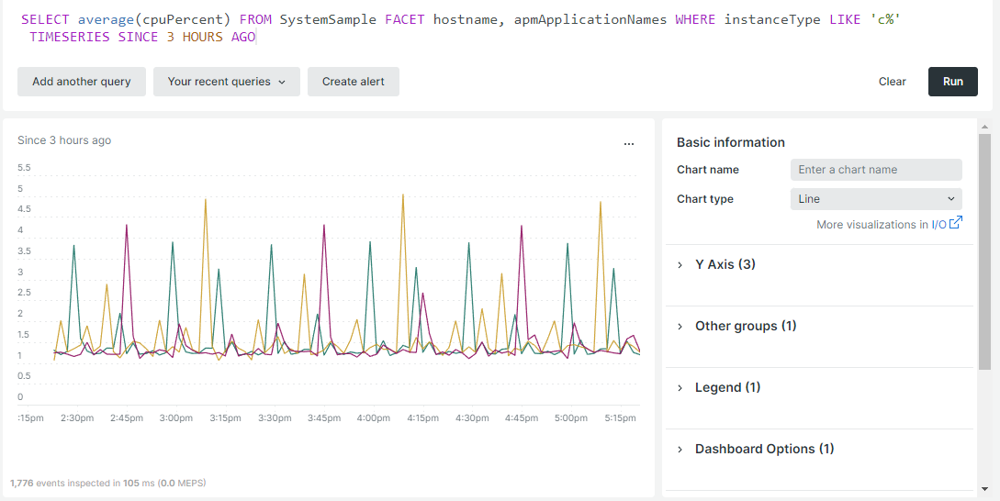

# Auto scaling

Auto scaling automatically adds or removes resources to the cloud infrastructure in order to maintain optimal performance and reasonable costs. Currently, this feature is only available for projects configured with a [Scaled architecture](scaled-architecture.md).

## Web server nodes

The [web tier](scaled-architecture.md#web-tier) scales to accommodate an increase in process requests and higher traffic requirements. Currently, the auto-scaling feature only scales horizontally by adding or removing web server nodes.

An auto-scaling event occurs when CPU usage and traffic reach a predefined threshold:

- **Nodes added**—CPUs/cores across all active web nodes are at 75% capacity for 1 minute and traffic is increasing by 20% for 5 consecutive minutes.
- **Nodes removed**—CPUs/cores across all active web nodes are loaded at 60% for 20 minutes. Nodes are removed in the order that they were added.

The minimum and maximum thresholds are determined and set based on the contracted resource limits of each merchant; this reduces the risk of infinite scaling.

## Monitor thresholds with New Relic

You can use the [New Relic service](../monitor/new-relic.md#use-new-relic) to monitor certain thresholds, such as host count and CPU usage. The following New Relic queries use a variable notation for `cluster-id` for example purposes only.

>[!TIP]
>
>For a reference on building queries, see [NRQL syntax, clauses, and functions](https://docs.newrelic.com/docs/query-your-data/nrql-new-relic-query-language/get-started/nrql-syntax-clauses-functions/) in the _New Relic_ documentation.
>Use your queries to build a [New Relic dashboard](https://docs.newrelic.com/docs/query-your-data/explore-query-data/dashboards/introduction-dashboards/).

### Host count

The following example New Relic query shows host count within the environment:

```sql
SELECT uniqueCount(SystemSample.entityId) AS 'Infrastructure hosts', uniqueCount(Transaction.host) AS 'APM hosts seen' FROM SystemSample, Transaction where (Transaction.appName = 'cluster-id_stg' AND Transaction.transactionType = 'Web') OR SystemSample.apmApplicationNames LIKE '%|cluster-id_stg|%' TIMESERIES SINCE 3 HOURS AGO
```

In the following screenshot, **APM hosts seen** refers to the number of hosts with transactions logged during the selected period.


### CPU usage

The following example New Relic query shows CPU usage for web nodes:

```sql
SELECT average(cpuPercent) FROM SystemSample FACET hostname, apmApplicationNames WHERE instanceType LIKE 'c%' TIMESERIES SINCE 3 HOURS AGO
```



## Enable auto scaling

To enable or disable auto scaling for your Adobe Commerce on cloud infrastructure project, [Submit an Adobe Commerce Support ticket](https://experienceleague.adobe.com/docs/commerce-knowledge-base/kb/help-center-guide/magento-help-center-user-guide.html#submit-ticket). Choose the following reasons in the ticket:

- **Contact reason**: Infrastructure Change Request
- **Adobe Commerce Infrastructure Contact Reason**: Other Infrastructure Change Request

>[!IMPORTANT]
>
>The auto-scaling feature captures unanticipated events. Even if you have auto scaling enabled, Adobe recommends that you continue to [Submit an Adobe Commerce Support ticket](https://experienceleague.adobe.com/docs/commerce-knowledge-base/kb/help-center-guide/magento-help-center-user-guide.html#submit-ticket) if you expect an upcoming event.

### Load testing

Adobe enables auto scaling on your Cloud project _staging_ cluster first. After you perform and complete load testing in your Staging environment, Adobe then enables auto scaling on your production cluster. For guidance on load testing, see [Performance testing](../launch/checklist.md#performance-testing).

### IP allowlist

After enabling auto scaling, the outbound web node traffic originates from the IP addresses of the service nodes. If you use an allowlist with a third-party service that is not bundled with your Adobe Commerce on cloud infrastructure project, then you may need to update the IP addresses in the third-party service allowlist.

For example:

- If the allowlist contains the IP addresses for your service nodes (1, 2, and 3), then there is no action required.
- If the allowlist contains the IP addresses for your service nodes (1, 2, and 3) and web nodes (4, 5, and 6)—in this case all six nodes—then there is no action required.
- If the allowlist contains the IP addresses _only_ for your web nodes (4, 5, and 6), then you need to update the allowlist to include the IP addresses for the service nodes.
