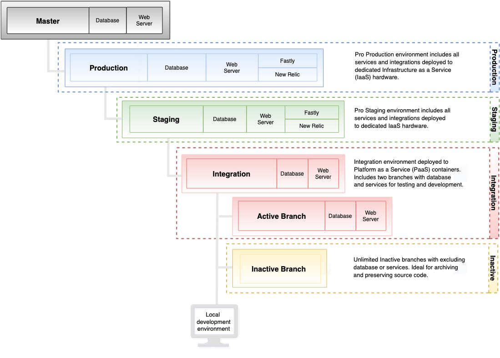
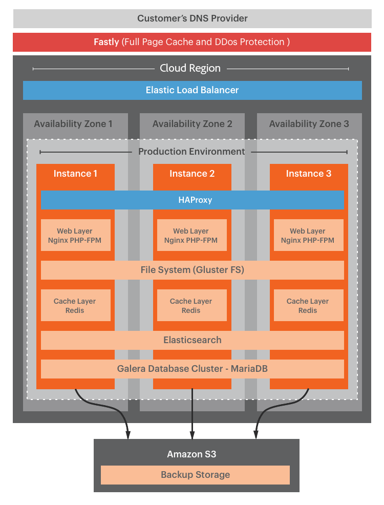

# Pro architecture

Your Adobe Commerce on cloud infrastructure Pro architecture supports multiple environments that you can use to develop, test, and launch your store.

- **Master**—Provides a `master` branch deployed to Platform as a service (PaaS) containers.
- **Integration**—Provides a single `integration` branch for development, though you can create one additional branch. This allows for up to two _active_ branches deployed to Platform as a service (PaaS) containers.
- **Staging**—Provides a single `staging` branch deployed to dedicated Infrastructure as a service (IaaS) containers.
- **Production**—Provides a single `production` branch deployed to dedicated Infrastructure as a service (IaaS) containers.

The following table summarizes the differences between environments:

|                                        | INTEGRATION | STAGING           | PRODUCTION           |
| -------------------------------------- | ----------- | ----------------- | -------------------- |
| Supports settings management in the [!DNL Cloud Console] | Yes         | Limited           | Limited              |
| Supports multiple branches             | Yes         | No (Staging only) | No (Production only) |
| Uses YAML files for configuration      | Yes         | No                | No                   |
| Runs on dedicated IaaS hardware        | No          | Yes               | Yes                  |
| Includes Fastly CDN                    | No          | Yes               | Yes                  |
| Includes New Relic service             | No          | APM               | APM + NRI            |
| Automatic Backups                      | No          | Yes               | Yes                  |

>[!NOTE]
>
>Adobe provides the Cloud Docker for Commerce tool for deploying to a local Cloud Docker environment so that you can develop and test Adobe Commerce projects. See [Docker development](../dev-tools/cloud-docker.md).

## Environment architecture

Your project is a single Git repository with three main environment branches: `integration`, `staging`, and `production`. The following diagram shows the hierarchical relationship of Pro environments:

### Master environment

On Pro projects, the `master` branch provides an active PaaS environment with your production environment. Always push a copy of the production code to the `master` environment so that you can debug the production environment without interrupting services.

**Caveats:**

- Do **not** create a branch based on the `master` branch. Use the integration environment to create active branches for development.

- Do not use the `master` environment for development, UAT, or performance testing

### Integration environment

The integration environment runs in a Linux container (LXC) on a grid of servers known as PaaS. Each environment includes a web server and database to test your site. See [Regional IP Addresses](../project/regional-ip-addresses.md) for a list of AWS and Azure IP addresses.

**Recommended use cases:**

Integration environments are designed for limited testing and development before moving changes to staging and production environments. For example, you can use the integration environment to complete the following tasks:

- Ensure that changes to continuous integration (CI) processes are Cloud compatible

- Test critical workflows on key pages like Home, Category, Product Details Page (PDP), Checkout, and Admin

For best performance in the integration environment follow these best practices:

- Restrict catalog size - a good rule-of-thumb would be the size of the Sample Data which contains about 2048 products. You can try reducing your catalog size to around 4-5k products.

- Reduce the number of customer groups - it can affect the indexing performance and, in turn, the overall performance

- Limit use to one or two concurrent users

- Disable cron jobs and manually run as needed

**Caveats:**

- Fastly CDN and New Relic services are not accessible in an integration environment

- The integration environment architecture does not match the Staging and Production architecture

- Do not use the `integration` environment for development testing, performance testing, or user acceptance testing (UAT)

- Do not use the `integration` environment to test B2B for Adobe Commerce functionality

- You cannot restore the database in the integration environment from the database production or staging

{{enhanced-integration-envs}}

### Staging environment

The staging environment provides a near-production environment to test your site. This environment, which is hosted on dedicated IaaS hardware, includes all services, such as Fastly CDN, New Relic APM, and search.

**Recommended use cases:**

The environment matches the production architecture and is designed for UAT, content staging, and final review before pushing features to the `production` environment. For example, you can use the `staging` environment to complete the following tasks:

- Regression testing against production data

- Performance testing with Fastly caching enabled

- Test new builds instead of patching in Production

- UAT testing for new builds

- Test B2B for Adobe Commerce

- Customize cron configuration and test cron jobs

See [Deployment workflow](pro-develop-deploy-workflow.md#deployment-workflow) and [Test deployment](../test/staging-and-production.md).

**Caveats:**

- After launching the production site, use the staging environment primarily to test patches for production-critical bug fixes.

- You cannot create a branch from the `staging` branch. Instead, you push code changes from the `integration` branch to the `staging` branch.

### Production environment

The production environment runs your public-facing single and multi-site storefronts. This environment runs on dedicated IaaS hardware featuring redundant, high-availability nodes for continuous access and failover protection for your customers. The production environment includes all services in the staging environment, plus the [New Relic Infrastructure (NRI)](../monitor/new-relic-service.md#new-relic-infrastructure) service, which automatically connects with the application data and performance analytics to provide dynamic server monitoring.

**Caveat:**

You cannot create a branch from the `production` branch. Instead, you push code changes from the `staging` branch to the `production` branch.

### Production technology stack

The production environment has three virtual machines (VMs) behind an Elastic Load Balancer managed by an HAProxy per VM. Each VM includes the following technologies:

- **Fastly CDN**—HTTP caching and CDN

- **NGINX**—web server using PHP-FPM, one instance with multiple workers

- **GlusterFS**—file server for managing all static file deployments and synchronization with four directory mounts:

    - `var`
    - `pub/media`
    - `pub/static`
    - `app/etc`

- **Redis**—one server per VM with only one active and the other two as replicas

- **Elasticsearch**—search for Adobe Commerce on cloud infrastructure 2.2 to 2.4.3-p2

- **OpenSearch**—search for Adobe Commerce on cloud infrastructure 2.3.7-p3, 2.4.3-p2, 2.4.4 and later

- **Galera**—database cluster with one MariaDB MySQL database per node with an auto-increment setting of three for unique IDs across every database

The following figure shows the technologies used in the production environment:

## Redundant hardware

Rather than running a traditional, active-passive `master` or a primary-secondary setup, Adobe Commerce on cloud infrastructure runs a _redundant architecture_ where all three instances accept reads and writes. This architecture offers zero downtime when scaling and provides guaranteed transactional integrity.

Because of the unique, redundant hardware, Adobe can provide three gateway servers. Most external services enable you to add multiple IP addresses to an allowlist, so having more than one fixed IP address is not a problem. The three gateways map to the three servers in your production environment cluster and retain static IP addresses. It is fully redundant and highly available at every level:

- DNS
- Content Delivery Network (CDN)
- Elastic load balancer (ELB)
- Three-server cluster comprising all Adobe Commerce services, including the database and web server

## Backup and disaster recovery

Adobe Commerce on cloud infrastructure uses a high-availability architecture that replicates each Pro project on three separate AWS or Azure Availability Zones, each zone with a separate data center. In addition to this redundancy, Pro staging and production environments receive regular, live backups that are designed for use in cases of _catastrophic failure_.

**Automatic backups** include persistent data from all running services, such as the MySQL database and files stored on the mounted volumes. The backups are saved to encrypted Elastic Block Storage (EBS) in the same region as the production environment. The automatic backups are not publicly accessible because they are stored in a separate system.

{{pro-backups}}

You can create a **manual backup** of the database for your Staging and Production environments using CLI commands. See [Back up the database](../storage/database-dump.md). For `integration` environments, Adobe recommends creating a backup as a first step after accessing your Adobe Commerce on cloud infrastructure project and before applying any major changes. See [Backup management](../storage/snapshots.md).

### Recovery Point Objective

RPO is six hours maximum time to last backup (for example at 06:00, then 12:00, then 18:00). The frequency of backups depends on the backup schedule of your plan and the volume of changes to write to the storage service.

### Retention policy

Adobe retains automatic backups according to the following data retention policy:

| Time Period        | Backup Retention Policy |
| ------------------ | ----------------------- |
| Day 1 through 3    | One backup per hour     |
| Days 4 through 7   | One backup per day      |
| Weeks 2 through 6  | One backup per week     |
| Weeks 8 through 12 | One bi-weekly backup    |
| Month 3 through 5  | One backup per month    |

This policy may vary depending on your cloud infrastructure plan.

### Recovery Time Objective

RTO depends on the size of the storage. Large EBS volumes take more time to restore. Restoration times may vary depending on the size of your database:

- A large database (200+ GB) can take 5 hours
- A medium database (150 GB) can take 2 1/2 hours
- A small database (60 GB) can take 1 hour

## Pro cluster scaling

The Pro cluster sizing and _compute_ configurations vary depending on the chosen cloud provider (AWS, Azure), region, and service dependencies. Adobe cloud infrastructure can scale Pro clusters to accommodate traffic expectations and service requirements as demands change.

The redundant architecture empowers Adobe cloud infrastructure to upscale without downtime. When upscaling, each of the three instances rotates to upgrade capacity without impacting site operation. For example, you can add extra web servers to an existing cluster should the constriction be at the PHP level rather than the database level. This provides _horizontal scaling_ to complement the vertical scaling provided by extra CPUs on the database level. See [Scaled architecture](scaled-architecture.md).

If you expect a significant increase in traffic for an event or other reason, you can request a temporary increase in capacity. See [How to request a temporary upsize](https://experienceleague.adobe.com/docs/commerce-knowledge-base/kb/how-to/how-to-request-temporary-magento-upsize.html) in the _Commerce Help Center_.
