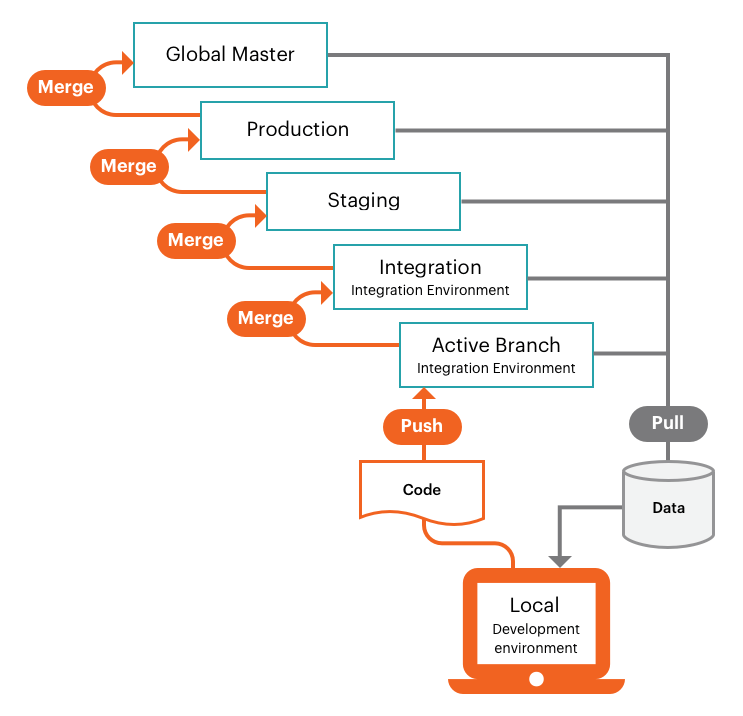

# Pro project workflow

The Pro project includes a single Git repository with a Global `master` and three main environments: the **Integration** environment for development and testing, the **Staging** environment for testing with all services, and the **Production** environment for launching and maintaining your live site. See [Pro architecture](pro-architecture.md) for an overview.

The following graphic demonstrates the Pro develop and deploy workflow, which uses a simple, git-branching approach. You [develop](#development-workflow) code using an Active branch based on the Integration environment branch, _pushing_ and _pulling_ code changes to and from your remote, Active branch. You deploy verified code by _merging_ the remote branch to the base branch, which activates an automated [build and deploy](#deployment-workflow) process for that environment.

## Development workflow

The Integration environment provides a single, base integration branch containing your Adobe Commerce on cloud infrastructure code. You can create one additional active environment branch. This allows for up to two active branches deployed to Platform as a service (PaaS) containers. There is no limit on the number of inactive environments.

{{enhanced-integration-envs}}

The project environments support a flexible, continuous integration process. Begin by cloning the `integration` branch to your local project folder. Create a branch, or multiple branches, to develop new features, configure changes, add extensions, and deploy updates:

-  **Fetch** changes from `integration`

-  **Branch** from `integration`

-  **Develop** code on local workstation

-  **Push** code changes to remote and validate

-  **Merge** to `integration` and test

With a developed code branch and the corresponding configuration files, your code changes are ready to merge to the `integration` branch for more comprehensive testing. The Integration environment is also best for:

-  **Integrating third-party services**—Not all services are available in the PaaS environment.

-  **Generating configuration management files**—Some configuration settings are _Read Only_ in a deployed environment.

-  **Configuring your store**—You should fully configure all store settings using the Integration environment. You can find the **Store Admin URL** on the _Integration_ environment panel in the _Project Web Interface_.

## Deployment workflow

Every time you push code from your local workstation to the remote environment or merge code to an environment branch, the build and deploy scripts generate new code and provision the configured services to the remote environment.

Build script actions:

-  Site in the target environment continues to run during a build

-  Check and run Adobe Commerce on cloud infrastructure patches and hotfixes

-  Compile code with a build and deploy log

-  Check for Configuration Management, static content deployment occurs during this phase

-  Create or use a slug of unchanged code to speed up the process

-  Provision all backend services and applications

Deploy script actions:

-  Place site in the target environment in a _Maintenance_ mode

-  Deploy static content if not completed during Build

-  Install or update Adobe Commerce on cloud infrastructure

-  Configure routing for traffic

After the build and deploy process, your store comes back online with your latest code changes and configurations. See [Deployment process](../deploy/process.md).

### Merge to Integration

Combine all verified code changes by merging your Active development branch into the base `integration` branch. You can test all your changes on the `integration` branch before promoting changes to the Staging environment.

### Merge to Staging

Staging is a pre-production environment that provides all services and settings as close to the Production environment as possible. Always push your code changes from the Integration environment to the Staging environment so that you can perform thorough testing with all services. The first time you use the Staging environment, you must configure services, such as [Fastly CDN](../cdn/fastly.md) and [New Relic](../monitor/new-relic-service.md). Configure payment gateways, shipping, notifications, and other vital services with sandbox or testing credentials.

It is best to thoroughly test every service, verify your performance testing tools, and perform UAT testing as an administrator and as a customer, until you feel that your store is ready for the Production environment. See [Deploy your store](../deploy/staging-production.md).

### Merge to Production

After thorough testing in the Staging environment, merge to the Production environment and thoroughly test using live credentials. The moment you launch your production site, customers must be able to complete purchases and administrators must be able to manage the live store. See the following topics for a detailed, clear walk-through for deploying your store and going live:

-  See [Deploy your store](../deploy/staging-production.md)
-  See [Site launch](../launch/overview.md)

### Merge to Global Master

Always push a copy of the Production code to the Global `master` in case there is an emergent need to debug the Production environment without interrupting services.

Do **not** create a branch from Global `master`. Use the `integration` branch to create new, active branches for development and fixes.
