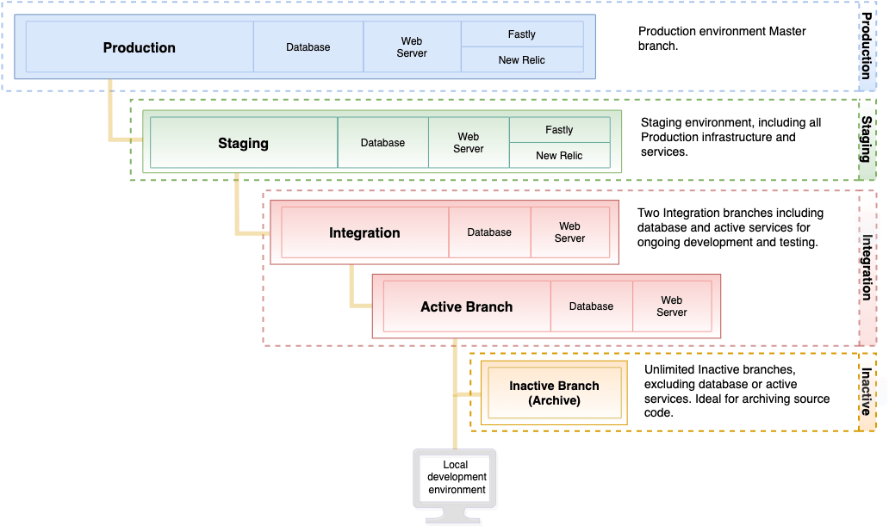

# Starter architecture

Your Adobe Commerce on cloud infrastructure Starter architecture supports up to **four** environments, including a `master` environment that contains the initial project code, the Staging environment, and up to two Integration environments.

All environments are in PaaS (Platform as a service) containers. These containers are deployed inside highly restricted containers on a grid of servers. These environments are read-only, accepting deployed code changes from branches pushed from your local workspace. Each environment provides a database and web server.

You can use any development and branching methodology you like. When you get initial access to your project, we strongly recommend that you create a Staging environment from the `master` environment. Then, create the Integration environment by branching from Staging.

## Starter environment architecture

The following diagram shows the hierarchical relationships of the Starter environments.

## Production environment

The Production environment provides the source code to deploy Adobe Commerce to the Cloud infrastructure that runs your public-facing single and multi-site storefronts. The Production environment uses code from the `master` branch to configure and enable the web server, database, configured services, and your application code.

Because the Production environment is read-only, make changes in the Integration environment and deploy across the architecture from the Integration to Staging, and finally to the Production environment. See [Deploy your store](../deploy/staging-production.md) and [Site launch](../launch/overview.md).

Adobe recommends fully testing in your Staging environment branch before pushing to the `master` branch, which deploys to the Production environment.

## Staging environment

We recommend creating a branch called `staging` from `master`. The `staging` branch deploys code to the Staging environment to provide a pre-production environment to test code, modules and extensions, payment gateways, shipping, product data, and much more. This environment provides the configuration for all services to match the Production environment including Fastly, New Relic APM, and search.

Additional sections in this guide provide instructions for final code deployments and testing production level interactions in a secure Staging environment. For best performance and feature testing, replicate your Production database into the Staging environment.

>[!WARNING]
>
>Adobe recommends testing every merchant and customer interaction in the Staging environment before deploying to the Production environment. See [Deploy your store](../deploy/staging-production.md) and [Test deployment](../test/staging-and-production.md).

## Integration environment

Developers use the Integration environment to develop, deploy, and test:

-  Adobe Commerce application code

-  Custom code

-  Extensions

-  Services

You can have up to **two** active Integration environments. You create an Integration environment by creating a branch from the `staging` branch. When you create an Integration environment, the environment name matches the branch name. An integration environment includes a web server and a database. It does not include all services, for example Fastly CDN and New Relic are not available.

You can have an unlimited number of inactive branches for code storage. To access, view, and test an inactive branch, you must activate it.

{{enhanced-integration-envs}}

## Production and Staging technology stack

The Production and Staging environments include the following technologies. You can modify and configure these technologies through the [`.magento.app.yaml`](../application/configure-app-yaml.md) file.

-  Fastly for HTTP caching and CDN
-  Nginx web server speaking to PHP-FPM, one instance with multiple workers
-  Redis server
-  Elasticsearch for catalog search for Adobe Commerce 2.2 to 2.4.3-p2
-  OpenSearch for catalog search for Adobe Commerce 2.3.7-p3, 2.4.3-p2, and 2.4.4 and later
-  Egress filtering (outbound firewall)

### Services

Adobe Commerce on cloud infrastructure currently supports the following services: PHP, MySQL (MariaDB), Elasticsearch (Adobe Commerce 2.2 to 2.4.3-p2), OpenSearch (2.3.7-p3, 2.4.3-p2, 2.4.4 and later), Redis, and [!DNL RabbitMQ].

Each service runs in a separate, secure container. Containers are managed together in the project. Some services are standard, such as the following:

-  HTTP router (handling incoming requests, but also caching and redirects)

-  PHP application server

-  Git

-  Secure Shell (SSH)

### Software versions

Adobe Commerce on cloud infrastructure uses the Debian GNU/Linux operating system and the [NGINX](https://glossary.magento.com/nginx) web server. You cannot upgrade this software, but you can configure versions for the following:

-  [PHP](../application/php-settings.md)

-  [MySQL](../services/mysql.md)

-  [Redis](../services/redis.md)

-  [RabbitMQ](../services/rabbitmq.md)

-  [Elasticsearch](../services/elasticsearch.md)

-  [OpenSearch](../services/opensearch.md)

In the Staging and Production environments, you use Fastly for CDN and caching. When your environment is initially provisioned, we install the latest version of the Fastly CDN extension. You can upgrade the extension to get the latest bug fixes and improvements. See [Fastly CDN module for Magento 2](https://github.com/fastly/fastly-magento2). Also, you have access to [New Relic](../monitor/new-relic.md#configure-new-relic-for-starter-environments.md) for performance monitoring.

You use the following files to configure the software versions that you want to use in your implementation.

-  [`.magento.app.yaml`](../application/configure-app-yaml.md)

-  [`routes.yaml`](../routes/routes-yaml.md)

-  [`services.yaml`](../services/services-yaml.md)

### Backup and disaster recovery

You can create a snapshot of your database and file system using the Project Web Interface or the CLI. The snapshot includes your deployed code, installed software and services, and data. See [Snapshots and backup management](../storage/snapshots.md).

## Prepare for development

The following workflow summarizes the process to branch your code, develop, and deploy your store:

1. Set up your local environment

1. Clone the `master` branch from the Project to your local environment

1. Create a `staging` branch from `master`

1. Create branches for development from `staging`

1. Push code to Git that builds and deploys to an environment for testing

See the following sections for detailed instructions and walk-throughs to develop, test, and deploy your store:

-  [Starter develop and deploy workflow](starter-develop-deploy-workflow.md)

-  [Docker development](../dev-tools/cloud-docker.md) (local development environment enabled by Cloud Docker for Commerce)

-  [Manage branches](../project/console-branches.md)

-  [Deploy your store](../deploy/staging-production.md)

-  [Site launch](../launch/overview.md)
