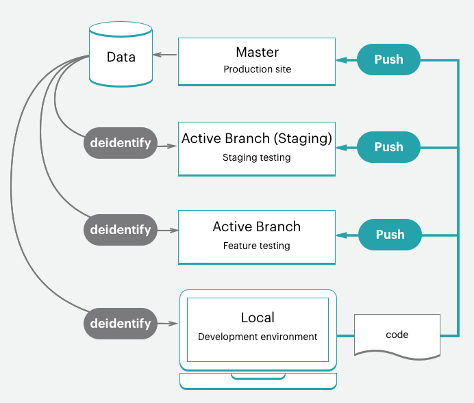
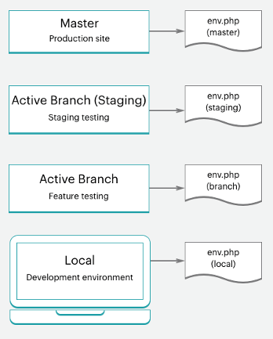
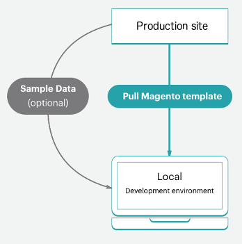
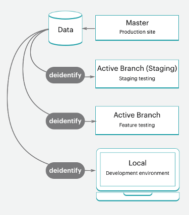

# Starter project workflow

The Adobe Commerce on cloud infrastructure includes a single Git repository with a `master` branch for the Production environment that can be branched to create Staging and Integration environments for testing and development work. You can have up to four active environments, including a `master` environment for your production server. See [Starter architecture](starter-architecture.md) for an overview.

For your environments, we recommend following a Development > Staging > Production workflow to develop and deploy your site.

-  **Production environment (live site)**—Provides a full Production environment with all services built and deployed from the code on the `master` branch.
-  **Staging environment**—Provides a full Staging environment that matches the Production environment with all services built and deployed from a `staging` branch that you create by cloning from `master`.
-  **Integration environments**—Provides up to two active development environments that you create from the `staging` branch. The Integration environment does not support third-party services like Fastly and New Relic.

For your branches, you can follow any development methodology. For example, you can follow an Agile methodology such as scrum to create branches for every sprint.

From each sprint, you can create branches for every user story. All the stories become testable. You can continually merge to the sprint branch and validate that branch on a continuous basis. When the sprint ends, you can merge the sprint branch to `master` to deploy all sprint changes to production without having to deal with a testing bottleneck.

## Development workflow

Development and deployment on Starter plans begin with your initial project. You create your project with the "blank site", which is an Adobe Commerce on cloud infrastructure template code repo with a fully prepared store. This creates a `master` branch with a copy of the code from your Production environment.

The development workflow uses the following process:

-  [Clone and branch](#clone-and-branch) from the `master` to create `staging` and development branches
-  [Develop code](#develop-code) and install extensions locally in a development branch
-  [Configure](#configure-store) your store and extension settings
-  [Generate configuration](#generate-configuration-management-files) management files
-  [Push code](#push-code-and-test) and configuration to build and deploy to the Staging and Production environments



You also have a few optional steps to help develop and test your code and your store data:

-  [Install sample data](#optional-install-sample-data) to your store
-  [Pull production store data](#optional-pull-production-data) down to environments

This process assumes that you have set up your [local developer workspace](https://devdocs.magento.com/cloud/setup/first-time-setup.html).

### Clone and branch

For a new Starter Plan project, a `master` branch was cloned from the Adobe Commerce on cloud infrastructure Git repository. To start branching and working with code, you need to clone the `master` branch to your local environment.

The format of the Git clone command is:

```bash
git fetch origin
```

```bash
git pull origin <environment-ID>
```

The first time you start working in branches for your Starter project, you need to create a `staging` branch. This creates a code branch matching the `master` branch that deploys to a Staging environment to test configuration and code changes before deploying to the Production environment.

Next, create branches from `staging` to develop code, add extensions, and configure third-party integrations. Anytime you need to develop custom code, add extensions, integrate with a third-party service, work in a development branch created from the `staging` branch. You have four active Integration environments available. When you push an active branch, one of these Integration environments automatically deploys your code to test.

The format of the Git branch command is:

```bash
git checkout <branch-name>
```

The format of the Cloud CLI branch command is:

```bash
magento-cloud environment:branch <environment-name> <parent-environment-ID>
```


### Develop code

Using this base branch of Adobe Commerce on cloud infrastructure code, you can start installing extensions, developing custom code, adding themes, and much more.

We recommend using a branching strategy with your development work. Using one branch to do all of your work all at once might make testing difficult. For example, you could follow continuous integration and sprint methodologies to work:

-  Add a few extensions and configure them with your first branch
-  Push this code, test, and merge to Staging then Production
-  Fully configure your services in `services.yaml` and add a theme
-  Push this code, test, and merge to Staging then Production
-  Integrate with a third-party service
-  Push this code, test, and merge to Staging then Production

And so on, until you have your store fully built, configured, and ready to launch. But keep reading, we have even better options for your store and code configuration.

>[!NOTE]
>
>Do not complete any configurations in your local workstation yet.


### Configure store

When you are ready to configure your store, push all your code to the Integration environment.
Configure your store settings from the Admin panel for the Integration environment, not in your local environment. You can find the URL by clicking **Access site** in the Project Web Interface

For the best information on configurations, review the documentation for Adobe Commerce and the installed extensions. Here are some links and ideas to help you get started:

-  [Best practices for store configuration](https://devdocs.magento.com/cloud/configure/configure-best-practices.html) for specific best practices in the cloud
-  [Basic configuration](https://docs.magento.com/user-guide/configuration/configuration-basic.html) for store admin access, name, languages, currencies, branding, sites, store views and more
-  [Theme](https://docs.magento.com/user-guide/design/design-theme.html) for your look and feel of the site and stores including CSS and layouts
-  [System configuration](https://docs.magento.com/user-guide/system/system.html) for roles, tools, notifications, and your encryption key for your database
-  Extension settings using their documentation

Beyond just store settings, you can further configure multiple sites and stores, configured services, and more. See [Configure your store](https://devdocs.magento.com/cloud/configure/configuration-overview.html).

Now you need to get these settings into your code. We have a helpful command to do this, keep reading.

### Generate configuration management files

If you are familiar with Adobe Commerce, you may be concerned about how to get your configuration settings from your database in development to the Staging and Production environments. Previously, you had to copy all your configuration settings down on paper or to a file, and then manually apply the settings to other environments. Or you may have dumped your database and pushed that data to another environment.

Adobe Commerce on cloud infrastructure provides a set of two [Configuration Management](https://devdocs.magento.com/cloud/live/sens-data-over.html) commands that export configuration settings from your environment into a file. These commands are only available for **Adobe Commerce on cloud infrastructure 2.2 and later**.

-  `php .vendor/bin/ece-tools config:dump`: Recommended. Exports only the configuration settings you have entered or modified from defaults into a configuration file.
-  `php bin/magento app:config:dump`: Exports every configuration setting, including modified and default, into a configuration file.

The generated file is `app/etc/config.php`.

You generate the file in the Integration environment where you configured Adobe Commerce. We walk you through the process of generating the file, adding it to your branch, and deploying it.

**Important notes** on Configuration Management:

-  Any configuration setting included in the file generated from the `app:config:dump` command is locked from editing, or read-only, in the deployed environment. This is one reason that Adobe recommends using the `.vendor/bin/ece-tools config:dump` command.

   For example, you install a module for Fastly in your development environment. You can only configure this module in the Staging and Production environment. Using the `.vendor/bin/ece-tools config:dump` command keeps those default fields editable when you deploy your development changes to the Staging and Production environment.

-  The generated file can be long depending on the size of your deployment. The `.vendor/bin/ece-tools config:dump` command generates a much smaller file than the file generated by the `app:config:dump` command.

If you are using Adobe Commerce version 2.2 or later, the configuration management commands provide an additional feature to protect sensitive data, like sandbox credentials for a PayPal module. During the export process, any values that contain sensitive data are exported to separate configuration file—`env.php` in the `app/etc/` directory. This file remains in your local environment and does not get copied when you push your code to another branch. You can also create environment variables with CLI commands in all Adobe Commerce on cloud infrastructure versions.



For more information, see [Configuration Management](https://devdocs.magento.com/cloud/live/sens-data-over.html).

### Push code and test

At this point, you should have a developed code branch with a configuration file (`config.local.php` or `config.php`) ready to test.

Every time you push code from your local environment, a series of build and deploy scripts run. These scripts generate new code and deploy it to the remote environment. For example, if you are pushing a development branch from your local environment to the remote branch, a matching environment updates services, code, and static content.

You can directly access this environment with a store URL, Admin URL, and SSH. These environments include a web server, database, and configured services. When ready, you can start deploying and testing in the Staging environment.

For more information, see [Deployment workflow](#deployment-workflow).

### Optional: Install sample data

If you need some example data when developing your store, you can install our sample data. This data simulates an active store, including customers, products, and other data. This sample data works best with a "blank site" Adobe Commerce on cloud infrastructure template installation when creating your project.

We recommend installing sample data in your local and Integration environments. If you use this data in Staging or Production, you need to remove the sample information and products before going live.

For instructions, see [Install optional sample data](https://devdocs.magento.com/cloud/howtos/sample-data.html).



### Optional: Pull production data

We recommend adding all of your products, catalogs, site content, and so on, directly to the Production environment. By adding this data to the Production environment, you can provide updated prices, coupons, inventory stock, sales announcements, information about future offerings, and much more for your customers. This data does not include extension configurations, which you configure in your local development branch.

As you develop features, add extensions, and design themes, having real data to work with is helpful. At any time, you can create a database dump from the Production environment and push that to your Staging and Integration environments as needed.

{{cloud-data-collection}}



>[!NOTE]
>
>Before pushing the data to another environment, you should consider sanitizing your data. You have a couple of options including [using support utilities](https://experienceleague.adobe.com/docs/commerce-operations/configuration-guide/cli/run-support-utilities.html) or developing a script to scrub out customer data.

>[!WARNING]
>
>We do not recommend pushing a database from an Integration or Staging environment to a Production environment. If you do, the data from the Integration or Staging environment overwrites your live Production data including sales, orders, new and updated customers, and much more.

## Deployment workflow

As we detailed in the architecture information, Adobe Commerce on cloud infrastructure is Git driven. Deploying Adobe Commerce on cloud infrastructure is part of your Git push processes for branches.

When you push branched code from your local environment to the remote branch, a series of build and deploy scripts begin.

Build scripts:

-  The site in the target environment continues running during a build

-  Check and run Adobe Commerce on cloud infrastructure patches and hotfixes

-  Compile your code with a build and deploy log

-  Check for Configuration Management, if the static content deployment occurs during this phase

-  Create or use a slug of unchanged code to speed up the process

-  Provision all backend services and applications

Deploy scripts:

-  Puts your site on the target environment in Maintenance mode

-  Deploys static content if not completed during Build

-  Installs or updates Adobe Commerce on cloud infrastructure

-  Configure routing for traffic

When fully completed, your store comes back online, live, with all of your updated code and configurations.

See [Deployment process](../deploy/process.md).

### Push to Staging and test

Always push your code in iterations to the Staging environment for full testing. The first time you use this environment, you need to configure a few services including [Fastly](https://devdocs.magento.com/cloud/cdn/cloud-fastly.html) and [New Relic](../monitor/new-relic.md). We also recommend configuring payment gateways, shipping, notifications, and other vital services with sandbox or testing credentials.

Staging is a pre-production environment, providing all services and settings as close to Production as possible. Thoroughly test every service, verify your performance testing tools, perform UAT testing as an administrator and customers, until you feel your store is ready for Production.

See [Deploy your store](https://devdocs.magento.com/cloud/live/stage-prod-live.html).

### Push to Production

When you push to the `master` branch, you are pushing to the Production environment. Complete configuration and testing activities in the Production environment like you did in the Staging environment with one important difference. In the Production environment, use live credentials for configuration and testing. The moment you launch your site, customers must be able to complete purchases and administrators should be able to manage your live store.

See [Deploy your store](https://devdocs.magento.com/cloud/live/stage-prod-live.html).

### Site launch

We provide a clear walk-through for going live and launching, which requires more steps than pressing a button. After you complete these steps, your store can serve up products in your customized theme for sale immediately.

See [Site launch](../launch/index.md).

## Continuous integration

Following your branching and development methodologies, you can easily develop new features, configure changes, and add extensions to continuously develop and deploy updates.

Adobe Commerce on cloud infrastructure environments support continuous integration for constant updates. This workflow supports releases multiple times a day or on a set schedule according to your business needs.

-  Create development branches with future features and changes

-  Test the code in your development environments

-  Deploy and test in Staging

-  Deploy to Production

See [Continuous integration](https://devdocs.magento.com/cloud/deploy/continuous-deployment.html).
