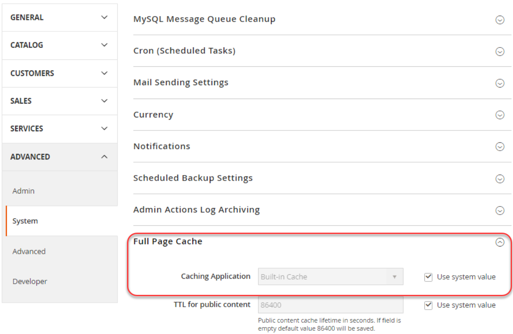
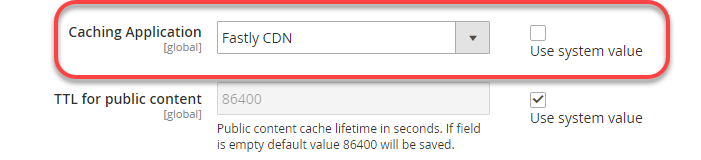
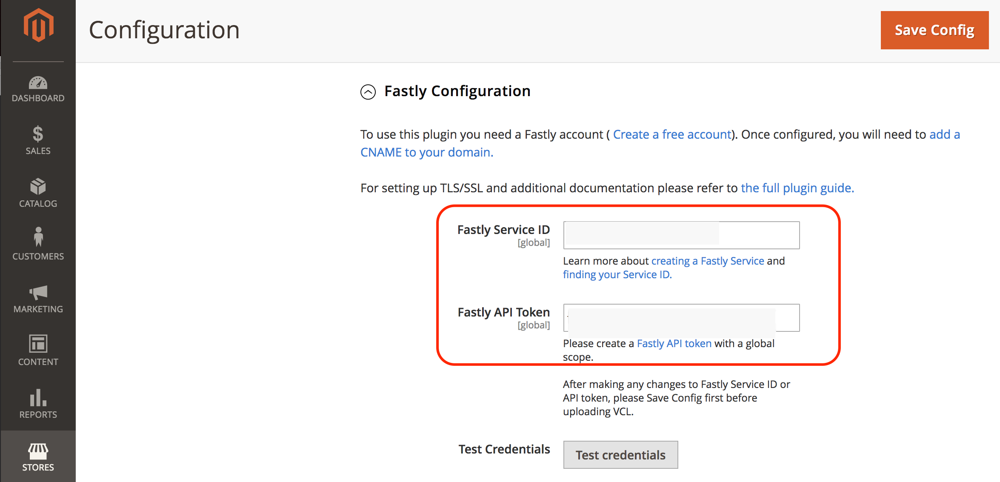
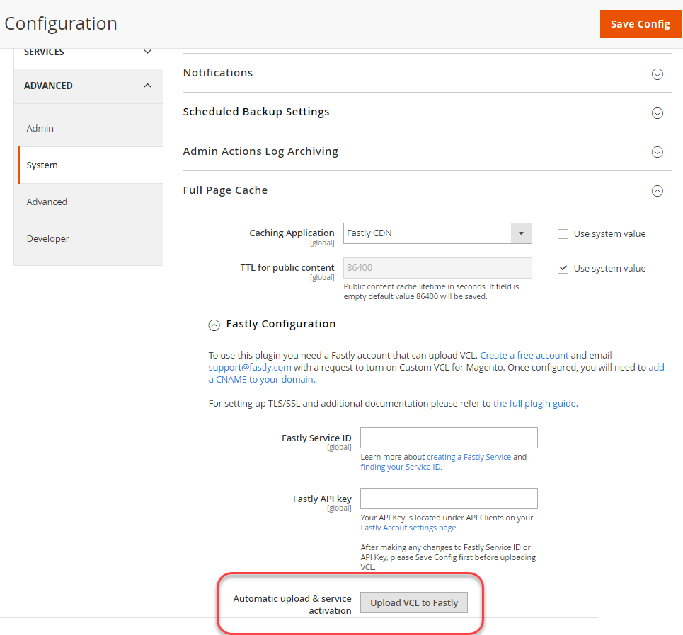

# Configure Fastly services

Fastly is required for Adobe Commerce on cloud infrastructure Staging and Production environments.

Fastly works with Varnish to provide fast caching capabilities and a [Content Delivery Network](https://glossary.magento.com/content-delivery-network) (CDN) for static assets. Fastly also provides a Web Application Firewall (WAF) to secure your site and Cloud infrastructure. To protect your site and Cloud infrastructure from malicious traffic and attacks, route all incoming site traffic through Fastly to protect your site and Cloud infrastructure from malicious traffic and attacks.

>[!NOTE]
>
>Fastly is not available in Integration environments.

Complete the following steps to enable, configure, and test Fastly early in your site development process to enable secure access to your site.

-  Get Fastly credentials for Staging and Production environments
-  Enable Fastly CDN caching
-  Upload Fastly VCL snippets
-  Update DNS configuration to route traffic to the Fastly service
-  Test Fastly caching

>[!NOTE]
>
>After you enable and verify Fastly with the default settings, you can customize cache configuration settings and enable additional options such as image optimization, edge modules, and custom VCL code. See [Customize cache configuration](fastly-custom-cache-configuration.md).

## Get Fastly credentials

During project provisioning, Adobe adds your project to the [Fastly service account](fastly.md#fastly-service-account-and-credentials) for Adobe Commerce on cloud infrastructure and creates Fastly account credentials for the Starter `master` and Pro Staging and Production environments. Each environment has unique credentials.

You need the Fastly credentials to configure Fastly CDN services from the Admin and to submit Fastly API requests.

>[!NOTE]
>
>With Adobe Commerce on cloud infrastructure, you cannot access the Fastly Admin directly. Use the Admin to review and update the Fastly configuration for your environments. If you cannot resolve an issue using the Fastly capabilities in the Admin, submit an [Adobe Commerce Support ticket](https://experienceleague.adobe.com/docs/commerce-knowledge-base/kb/help-center-guide/magento-help-center-user-guide.html#submit-ticket).

Use the following methods to find and save the Fastly service ID and API token for your environment:

**To view your Fastly credentials**:

The method for viewing credentials is different for Pro and Starter projects.

- IaaS-mounted shared directory—On Pro projects, use SSH to connect to your server and get the Fastly credentials from the `/mnt/shared/fastly_tokens.txt` file. Staging and Production environments have unique credentials. You must get the credentials for each environment.

- Local workspace—From the command line, use the `magento-cloud` CLI to [list and review](../environment/variables-cloud.md#viewing-environment-variables) Fastly environment variables.

  ```bash
  magento-cloud variable:get -e <environment-ID>
  ```

- Project Web UI—Check the following environment variables in the [Environment configuration](../project/overview.md#configure-environment).

  - `CONFIG__DEFAULT__SYSTEM__FULL_PAGE_CACHE__FASTLY__FASTLY_API_KEY`

  - `CONFIG__DEFAULT__SYSTEM__FULL_PAGE_CACHE__FASTLY__FASTLY_SERVICE_ID`

>[!NOTE]
>
>If you cannot find the Fastly credentials for the Staging or Production environments, contact your Adobe Customer Technical Advisor (CTA).

## Enable Fastly caching

You need the following components to enable and configure Fastly services:

- Latest version of the [Fastly CDN for Magento 2 module](fastly.md#fastly-cdn-module-for-magento-2) installed in the Staging and Production environments. See [Upgrade Fastly](#upgrade-the-fastly-module).

-  [Fastly credentials](#get-fastly-credentials) for Adobe Commerce on cloud infrastructure Staging and Production environments

**To enable Fastly CDN caching in Staging and Production**:

{{admin-login-step}}

1. Click **Stores** > Settings > **Configuration** > **Advanced** > **System** and expand **Full Page Cache**.

   

1. In the _Caching Application_ section, remove the selection from **Use system value**, and then select **Fastly CDN** from the drop-down list.

   

1. Expand **Fastly Configuration** and [choose caching options](https://github.com/fastly/fastly-magento2/blob/master/Documentation/CONFIGURATION.md#configure-the-module).

1. After configuring the caching options, click **Save Config** at the top of the page.

1. Clear the cache according to the notification.

1. Navigate back to **Stores** > **Settings** > **Configuration** > **Advanced** > **System** > **Fastly Configuration** to continue configuring Fastly.

### Test Fastly credentials

1. On the Admin, navigate to **Stores** > Settings > **Configuration** > **Advanced** > **System** > **Fastly Configuration**.

1. If needed, add the **Fastly service ID** and **API token** values for your project environment.

   

   >[!NOTE]
   >
   >Ignore the link to create a Fastly API token. Use the [Fastly credentials (Service ID and API token) provided by Adobe](#get-fastly-credentials) provided.

1. Click **Test credentials**.

1. If the test succeeds, click **Save Config**, and then clear the cache.

   If the test fails, verify that the correct service ID and API token values match the credentials for the current environment.

   If the test fails again, submit an Adobe Commerce support ticket or contact your Adobe account representative. For Pro projects, include the URLs for your Production and Staging sites. For Starter projects, include the URLs for your `Master` and Staging site.

>[!NOTE]
>
>For instructions to change Fastly API token credentials for a Staging or Production environment, see [Change Fastly credentials](fastly.md#change-fastly-api-token).

### Upload VCL to Fastly

After you enable the Fastly module, upload the default [VCL code](https://github.com/fastly/fastly-magento2/tree/master/etc/vcl_snippets) to the Fastly servers. This code provides a series of VCL snippets that specify the configuration settings to enable caching and other Fastly CDN services for your Adobe Commerce on cloud infrastructure.

>[!NOTE]
>
>Fastly caching services do not work until you complete the initial upload of the Fastly VCL code to the Adobe Commerce Staging and Production sites.

**To upload the Fastly VCL**:

1. In the _Fastly Configuration_ section, click **Upload VCL to Fastly** as the following figure shows.

   

1. After the upload completes, refresh the cache according to the notification at the top of the page.

## Provision SSL/TLS certificates

Adobe provides a Domain-Validated Let's Encrypt SSL/TLS certificate to serve secure HTTPS traffic from Fastly. Adobe provides one certificate for each Pro Production, Staging, and Starter Production environment to secure all domains in that environment. For detailed information about the certificate provided, see [Adobe SSL (TLS) certificates for Adobe Commerce on cloud infrastructure](https://experienceleague.adobe.com/docs/commerce-knowledge-base/kb/how-to/ssl-tls-certificates-for-magento-commerce-cloud-faq.html).

>[!NOTE]
>
>You can provide your own TLS or SSL certificate instead of using the Let's Encrypt certificate provided by Adobe. However, this process requires additional work to set up and maintain. To choose this option, submit an Adobe Commerce support ticket or work with Adobe to add custom, hosted certificates to your Adobe Commerce on cloud infrastructure environments.

To enable the SSL/TLS certificates for Adobe Commerce environments, Adobe automation completes the following steps:

-  Validates domain ownership
-  Provisions a Let's Encrypt SSL/TLS certificate that covers specified top-level and subdomains for your stores
-  Uploads the certificate to the Cloud environment when the site is live

This automation requires you to update the DNS configuration for your site to supply domain validation information. Use **one** of the following methods:

-  **DNS validation**–For live sites, update your DNS configuration with CNAME records that point to the Fastly service
-  **ACME challenge CNAME records**–Update your DNS configuration with ACME challenge CNAME records provided by Adobe for each domain in your environment

>[!TIP]
>
>If you have a Production domain that is not active, use the ACME challenge CNAME records for domain validation. Adding the records to your DNS configuration early allows Adobe to provision the SSL/TLS certificate with the correct domains before site launch. Before launching to production, you must replace these placeholder records with the CNAME records provided by Adobe.

When domain validation completes, Adobe provisions the Let's Encrypt TLS/SSL certificate, and uploads it to live Staging or Production environments. This process can take up to 12 hours. We recommend that you complete the DNS configuration updates several days in advance to prevent delays in site development and site launch.

## Update DNS configuration with development settings

During the initial Fastly setup process, you can use the following URLs to configure and test Fastly caching in Staging and Production environments:

- For Pro Staging and Production:

   - `mcprod.<your-domain>.com`
   - `mcstaging.<your-domain>.com`

- For Starter Production only:

   - `mcprod.<your-domain>.com`

These are the default pre-production URLs available after your project is provisioned. The value for `"your-domain"` is the domain name you specified during the onboarding process.

>[!NOTE]
>
>You cannot specify a custom domain for a non-production environment on Starter projects.

Update your DNS configuration to route traffic from your store URLs to the Fastly service. When you update the configuration, Adobe automatically provisions the required SSL/TLS certificates and uploads them to your Cloud environments. This provisioning can take up to 12 hours.

>[!NOTE]
>
>When you are ready to launch your Production site, you must update the DNS configuration again to point your production domains to the Fastly service and complete additional configuration tasks. See [Launch checklist](../launch/checklist.md).

**Prerequisites:**

-  Enable the Fastly module.
-  Upload the default Fastly VCL code.
-  Provide a list of top-level and subdomains for each environment to Adobe, or submit an Adobe Commerce Support ticket.
-  Wait for confirmation that the specified domains have been added to your Cloud environments.
-  On Starter projects, add the domains to your Fastly service configuration. See [Manage domains](fastly-custom-cache-configuration.md#manage-domains).
-  For information about updating the DNS configuration, check with your [DNS registrar](https://lookup.icann.org/) for the correct method for your domain service.


**To update your DNS configuration for development**:

1. Add CNAME records to point pre-production URLs to the Fastly service: `prod.magentocloud.map.fastly.net`, for example:

   | Domain or Subdomain       | CNAME                            |
   |---------------------------|----------------------------------|
   | mcprod.your-domain.com    | prod.magentocloud.map.fastly.net |
   | mcstaging.your-domain.com | prod.magentocloud.map.fastly.net |

   When the CNAME records are live, Adobe provisions certificates and uploads the SSL/TLS certificates.

   >[!NOTE]
   >
   >If you plan to use apex domains (`your-domain.com`) for your Production site, you must configure DNS address records (A records) to point to the Fastly server IP addresses. See [Update DNS configuration with production settings](../launch/checklist.md#to-update-dns-configuration-for-site-launch).


1. Add ACME challenge CNAME records for domain validation and pre-provisioning of Production SSL/TLS certificates, for example:

   | Domain or Subdomain                           | CNAME                                     |
   |-----------------------------------------------|-------------------------------------------|
   | _acme-challenge.your-domain.com<br>           | 0123456789abcdef.validation.magento.cloud |
   | _acme-challenge.www.your-domain.com<br>       | 9573186429stuvwx.validation.magento.com   |
   | _acme-challenge.mystore.your-domain.com<br>   | 1234567898zxywvu.validation.magento.cloud |
   | _acme-challenge.subdomain.your-domain.com<br> | 1098765743lmnopq.validation.magento.cloud |

   >[!NOTE]
   >
   >The ACME challenge records in this example are placeholders that are not intended to provision your Adobe Commerce staging and production sites. Contact Adobe to get the correct ACME challenge record information for your project.

   After adding the CNAME records, Adobe validates the domains and provisions the SSL/TLS certificate for the environment. When you update the DNS configuration to route traffic from these domains to the Fastly service, Adobe uploads the certificate to the environment.

1. Update the Adobe Commerce Base URL.

   -  Use SSH to log in to the Production environment.

      ```bash
      magento-cloud ssh
      ```

   -  Use the Cloud CLI to change the base URL for your store.

      ```bash
      php bin/magento setup:store-config:set --base-url="https://mcstaging.your-domain.com/"
      ```

   >[!NOTE]
   >
   >As an alternative to using the Cloud CLI, you can update the Base URL from the [Admin](https://experienceleague.adobe.com/docs/commerce-admin/stores-sales/site-store/store-urls.html)
 

1. Restart web browser.

1. Test your website.

## Test Fastly caching

After you complete the DNS configuration changes, use the [cURL](https://curl.se/) command-line tool to verify that Fastly cache is working.

**To check the response headers**:

1. In a terminal, use the following `curl` command to test your live site URL:

   ```bash
   curl -vo /dev/null -H Fastly-Debug:1 https://<live-URL>
   ```

   If you have not set a static route or completed the DNS configuration for the domains on your live site, use the `--resolve` flag, which bypasses DNS name resolution.

   ```bash
   curl -vo /dev/null -H Fastly-Debug:1 --resolve <live-URL-hostname>:443:<live-IP-address>
   ```

1. In the response, verify the [headers](fastly-troubleshooting.md#check-cache-hit-and-miss-response-headers) to ensure that Fastly is working. You should see following unique headers in the response:

   ```http
   < Fastly-Magento-VCL-Uploaded: yes
   < X-Cache: HIT, MISS
   ```

If the headers do not have the correct values, see [Resolve errors found in the response headers](fastly-troubleshooting.md#curl) for troubleshooting help.

## Upgrade the Fastly module

Fastly updates the Fastly CDN for Magento 2 module to resolve issues, increase performance, and provide new features.
We recommend that you update the Fastly module in your Staging and Production environments to the [latest version](https://github.com/fastly/fastly-magento2/releases).

After you update the module, you must upload the VCL code to apply the changes to the Fastly service configuration.

>[!WARNING]
>
> If you have customized the default Fastly VCL code with a custom version, upgrading the Fastly module overwrites your changes. If you have added custom VCL snippets with unique names, those changes are preserved during the upgrade process. As a best practice, upgrade the Staging environment and validate the changes before applying changes to the Production environment.

**To check the version of Fastly CDN module for Magento 2**:

1. Change to the root directory of your Cloud environment.

1. Use Composer to check the installed version.

   ```bash
   composer show *fastly*
   ```

1. If the [latest release](https://github.com/fastly/fastly-magento2/releases) is not installed, complete the steps to upgrade the Fastly module.

**To upgrade the Fastly module**:

1. In your local Integration environment, use the following module information to [upgrade the Fastly module](../store/extensions.md#upgrade-an-extension).

   ```text
   module name: fastly/magento2
   repository: https://github.com/fastly/fastly-magento2.git
   ```

1. Push your updates to the Staging environment.

1. Log in to the Admin for your Staging environment to [upload the VCL code](#upload-vcl-to-fastly).

1. [Verify Fastly services](fastly-troubleshooting.md#verify-or-debug-fastly-services) on the Adobe Commerce Staging site.

After you verify Fastly services on the Staging site, repeat the upgrade process in the Production environment.


>[!TIP]
>
> If you have issues with Fastly services in your Adobe Commerce environments, see the [Adobe Commerce Fastly troubleshooter](https://experienceleague.adobe.com/docs/commerce-knowledge-base/kb/troubleshooting/miscellaneous/magento-fastly-troubleshooter.html).
