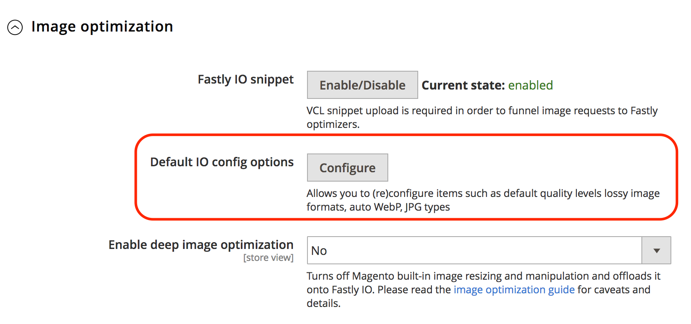
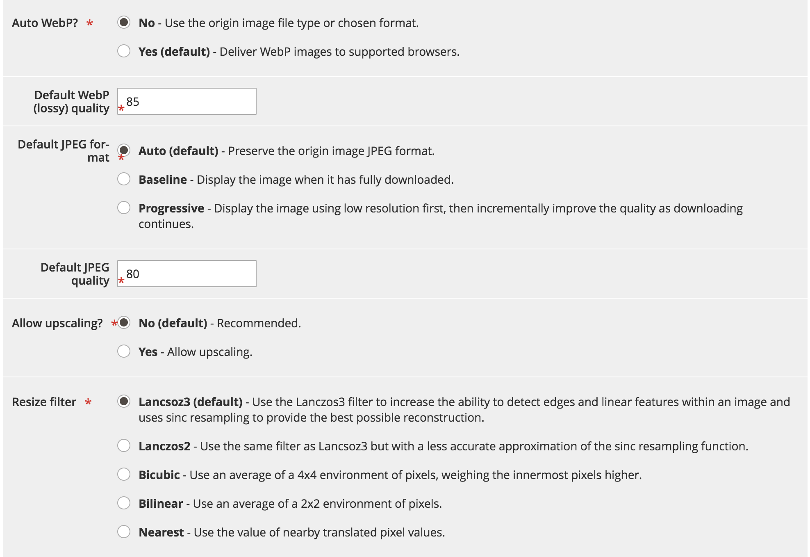
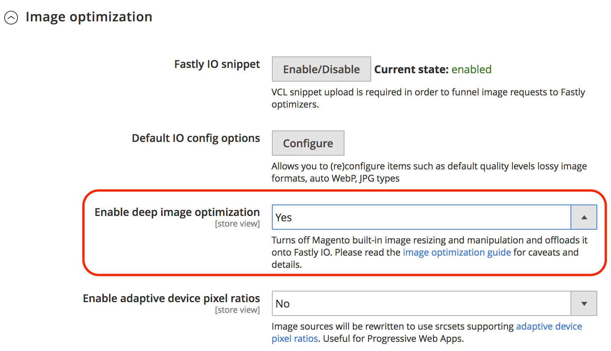
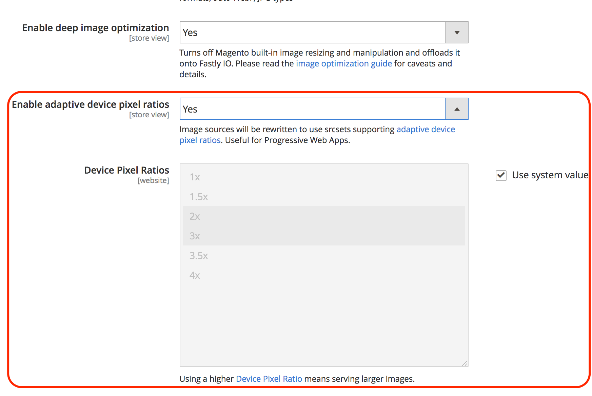

# Fastly image optimization

Fastly image optimization (Fastly IO) provides real-time image manipulation and optimization to speed up image delivery and simplify maintenance of image source sets for responsive web applications. Once configured Fastly IO provides the following image optimization features:

-  Force lossy conversion
-  Deep image optimization
-  Adaptive pixel ratios
-  Support for common image formats: PNG, JPEG, GIF, and WebP

Before you enable and configure the Fastly IO option, you must set up your Fastly service and configure Origin shielding.

Based on your configuration settings, the Fastly Image Optimization (Fastly IO) snippet inserts the VCL code to perform the image optimization that speeds up product image delivery in the storefront. There are three steps to configure the Fastly IO: Enable, Configure, and Verify.

## Enable Fastly IO

Enable Fastly image optimization (Fastly IO) from the Admin panel by uploading the Fastly IO VCL snippet. The snippet provides the Fastly configuration instructions to process all images through image optimizers, using default configurations.

**Prerequisites:**

-  Install or upgrade to Fastly module version 1.2.62 or later
-  [Configure Fastly Origin shield and back end](fastly-custom-cache-configuration.md#configure-back-ends-and-origin-shielding)

**To enable Fastly IO**:

1. Log in to your local [Admin](../../get-started/onboarding.md#access-your-admin-panel) panel as an administrator.

1. Select **Stores** > **Settings** > **Configuration** > **Advanced** > **System**.

1. In the right pane, expand **Full Page Cache**.

1. Select **Fastly Configuration** > **Image Optimization** to specify the configuration settings.

1. In the _Fastly IO snippet_ field, select **Enable/Disable**.

1. Upload the Fastly IO snippet:

   - Select **Default IO config options** to open the Image optimization default config options page.
   - Select **Upload** to upload the VCL snippet to your server.

## Configure Fastly IO

Review and update the default IO configuration settings for image optimization as needed. For example, you might want to change WebP and JPEG quality levels for lossy formats, or change the format for serving JPEG images to _Progressive_ or _Baseline_. Also, you can use Fastly IO for more granular image optimization features, such as:

-  Force lossy conversion
-  Deep image optimization
-  Adaptive pixel ratios

**To update Fastly IO**:

1. On the _Fastly Configuration_ page in the _Default IO config options_ field, select **Configure**.

   

1. Review and update the Fastly IO configuration settings on the _Image optimization default config options_ page:

   

   -  **Auto WebP?**—leave the default setting (`Yes`) to convert images to the WebP format in browsers that support it. If you change the setting to **No**, Fastly uses the image file type instead of converting the image to WebP format.

   -  **Default WebP (lossy) quality**—leave the default setting (`85`) or type the compression level for lossy file-formatted images. You can specify any whole number from 1 to 100.

   -  **Default JPEG format controls** — leave the default setting (`Auto`), or select the JPEG type to use when serving an image. If the value is set to the _Auto_, Fastly delivers images with the output type matching the input type. Select _Baseline_ to display images line by line starting from top left and going to the bottom right. Select _Progressive_ to display a blurry image that becomes clear as it loads.

   -  **Default JPEG quality**—leave the default setting (`85`) or type the compression level for quality of lossy file formats. Specify any whole number from 1 to 100.

   -  **Allow upscaling?**—leave default setting (`No`), or select `Yes` to return images larger than the original source file so they can fit the requested dimensions.

   -  **Resize filter**—leave the default setting (`Lancsoz3`), or select an alternative. This setting specifies the filter used to deliver a resized image. Depending on the filter selected, the resized image can have a higher or lower number of pixels.

      -  `Lanczos3` (default)—Delivers the best quality image. It increases the ability to detect edges and linear features within an image and uses _[!DNL sinc]_ resampling to provide the best possible reconstruction.
      -  `Lanczos2`—Uses same filter as `Lancsoz3` but with a less accurate approximation of the _[!DNL sinc]_ resampling function.
      -  `Bicubic`—Has a natural sharpening effect when making an image smaller.
      -  `Bilinear`—Has a natural smoothing effect when making an image larger.
      -  `Nearest`—Has a natural pixelation effect when resizing pixel art.

1. After you specify the IO configuration settings for the Fastly service, select **Cancel** to return to the Fastly configuration settings.

1. In the Image Optimization configuration _Enable deep image optimization_ field, select **Yes** to turn on deep image optimization.

   

   Deep image optimization is off by default. When this feature is enabled, the built-in resizing feature in Adobe Commerce is turned off and resizing work is offloaded to the Fastly IO service. Image optimization only applies to product images. CMS images are not resized. See the [Fastly documentation](#deep-image-optimization).

1. After you enable deep image optimization, enable the [adaptive pixel ratios](#adaptive-pixel-ratios) feature to generate images optimized for use in responsive websites.

   

   -  In the _Enable adaptive device pixel ratios_ field, select **Yes**.
   -  In the _Device pixel ratios_ field, accept the default setting, or select the **System Input** check box to remove the setting. Then, select the desired ratio. A higher Device Pixel Ratio setting delivers larger images.

1. Select **Save Configuration**.

### Force lossy conversion

By default the Fastly IO service forces conversion of lossless formats such as PNG, BMP, or WEBP into JPEG/WEBP format.

The advantage of forcing lossy conversion is that smaller images are served.
For example, by using JPEG or WEBp format instead of PNG, the size may be reduced by 60 to 70 percent depending on the quality level specified in the Fastly IO configuration.

Depending on the quality level selected for image optimization, you might perceive visual differences in images. For example, Alpha channel/transparencies are stripped out and replaced with a white background, unless you use Deep image optimization which uses the background color of your theme.

If you turn off lossy conversion (`WebP Auto? = No`), Fastly IO only changes JPEG images to WEBP format for compatible browsers. No other image types are changed. For example, if the original image is PNG the output from the Fastly IO service is PNG.

### Deep image optimization

Deep image optimization is off by default. Enabling this option turns off the built-in Adobe Commerce resizing and offloads it completely to the Fastly IO service.
This feature only resizes _product_ images. CMS images are not resized.

Enabling deep image optimization adds a background color definition to every image as defined in your theme. As a result, WebP images are switched from WebP lossless to WebP lossy. One of the major differences between lossless and lossy is that lossy drops the alpha channel from PNG images, which delivers much smaller images. However, images with transparencies can look odd on product and campaign pages that use a different background.

For example, the following code represents the original source for an image from the Luma theme:

```html

```

When the Fastly IO Deep image optimization feature is enabled, the original source code for the image is rewritten as shown in the following example:

```html

```

### Adaptive pixel ratios

The Adaptive pixel ratios feature is useful to optimize images for Progressive web applications. It allows you to deliver multiple image sizes and resolutions from one image source file by adding a `srcset` for each product image.

When the Adaptive pixel ratios feature is enabled, the Fastly IO service delivers a fixed-width image that can adapt to varying `device-pixel-ratios`.
For example, the service modifies the product image definition as shown in the following example:

```html

```

See `srcset` [browser support](https://caniuse.com/#feat=srcset) and [specification](https://html.spec.whatwg.org/multipage/embedded-content.html#attr-img-srcset).

## Validate Fastly IO

After you enable and configure Fastly IO, validate your configuration by performing web page speed tests with and without Fastly IO enabled. Also, review the images in your store to check image size and appearance for issues.
