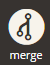

# Deploy to Staging and Production

The process for deploying and going live begins with development, continues to Staging, and ends with going live in Production. To provide the best experience for developing, testing, and deploying your store with consistent configurations we provide an end-to-end environment solution. Every environment supports direct URL access to the storefront and Admin and SSH access for CLI commands.

When you are ready to deploy your store, you must complete deployment and testing on the Staging environment before deploying to Production. This section provides in-depth instructions and information on the build and deploy process, migrating data and content, and testing.

## Starter deployment flow

We recommend creating a `staging` branch from the `master` branch to best support your Starter plan development and deployment. With this in place, you have two of your four active environments ready: `master` for Production and `staging` for Staging.

For detailed information of the process, see [Starter Develop and Deploy Workflow](../architecture/starter-develop-deploy-workflow.md).

## Pro deployment flow

Pro comes with a large Integration environment with two active branches, a global `master` branch, Staging, and Production branches. When you create your project, code is ready to branch, develop, and push for building and deploying your site. Although the Integration environment can have many branches, Staging and Production have only one branch for each environment.

For detailed information of the process, see [Pro Develop and Deploy Workflow](../architecture/pro-develop-deploy-workflow.md).

## Deploy code to staging

The Staging environment provides a near-production environment that includes a database, web server, and all services including Fastly and New Relic. You can fully push, merge, and deploy through the [Project Web Interface](../project/overview.md) or [Cloud CLI commands](../dev-tools/cloud-cli.md) through a terminal application.

### Deploy code with the Project Web Interface

The Project Web Interface provides features to create, manage, and deploy code in Integration, Staging, and Production environments for Starter and Pro plans.

**For Pro projects, deploy the Integration branch to Staging**:

1. [Log in](https://accounts.magento.cloud) to your project.
1. Select the `integration` branch.
1. Select the **Merge** option to deploy to Staging.

    

1. Complete all [testing](../test/staging-and-production.md) in the Staging environment.
1. When Staging is ready, select the **Merge** option to deploy to Production.

**For Starter, deploy the development branch to Staging**:

1. [Log in](https://accounts.magento.cloud) to your project.
1. Select the prepared code branch.
1. Select the **Merge** option to deploy to Staging.

    

1. Complete all [testing](../test/staging-and-production.md) in the Staging environment.
1. When Staging is ready, select the **Merge** option to deploy to Production (`master`).

### Deploy code with the command line

The Cloud CLI provides commands to deploy code. You need SSH and Git access to your project.

#### Step 1:  Deploy and test the Integration environment

1. After logging into the project, check out the Integration environment:

   ```bash
   magento-cloud environment:checkout <environment-ID>
   ```

1. Synchronize your local Integration environment with the remote environment:

   ```bash
   magento-cloud environment:synchronize <environment-ID>
   ```

1. Create a snapshot of the environment as a backup:

   ```bash
   magento-cloud snapshot: create -e <environment-ID>
   ```

1. Update code in your local branch as needed.

1. Add, commit, and push changes to the environment.

   ```bash
   git add -A && git commit -m "Commit message" && git push origin <environment-ID>
   ```

1. Complete site testing.

#### Step 2: Merge changes to Staging and deploy

1. Check out the Staging environment:

   ```bash
   magento-cloud environment:checkout <environment-ID>
   ```

1. Synchronize your local Staging environment with the remote environment:

   ```bash
   magento-cloud environment:synchronize <environment-ID>
   ```

1. Create a snapshot of the environment as a backup:

   ```bash
   magento-cloud snapshot: create -e <environment-ID>
   ```

1. Merge the Integration environment to Staging to deploy:

   ```bash
   magento-cloud environment:merge <integration-ID>
   ```

1. Complete site testing.

#### Step 3: Deploy to Production

1. Check out, synchronize, and create a snapshot of your local Production environment.

1. Merge the Staging environment to Production to deploy:

   ```bash
   magento-cloud environment:merge <staging-ID>
   ```

1. Complete site testing.

## Migrate static files

[Static files](https://glossary.magento.com/static-files) are stored in `mounts`. There are two methods for migrating files from a source mount location, such as your local environment, to a destination mount location. Both methods use the `rsync` utility, but we recommend using the `magento-cloud` CLI for moving files between the local and remote environment. And we recommend using the `rsync` method when moving files from a remote source to a different remote location.

### Migrate files using the CLI

You can use the `mount:upload` and `mount:download` CLI commands to migrate files between the local and remote environment. Both commands use the `rsync` utility, but the CLI commands provide options and prompts tailored to the Adobe Commerce on cloud infrastructure environment. For example, if you use the simple command with no options, the CLI prompts you to select which mount or mounts to upload or download.

```bash
magento-cloud mount:download
```

Sample response:

```terminal
Enter a number to choose a mount to download from:
  [0] app/etc
  [1] pub/static
  [2] var
  [3] pub/media
  [4] All mounts
 > 3

Target directory: ~/pub/media/

Downloading files from the remote mount pub/media to pub/media

Are you sure you want to continue? [Y/n] Y
```

**To upload files from a local `pub/media/` folder to the remote `pub/media/` folder for the current environment**:

```bash
magento-cloud mount:upload --source /path/to/project/pub/media/ --mount pub/media/
```

Sample response:

```terminal
Uploading files from pub/media to the remote mount pub/media

Are you sure you want to continue? [Y/n] Y

  building file list ...   done
  ./
  sample-file.jpeg

  sent 8.43K bytes  received 48 bytes  3.39K bytes/sec
  total size is 154.57K  speedup is 18.23
```

Use the `--help` option for the `mount:upload` and `mount:download` commands to see more options. For example, there is a `--delete` option to remove extraneous files during the migration.

### Migrate files using rsync

Alternatively, you can use the `rsync` utility to migrate files.

```bash
rsync -azvP <source> <destination>
```

This command uses the following options:

-  `a`–archive
-  `z`–compress files during the migration
-  `v`–verbose
-  `P`–partial progress

See the [rsync man page](https://linux.die.net/man/1/rsync).

>[!NOTE]
>
>To transfer media from remote-to-remote environments directly, you must enable SSH agent forwarding, see [GitHub guidance](https://docs.github.com/en/developers/overview/using-ssh-agent-forwarding).

**To migrate static files from remote-to-remote environments directly (fast approach)**:

1. Use SSH to log in to the source environment. Do not use the `magento-cloud` CLI. Using the `-A` option is important because it enables forwarding of the authentication agent connection.

    >[!TIP]
    >
    >To find the **SSH access** link in your Project Web Interface, select the environment and click **Access Site**.

   ```bash
   ssh -A <environment_ssh_link@ssh.region.magento.cloud>
   ```

1. Use the `rsync` command to copy the `pub/media` directory from your source environment to a different remote environment.

   ```bash
   rsync -azvP pub/media/ <destination_environment_ssh_link@ssh.region.magento.cloud>:pub/media/
   ```

1. Log in to the other remote environment to verify the files migrated successfully.

## Migrate the database

>[!WARNING]
>
>Database import and export operations can take a long time, which can affect site performance and availability. Schedule import and export operations during off-peak hours to prevent slow performance or outages on Production sites.

**Prerequisite:** A database dump (see Step 3) should include database triggers. For dumping them, confirm you have the [TRIGGER privilege](https://dev.mysql.com/doc/refman/5.7/en/privileges-provided.html#priv_trigger).

**Important:** The Integration environment database is strictly for development testing and can include data that you do not want to migrate into Staging and Production.

For continuous integration deployments, we **do not recommend** migrating data from Integration to Staging and Production. You could pass testing data or overwrite important data. Any vital configurations are passed using the [configuration file](../store/store-settings.md) and `setup:upgrade` command during build and deploy.

Adobe **recommends** migrating data from Production into Staging to fully test your site and store in a near-production environment with all services and settings.

>[!NOTE]
>
>To transfer media from remote-to-remote environments directly you must enable ssh agent forwarding, see [GitHub guidance](https://docs.github.com/en/developers/overview/using-ssh-agent-forwarding).

**To migrate a database**:

1. SSH into the environment you want to create a database dump from:

   ```bash
   ssh -A <environment-ssh-link@ssh.region.magento.cloud>
   ```

1. List the environment relationships to find the database login information:

   ```bash
   php -r 'print_r(json_decode(base64_decode($_ENV["MAGENTO_CLOUD_RELATIONSHIPS"]))->database);'
   ```

1. Create a database dump file in GZIP format:

   ```bash
   mysqldump -h <database-host> --user=<database-username> --password=<password> --single-transaction --triggers <database-name> | gzip - > /tmp/database.sql.gz
   ```

   For Starter environments and Pro Integration environments, use `main` as the name of the database.

   For Pro Staging and Production, the name of the database is in the `MAGENTO_CLOUD_RELATIONSHIPS` variable (typically the same as the application name and username).

   If you have configured two-factor authentication on the target environment, it is better to exclude related 2FA tables to avoid reconfiguring it after database migration:

   ```bash
   mysqldump -h <database-host> --user=<database-username> --password=<password> --single-transaction --triggers --ignore-table=tfa_user_config --ignore-table=tfa_country_codes <database name> | gzip - > /tmp/database.sql.gz
   ```

1. Transfer the database dump to another remote environment with the `rsync` command:

   ```bash
   rsync -azvP /tmp/database.sql.gz <destination-environment-ssh-link@ssh.region.magento.cloud>:/tmp
   ```

1. Type `logout` to terminate the SSH connection.

1. Open an SSH connection to the environment that you want to migrate the database into:

   ```bash
   ssh -A <destination-environment-ssh-link@ssh.region.magento.cloud>
   ```

1. Import the database dump:

   ```bash
   zcat /tmp/database.sql.gz | mysql -h <database-host> -u <username> -p<password> <database-name>
   ```

   The following example references the GZIP file created by the database dump operation:

   ```bash
   zcat /tmp/database.sql.gz | mysql -h database.internal -u user -ppassword main
   ```
