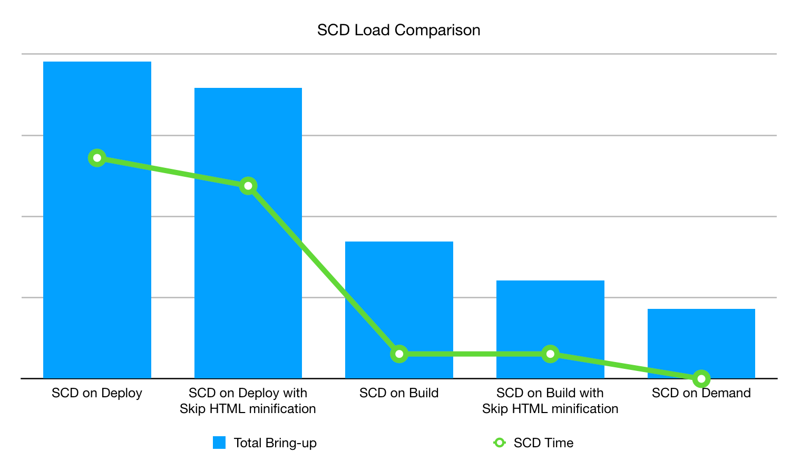

# Static content deployment strategies

Static content deployment (SCD) has a significant impact on the store deployment process that depends on how much content to generate—such as images, scripts, CSS, videos, themes, locales, and web pages—and when to generate the content. For example, the default strategy generates static content during the [deploy phase](process.md#deploy-phase-deploy-phase) when the site is in maintenance mode; however, this deployment strategy takes time to write the content directly to the mounted `pub/static` directory. You have several options or strategies to help you improve the deployment time depending on your needs.

## Optimize JavaScript and HTML content

You can use bundling and minification to build optimized JavaScript and HTML content during static content deployment.

### Minify content

You can improve the SCD load time during the deployment process if you skip copying the static view files in the `var/view_preprocessed` directory and generate _minified_ HTML when requested. You can activate this by setting the [SKIP_HTML_MINIFICATION](../environment/variables-global.md#skiphtmlminification) global environment variable to `true` in the `.magento.env.yaml` file.

>[!NOTE]
>
>Beginning with the `ece-tools` package version 2002.0.13, the default value for the SKIP_HTML_MINIFICATION variable is set to `true`.

You can save **more** deployment time and disk space by reducing the number of unnecessary theme files. For example, you can deploy the `magento/backend` theme in English and a custom theme in other languages. You can configure these theme settings with the [SCD_MATRIX](../environment/variables-deploy.md#scdmatrix) environment variable.

## Choosing a deploy strategy

Deployment strategies differ based on whether you choose to generate static content during the _build_ phase, the _deploy_ phase, or _on-demand_. As seen in the following chart, generating static content during the deploy phase is the least optimal choice. Even with minified HTML, each content file must be copied to the mounted `~/pub/static` directory, which can take a long time. Generating static content on demand seems like the optimal choice. However, if the content file does not exist in the cache it generates at the moment it is requested, which adds load time to the user experience. Therefore, generating static content during the build phase is the most optimal.



### Setting the SCD on build

Generating static content during the build phase with minified HTML is the optimal configuration for [**zero-downtime** deployments](reduce-downtime.md), also known as the **ideal state**. Instead of copying files to a mounted drive, it creates a symlink from the `./init/pub/static` directory.

Generating static content requires access to themes and locales. Adobe Commerce stores themes in the file system, which is accessible during the build phase; however, Adobe Commerce stores locales in the database. The database is _not_ available during the build phase. In order to generate the static content during the build phase, you must use the `config:dump` command in the `ece-tools` package to move locales to the file system. It reads the locales and saves them in the `app/etc/config.php` file.

**To configure your project to generate SCD on build**:

1. On your local workstation, change to your project directory.
1. Use SSH to log in to the remote environment.

   ```bash
   magento-cloud ssh
   ```

1. Move locales to the file system, then update the [`config.php` file](../development/commerce-version.md#create-a-configphp-file).

1. The `.magento.env.yaml` configuration file should contain the following values:

   -  [SKIP_HTML_MINIFICATION](../environment/variables-global.md#skip_html_minification) is `true`
   -  [SKIP_SCD](../environment/variables-build.md#skip_scd) on build stage is `false`
   -  [SCD_STRATEGY](../environment/variables-build.md#scd_strategy) is `compact`

1. Verify configuration of the [Post-deploy hook](../application/hooks-property.md) in the `.magento.app.yaml` file.

1. Verify your settings by running the [Smart wizard for the ideal state](smart-wizards.md).

   ```bash
   php ./vendor/bin/ece-tools wizard:ideal-state
   ```

### Setting the SCD on demand

Generating SCD on demand is optimal for a development workflow in the Integration environment. It decreases deployment time so that you can quickly review your implementations and run integration tests. Enable the [SCD_ON_DEMAND](../environment/variables-global.md#scdondemand) environment variable in the global stage of the `.magento.env.yaml` file. The SCD_ON_DEMAND variable overrides all other configurations related to SCD and clears existing content from the `~/pub/static` directory.

When using the SCD on-demand strategy, it helps to preload the cache with pages you expect to request, such as the home page. Add your list of expected pages in the [WARM_UP_PAGES](../environment/variables-post-deploy.md#warmuppages) environment variable in the post-deploy stage of the `.magento.env.yaml` file.

>[!WARNING]
>
>Do not use the SCD on-demand strategy in the Production environment.

### Skipping SCD

Sometimes you can choose to skip generating static content completely. You can set the [SKIP_SCD](../environment/variables-build.md#skipscd) environment variable in the global stage to ignore other configurations related to SCD. This does not affect existing content in the `~/pub/static` directory.
