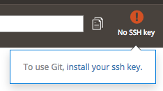

# Secure connections to remote environments

Secure Shell (SSH) is a common protocol used to securely log into remote servers and systems. You can use SSH to access your remote environments for managing the Adobe Commerce application and accessing remote environment logs. Adobe supports Secure FTP (sFTP) using your SSH public key.

## Generate an SSH key pair

Create an SSH key pair on every machine and workspace that requires access to your project source code and environments. The SSH key allows you to connect to GitHub to manage source code and to connect to cloud servers without having to constantly supply your username and password. See [Connecting to GitHub with SSH](https://docs.github.com/en/authentication/connecting-to-github-with-ssh) for further instructions on creating an SSH key pair. 

- The _public key_ is safe to provide for accessing a site, SSH, and sFTP.
- The _private key_ remains private on the workstation.

>[!CAUTION]
>
>**Never share your private key.** Do not add it to a ticket, copy it to a chat, or attach it to emails.

## Add an SSH public key to your account

After you add your SSH public key to your Adobe Commerce on cloud infrastructure account, redeploy all active environments on your account to install the key.

>[!NOTE]
>
>For Pro Staging and Production environments, you must [Submit an Adobe Commerce Support ticket](https://experienceleague.adobe.com/docs/commerce-knowledge-base/kb/help-center-guide/magento-help-center-user-guide.html#submit-ticket) with your **public** key attached. **Never provide your private SSH key.**

You can add SSH keys to your account using one of the following methods:

- Cloud CLI
- Project Web Interface
- Cloud account console

### Add your SSH key using the Cloud CLI

1. On your local workstation, change to your project directory.

1. Log in to your project:

   ```bash
   magento-cloud login
   ```

1. Add the public key.

   ```bash
   magento-cloud ssh-key:add ~/.ssh/id_rsa.pub
   ```

>[!TIP]
>
>You can list and delete SSH keys using the Cloud CLI commands `ssh-key:list` and `ssh-key:delete`.

### Add your SSH key using the Project Web Interface

1. Log in to [the Project Web Interface](https://accounts.magento.cloud/user/).

1. Click **No SSH key**. This icon is to the right of the command field and is visible when the project does not contain an SSH key.

   

1. Copy and paste the content of your public SSH key in the **Public key** field.

1. Follow the prompts to complete the task.

### Add a key from the Cloud Account dashboard

1. Log in to [your Cloud account](https://accounts.magento.cloud/user/).

1. On the account dashboard, click the **Account Settings** tab.

1. Under _SSH keys_, click **Add a public key**.

1. In the _Add an SSH key_ form, give your key a **Title**, and paste the public SSH key in the **Key** field.

1. Click **Save**.

## Connect to a remote environment

You can connect to a remote environment using the `magento-cloud` CLI or an SSH command. The `magento-cloud` CLI commands can only be used in Starter and Pro Integration environments.

### Use the Cloud CLI

**To log in to a remote integration environment**:

1. On your local workstation, change to your project directory.

1. List the environments in that project.

   ```bash
   magento-cloud environment:list -p <project-ID>
   ```

1. Use SSH to log in to the remote environment.

   ```bash
   magento-cloud ssh -p <project-ID> -e <environment-ID>
   ```

### Use an SSH command

The Project Web Interface includes a list of Web and SSH access commands for each environment.

**To copy the SSH command**:

1. Log in to the Project Web Interface.

1. Select an environment or branch to access.

1. Click **[Access site](../project/overview.md#access-site)**.

1. In the _SSH access_ section, click the clipboard button to copy the full SSH command to the clipboard.

1. Enter the command in a terminal window to open the SSH connection.

   Example SSH command:

   ```bash
   ssh abcdefg123abc-branch-a12b34c--mymagento@ssh.us-2.magento.cloud
   ```

>[!TIP]
>
>For Pro Staging and Production environments, the SSH command may look like:
>
>```bash
>ssh <node>.ent-<project-ID>-<environment>-<user-ID>@ssh.<region>.magento.com
>```

## sFTP

Adobe Commerce on cloud infrastructure supports accessing your environments using sFTP (secure FTP) with SSH authentication. Use a client that supports SSH key authentication for sFTP and use your SSH public key. Your public SSH key must be added to the target environment. For Starter environments and Pro Integration environments, you can [add it through the Project Web Interface](#add-your-ssh-key-using-the-project-web-interface).

>[!NOTE]
>
>For Pro Staging and Production, you must [Submit an Adobe Commerce Support ticket](https://experienceleague.adobe.com/docs/commerce-knowledge-base/kb/help-center-guide/magento-help-center-user-guide.html#submit-ticket) with your **public** key attached. **Never provide your private SSH key.**

When configuring sFTP, use the information from your SSH access environment command: `<project-id>-<environment-id>--<app-name>@ssh<cloud-host>`

- **Username**: All content before the `@` in your SSH access destination.
- **Password**: You do not need a password for sFTP. sFTP access uses the SSH key based authentication.
- **Host**: All content after the `@` in your SSH access.
- **Port**: 22, which is the default SSH port.
- **SSH** Private Key: If necessary, provide the location of your private key to the sFTP client. By default, private keys are stored in the `~/.ssh` directory.

Depending on the client, you may need to enter additional options and setup to complete SSH authentication for sFTP. Review the documentation for your selected client.

For **Starter environments and Pro Integration environments**, you may also want to consider [adding a `mount`](../application/properties.md#mounts) for access to a specific directory. You would add the mount to your `.magento.app.yaml` file. For a list of writable directories, see [Project structure](../project/file-structure.md). This mount point only works in those environments.

For **Pro Staging and Production environments**, you must [Submit an Adobe Commerce Support ticket](https://experienceleague.adobe.com/docs/commerce-knowledge-base/kb/help-center-guide/magento-help-center-user-guide.html#submit-ticket) to request sFTP access and a mount point for access to the specific `pub/media` folder.

## SSH tunneling

You can use SSH tunneling to connect to a service from your local development environment as if the service were local. Before tunneling, configure your [SSH](#add-an-ssh-public-key-to-your-account).

Use a terminal application to log in and issue commands.

```bash
magento-cloud login
```

Verify if any tunnels are open using.

```bash
magento-cloud tunnel:list
```

To build a tunnel, you must know the [application name](../application/properties.md#name). You can check application name using the CLI:

```bash
magento-cloud apps
```

### Set up the SSH tunnel

```bash
magento-cloud tunnel:open -e <environment-ID> --app <app-name>
```

For example, to open a tunnel to the `sprint5` branch in a project with an app named `mymagento`, enter

```bash
magento-cloud tunnel:open -e sprint5 --app mymagento
```

Sample response:

```terminal
SSH tunnel opened on port 30004 to relationship: redis
SSH tunnel opened on port 30005 to relationship: database
Logs are written to: /home/magento_user/.magento/tunnels.log

List tunnels with: magento-cloud tunnels
View tunnel details with: magento-cloud tunnel:info
Close tunnels with: magento-cloud tunnel:close
```

**To display information about your tunnel**:

```bash
magento-cloud tunnel:info -e <environment-ID>
```

### Connect to services

After establishing an SSH tunnel, you can connect to services as if running locally. For example, to connect to the database, use the following command:

```bash
mysql --host=127.0.0.1 --user='<database-username>' --pass='<user-password>' --database='<name>' --port='<port>'
```
