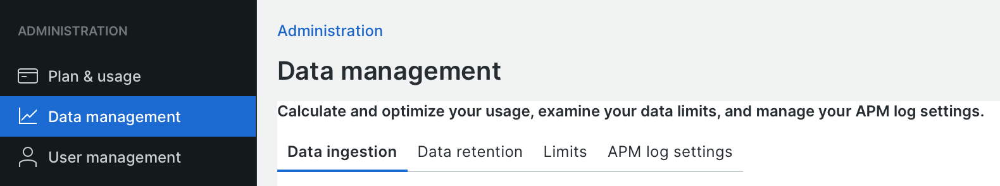

# Data ingestion

New Relic depends on rich data to provide effective monitoring and analysis, but large data sets can affect timely results, performance, and compliance. This topic provides some guidance on managing data ingestion and strategies to refine your data so that it is most effective.

New Relic provides a _Data management_ view that summarizes your plan usage by data source.

**To view your ingest data and sources**:

1. From your New Relic user menu, click **[!UICONTROL Manage your data]**.
1. Click **[!UICONTROL Data management]** in the _Administration_ list.

    

   The **[!UICONTROL Data ingestion]** tab displays data ingested for the day and the source of the data.
   The data retention tab displays and controls how long data is stored. 

1. Select the **[!UICONTROL Limits]** tab and see the limits for your account.

Data sources for Adobe Commerce include:

- **APM events**—event data used in charts and dashboards
- **Infrastructure**—process and host metrics, such as CPU, storage, networking
- **Logging**—logs for CDN, APM, and application server

Log data contributes to a large part of ingestion. See how to [View and analyze log data](log-management.md#view-and-analyze-log-data) and work with your _Solution Account Manager_ to form a strategy for data ingestion and retention needs. Read more about [managing data ingest](https://docs.newrelic.com/docs/data-apis/manage-data/manage-data-coming-new-relic/) in the _New Relic documentation_.
