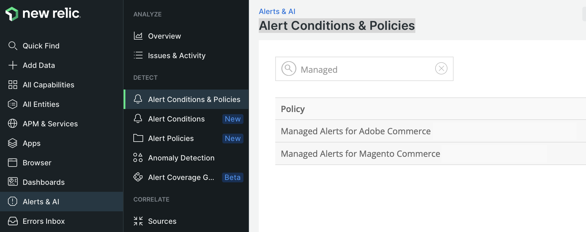

# Investigate Commerce performance with the New Relic service

New Relic connects and monitors your infrastructure and application using PHP agents. After a Cloud environment connects to New Relic, you can log in to your New Relic account to review the data collected by the agent.

On the _APM & Services_ page, select the **Summary** to view transactional information about your application. This view helps you identify potential failures and check the overall health of your application and services.

From this view, you can track transactions encountering slow responses or bottlenecks, application throughput, web errors, and more.

Review tracked data:

- **Most time consuming**—Determine time consumption by tracking requests in parallel. For example, you may have the highest transaction time spent in product and category views. If a customer account page suddenly ranks high in time consumption, your application might be affected by a call or query-dragging performance.

- **Highest throughput**—Identify pages hit the most based on the size and frequency of bytes transmitted.

All collected data details the time spent on actions that transmit data, queries, or _Redis_ data. If queries cause issues, New Relic provides information to track and respond to those issues.

>[!TIP]
>
>For details on using this data to troubleshoot application performance issues, see [Troubleshoot performance using New Relic](https://experienceleague.adobe.com/docs/commerce-knowledge-base/kb/troubleshooting/miscellaneous/troubleshoot-performance-using-new-relic-on-magento-commerce.html) in the _Adobe Commerce Help Center_.

## Monitor performance with Managed Alerts

Adobe provides the Managed Alerts for Adobe Commerce alert policy to track performance metrics.
Based on industry best practices, the policy includes a collection of alerts that set thresholds to trigger warning and critical notifications when site infrastructure or application issues affect performance. The Managed Alerts policy tracks the following metrics on Production environments only:

| Metric             | Data collection | Availability    |
|:-------------------|:----------------|:----------------|
| [!DNL Apdex] score        | APM             | Pro and Starter |
| CPU usage          | NRI             | Pro             |
| Disk space         | NRI             | Pro             |
| Error rate         | APM             | Pro and Starter |
| Memory usage       | NRI             | Pro             |
| MariaDB query load | NRI             | Pro             |
| Redis memory       | NRI             | Pro             |

When site infrastructure or application conditions trigger an alert threshold, New Relic sends alert notifications so that you can proactively address the issue. See [Managed Alerts for Adobe Commerce](https://experienceleague.adobe.com/docs/commerce-knowledge-base/kb/support-tools/managed-alerts/managed-alerts-for-magento-commerce.html) in the _Adobe Commerce Help Center_ for details about alert thresholds and troubleshooting steps to resolve the issues that triggered the alert.

>[!TIP]
>
>For Pro Staging and Integration environments and Starter environments, use [Health notifications](../integrations/health-notifications.md) to monitor disk space.

**Prerequisites:**

- Credentials to log in to the New Relic account for your Cloud project
- Verify that your Cloud environment is connected to New Relic
- Configure at least one [workflow](#set-up-a-workflow-for-notifications) to receive the alert notifications

**To review the Managed Alerts for Adobe Commerce policy**:

1. Log in to your [New Relic account](https://login.newrelic.com/login).

1. Locate the _Managed Alerts for Adobe Commerce_ policy:

   - In the Explorer navigation menu, click **Alerts & AI**.

   - Under _Detect_, click **Alert Conditions & Policies**.
   
   - Verify you have the correct Account selected at the top of the _Alert Conditions & Policies_ view.

   - In the _Policy_ list, select **Managed Alerts for Adobe Commerce** policy.

      

      >[!NOTE]
      >
      >If the Managed Alerts for Adobe Commerce policy is not available, see [Managed Alerts for Adobe Commerce](https://experienceleague.adobe.com/docs/commerce-knowledge-base/kb/support-tools/managed-alerts/managed-alerts-for-magento-commerce.html) in the _Adobe Commerce Help Center_.

1. Click the **Alert conditions** tab to review the alert conditions defined in the policy.

### Create alert policies

Do not modify any alerts included in the Managed Alerts for Adobe Commerce policy. Adobe updates and improves the alert conditions in this policy over time, which overwrites any customizations you add to the policy.

Instead of modifying an existing alert, you can create an alert policy. Then, copy the alert conditions to the new policy. See [Update policies or conditions](https://docs.newrelic.com/docs/alerts-applied-intelligence/new-relic-alerts/alert-policies/update-or-disable-policies-conditions/) in the _New Relic_ documentation.

>[!TIP]
>
>See [Introduction to alerts](https://docs.newrelic.com/docs/alerts-applied-intelligence/new-relic-alerts/learn-alerts/alerts-concepts-workflow/) in the _New Relic_ documentation for more detailed information about Alerts, alert policies, and workflows.

## Set up a workflow for notifications

You can now set up a _workflow_, formerly called a notification channel, to receive notifications based on an alert policy to monitor your Production sites. Notifications about performance issues go to all workflows associated with an alert policy when conditions on the application or infrastructure trigger an alert. You also receive notifications when an issue is acknowledged and closed.

New Relic provides templates for configuring different types of workflow notifications, including email, Slack, PagerDuty, webhooks, and more.

**To configure a workflow**:

1. Log in to your [New Relic account](https://login.newrelic.com/login).

1. Create a workflow.

   - In the Explorer navigation menu, click **Alerts & AI**.

   - In the left navigation under _Enrich & Notify_, click **Workflows**.

   - Click **Add a workflow** on the right-hand side.

      

   - On the _Configure your workflow_ page, enter a name for the workflow.

   - In the _Filter data_ section, select **Managed Alerts for Adobe Commerce** from the **[!UICONTROL Policy]** drop-down list.

   - In the _Notify_ section, select a channel and follow the instructions.

   - Click **[!UICONTROL Test workflow]** to verify your configuration.

1. Click **Activate workflow**.

See the New Relic documentation about [Workflows](https://docs.newrelic.com/docs/alerts-applied-intelligence/applied-intelligence/incident-workflows/incident-workflows/).

>[!WARNING]
>
>The alerts in the Managed Alerts for Adobe Commerce policy have default workflows configured to notify Adobe teams that support Adobe Commerce on cloud infrastructure customers. Do not modify the configuration for these default channels, and do not remove any alert policies assigned to them.
