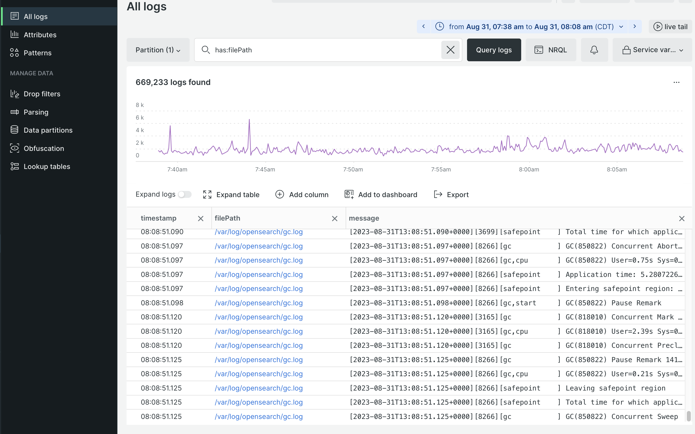
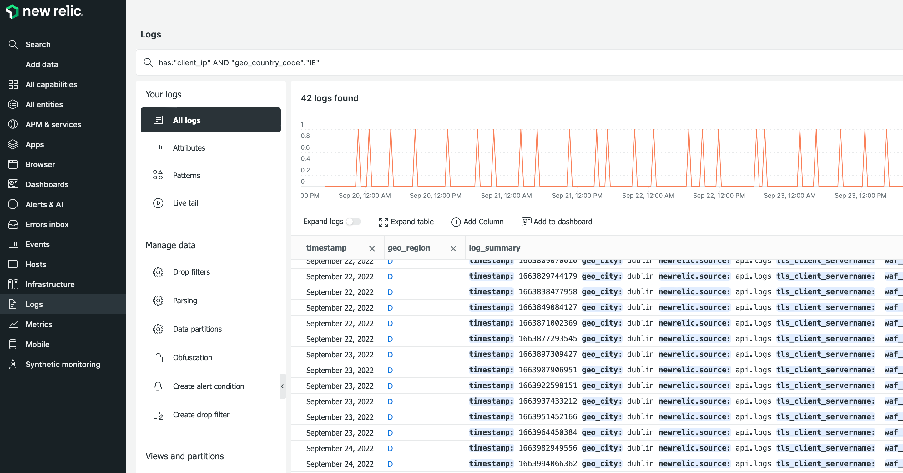

# New Relic log management

All cloud infrastructure projects include [New Relic log management](https://docs.newrelic.com/docs/logs/get-started/get-started-log-management/). The service is pre-configured to aggregate all log data from your Staging and Production environments and display it in a centralized log management dashboard.

The aggregated data includes information from the following logs:

- All `ece-tools` and application logs from the `~/var/log` directory
- Logs for cloud services from the `var/log/platform/<project-ID>` directory
- Fastly CDN and WAF

When your project is connected to New Relic, you can use the New Relic Logs service to complete tasks like the following:

- Use New Relic queries to search aggregated log data
- Visualize log data through the New Relic Logs application
- Create custom charts, dashboards, and alerts
- Troubleshoot performance issues from a single dashboard

## View and analyze log data

Use the New Relic Logs application to search across the aggregated log data and troubleshoot application, infrastructure, CDN, and WAF errors. You can create charts, dashboards, and alerts using log data collected from New Relic APM and Infrastructure services.

**To use the New Relic Logs application**:

1. Log in to your [New Relic account](https://login.newrelic.com/login).

1. Select **Logs** from the Explorer navigation menu.

1. Verify that your Account is selected at the top of the _All logs_ view.

1. Select a time range for the Logs query.

1. To review infrastructure log data for cloud services (logs from `~/var/log/`), enter the query string `has: "filePath"` in the _Search for Logs_ field. Then, click **[!UICONTROL Query logs]**.

   The names of the log files are stored in the `filePath` column, with full paths to the log file.

   

1. To review Fastly log data, enter the query string `has: "client_ip"` in the _Search for Logs_ field. Then, click **[!UICONTROL Query logs]**.

1. To filter the Fastly log results by country code, click **[!UICONTROL Add column]**, then select **[!UICONTROL geo_country_code]**.

   

>[!TIP]
>
>You can save the query view from the _Saved views_ dropdown. Click **[!UICONTROL Create new]**, provide a name, select options, and click **[!UICONTROL Save view]**.
>
>See [Get started with log management](https://docs.newrelic.com/docs/logs/get-started/get-started-log-management/) and [Introduction to the New Relic query language](https://docs.newrelic.com/docs/query-your-data/nrql-new-relic-query-language/get-started/introduction-nrql-new-relics-query-language/) on the _New Relic Docs_ site.
