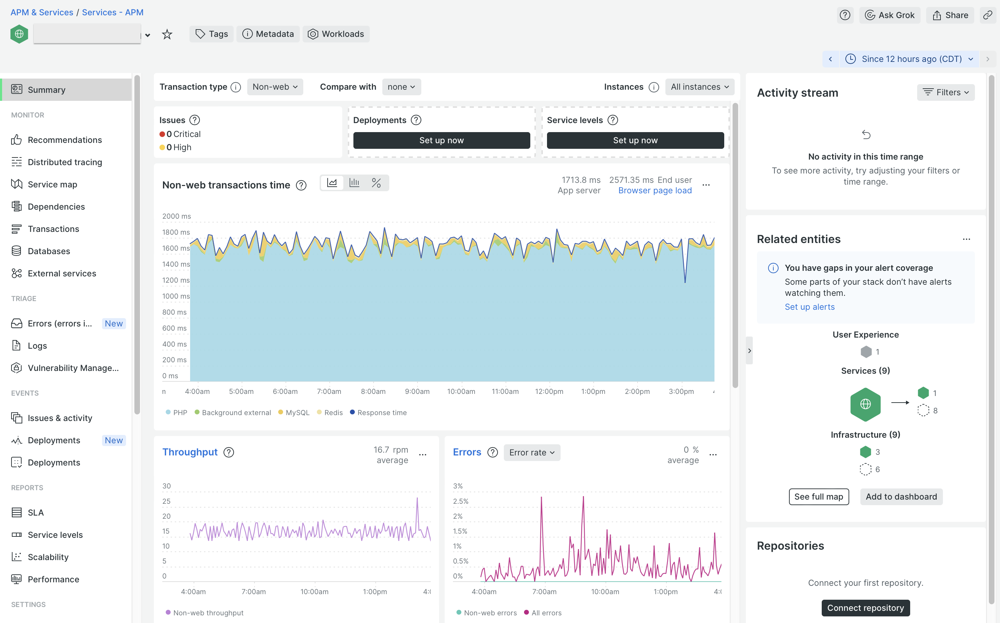
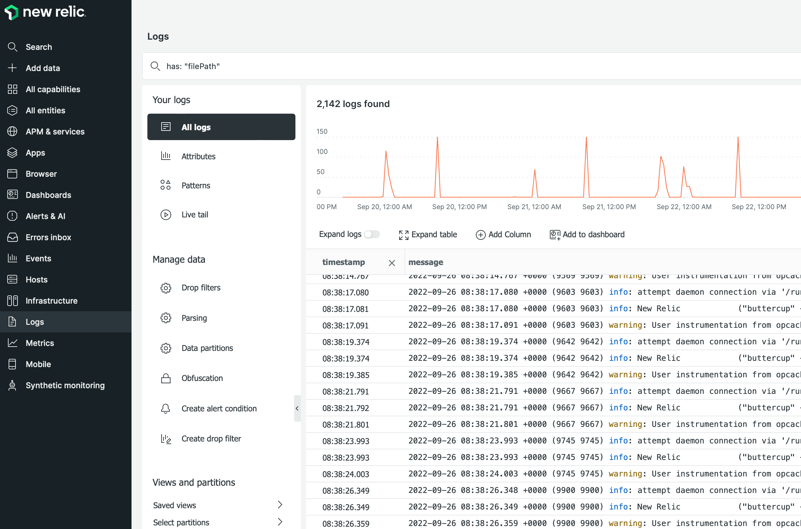
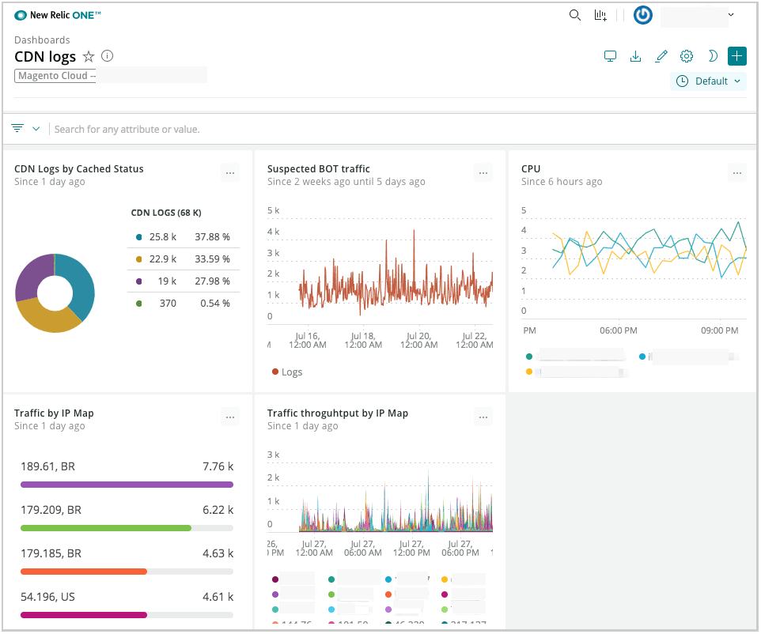
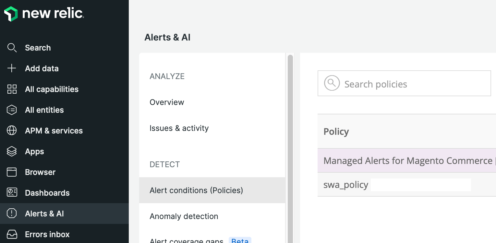
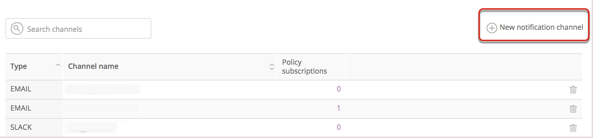
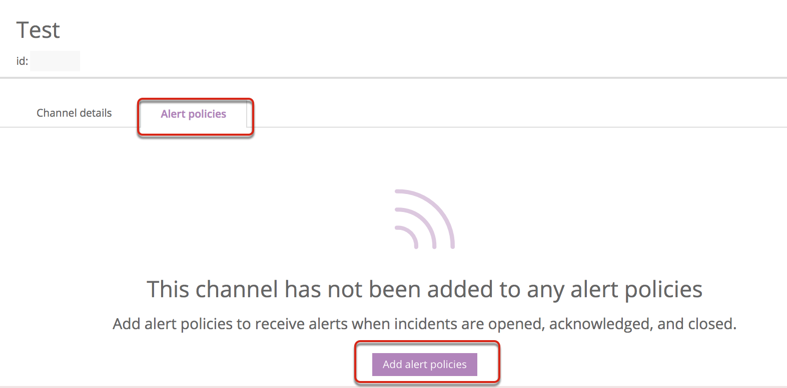

# New Relic service

All Adobe Commerce on cloud infrastructure projects include access to the following New Relic services to help manage, monitor, and troubleshoot your applications and infrastructure by collecting, viewing, and analyzing data.

-  [New Relic APM](#new-relic-apm) (Pro and Starter)
-  [New Relic Infrastructure](#new-relic-infrastructure) (Pro, Production environment only)
-  [New Relic Logs](#new-relic-logs) (Production and Staging environments)

## New Relic APM

[New Relic for application performance management (APM)][New Relic APM] is a software analytics product that helps you analyze and improve application interactions. New Relic APM is available to all Adobe Commerce on cloud infrastructure projects and provides the following features:

-  **Focus on specific transactions**—Actively mark and monitor key customer actions in your site, such as adding to the cart, checking out, or processing a payment.
-  **Database query monitoring**—Locate and monitor database queries affecting performance.
-  **App Map**—View all application dependencies within your site, extensions, and external services.
-  **[!DNL Apdex] scores**—Evaluate performance and create alerts that identify issues and notify you when they occur, such as site performance affected by a flash sale or web event. See [Apdex score][].
-  **Managed alerts for Adobe Commerce**–Use this New Relic alert policy to monitor application and infrastructure performance based on industry best practices. See [Monitor performance with the Managed alerts for Adobe Commerce alert policy](#monitor-performance-with-managed-alerts).

Your Adobe Commerce on cloud infrastructure project includes the software for the New Relic APM service along with a license key. You do not need to purchase or install any additional software.

## New Relic Infrastructure

Pro projects include the [New Relic Infrastructure (NRI)][nri] service, which automatically connects with the application data and performance analytics to provide dynamic server monitoring. This service is available on Production and Staging environments.

>[!NOTE]
>
>For Pro accounts, if New Relic APM is not installed on the Staging and Production environments or New Relic Infrastructure is not available in the Production environment, [Submit an Adobe Commerce Support ticket](https://experienceleague.adobe.com/docs/commerce-knowledge-base/kb/help-center-guide/magento-help-center-user-guide.html#submit-ticket) to request installation.

## New Relic Logs

All cloud infrastructure projects include the [New Relic Logs][] service. The service is pre-configured to aggregate all log data from your Staging and Production environments and display it in a centralized log management dashboard.

The aggregated data includes information from the following logs:

-  All `ece-tools` and application logs from the `~/var/log` directory
-  Logs for cloud services from the `var/log/platform/<project-ID>` directory
-  Fastly CDN and WAF

When your project is connected to New Relic, you can use the New Relic Logs service to complete tasks like the following:

-  Use [New Relic queries][New Relic query syntax for logs] to search aggregated log data
-  Visualize log data through the New Relic Logs application
-  Create custom charts, dashboards, and alerts
-  Troubleshoot performance issues from a single dashboard

See [View and analyze logs](#view-and-analyze-log-data).

## Manage New Relic account

When Adobe provisions your cloud infrastructure project, the License Owner receives an email from New Relic with credentials and instructions for accessing the New Relic account. If you did not receive the email, use the License Owner email address to reset the New Relic password.

A New Relic account can have only one person assigned to the Owner role. If you must change the account owner, assign the Admin role to the current Owner, then assign the Owner role to another user. See [Update the account owner](https://docs.newrelic.com/docs/accounts/original-accounts-billing/original-users-roles/users-roles-original-user-model/) in the New Relic documentation for instructions.

>[!TIP]
>
>Before assigning the Owner role to a user, verify that the user exists on the New Relic account for Adobe Commerce on cloud infrastructure. If you must add the user to that account and an existing account Owner or Admin cannot help, any user with access to the [Adobe Partnership Owner Account][] for New Relic can add users on behalf of the customer.

We recommend adding at least one **Admin** user to your New Relic account to manage all access, integrations, and tool usage. Project Owners and Admin users can add and remove users from the New Relic account. We also recommend that you do not create more than five full-access **Users**. Only grant full access to users that strictly require access to the complete feature set. There is no specific guidance on free **Restricted** users.

**To add a user**:

1. Using your License Owner New Relic credentials, [log in to New Relic][New Relic login].

1. From the [account dropdown][] menu, select **Account settings** > **Account** > **Users and roles**.

1. Click **New user**.

1. Add the name and email address for the account.

1. Assign the user role: Admin, User, or Restricted.

1. Click **Add user**.

1. Ask the new user to check their email for a New Relic notification with account information.

## Set up New Relic

Pro environments are preconfigured to use New Relic services.

For Starter environments, you must check the `.magento.app.yaml` file to verify that the `runtime` section includes the New Relic extension. If the extension has not been configured, add the following:

> `.magento.app.yaml`

```yaml
runtime:
    extensions:
        - newrelic
```

## Connect to New Relic

To connect a Cloud environment to New Relic, add the New Relic license key to the environment.

-  For Pro accounts, Adobe adds the license key to your Cloud environments during the provisioning process. You can log in to your New Relic account to verify connectivity between your Adobe Commerce on cloud infrastructure site and New Relic.

-  For Starter accounts, you have a New Relic license key that supports up to three environments. You must add the key to your environment configurations manually. The license key is not pre-provisioned on Starter environments.

### Configure New Relic for Starter environments

For Starter environments, enable the New Relic integration by adding the New Relic license key to the environment configuration. We recommend adding the key to the Staging and Production environments and one other environment of your choice. Only the New Relic license key is required for configuration. You can find information about additional configuration options in the [New Relic reporting](https://docs.magento.com/user-guide/configuration/general/new-relic-reporting.html) topic in the _Adobe Commerce User Guide_.

{{redeploy-warning}}

**Prerequisites:**

-  Log in credentials for the Adobe Commerce account page, or for the New Relic account associated with your project
-  [Admin-level access](../project/user-access.md) to the Starter environments to configure, or credentials to access the [Admin](https://docs.magento.com/user-guide/system/permissions.html) for the environment.

**To configure New Relic for Starter environments**:

1. Find your New Relic license key from the Project Web UI or the Cloud CLI.

   Account UI method:

   -  Open your cloud project [account page](https://accounts.magento.cloud/user).

   -  On the _Projects_ tab, find your project.

   -  Click **View Details** to see the project infrastructure information.

   -  Expand the **NewRelic Service** section to view the license key.

   -  Copy the license key.

   Cloud CLI method:

   ```bash
   magento-cloud subscription:info services.newrelic
   ```

1. Add the New Relic license key to an environment using the `magento-cloud` CLI, or add it from the [Admin](https://docs.magento.com/user-guide/reports/new-relic-reporting.html#step-3-configure-your-store).

   -  Change to the environment that needs the license key.

   -  Set the variable using the following `magento-cloud` CLI command:

      ```bash
      magento-cloud variable:set php:newrelic.license <newrelic-license-key>
      ```

1. [Log in to New Relic][New Relic login] to verify that you can view data from the Adobe Commerce environment. See [Investigate performance](#investigate-performance).

### Remove license key from a Starter environment

If three active Starter environments already use the same New Relic license key, and you want to configure New Relic reporting on a different environment, you must remove the key from one of the configured environments before you can reuse it.

**To remove a license key from an environment**:

1. List environment variables.

   ```bash
   magento-cloud vget
   ```

   Response:

   ```terminal
   +----------------------+------------+------------------------+
   | Name                 | Level      | Value                  |
   +----------------------+------------+------------------------+
   | php:newrelic.license | environment| <newrelic-license-key> |
   +----------------------+------------+------------------------+
   ```

   >[!WARNING]
   >
   >If you added the license key as a _project_ variable, you must remove that project-level variable. A project variable adds the license to every environment branch created, which can consume or exceed the license limit. To list project variables: `magento-cloud pvget`

1. Delete the license variable.

   ```bash
   magento-cloud variable:delete php:newrelic.license
   ```

## Use New Relic

The following sections provide an overview for using the New Relic services integrated with your Adobe Commerce on cloud infrastructure project with a few examples.

### Investigate performance

New Relic connects and monitors your infrastructure and application using PHP agents. After a Cloud environment [connects to New Relic](#connect-to-new-relic), you can log in to your New Relic account to review the data collected by the agent.

On the APM Applications page, use the [New Relic APM Overview] to view information about your application.



From this view, you can track and find the following types of information:

-  Applications and transactions encountering slow responses or bottlenecks
-  Customer comments about issues with your site
-  Applications with high transaction time
-  Traffic to transaction time

We recommend reviewing tracked data:

-  **Most time consuming**—Determine time consumption by tracking requests in parallel. For example, you may have the highest transaction time spent in product and category views. If a customer account page suddenly ranks high in time consumption, your application might be affected by a call or query-dragging performance.

-  **Highest throughput**—Identify pages hit the most based on the size and frequency of bytes transmitted.

All collected data details the time spent on actions that transmit data, queries, or _Redis_ data. If queries cause issues, New Relic provides information to track and respond to those issues.

For details on using this data to troubleshoot application performance issues, see [Troubleshoot performance using New Relic](https://experienceleague.adobe.com/docs/commerce-knowledge-base/kb/troubleshooting/miscellaneous/troubleshoot-performance-using-new-relic-on-magento-commerce.html) in the _Adobe Commerce Help Center_.

>[!NOTE]
>
>You can learn more about using the New Relic APM and Infrastructure agents to collect and analyze application data from the [New Relic APM][] and [New Relic Infrastructure][nri] documentation.

### View and analyze log data

You can use the New Relic Logs application to search across the aggregated log data and troubleshoot application, infrastructure, CDN, and WAF errors. Also, you can connect the log data with other data collected by New Relic APM and Infrastructure services to create charts, dashboards, and alerts to manage application and cloud service operations.

**To use the New Relic Logs application**:

1. Use your New Relic credentials to [log in to your New Relic account][New Relic login].

1. Select the application name in the **Services - APM** list.

1. Select **Logs** from the Explorer navigation menu.

1. To review infrastructure log data for cloud services, enter the query string `has: "filePath"` in the _Find logs where_ field. Then, click **Query logs**.
   The names of the log files are stored in the `filePath` field, with full paths to the log file.

   

1. To review Fastly log data, enter the query string `has: "client_ip"` in the _Find logs where_ field. Then, click **Query logs**.

1. To filter the Fastly log results further, select an attribute from the left menu, then click **Query logs** to apply the updated query.

   For example, to query the Fastly data by country code, select the _Geo Country Code_ attribute.

   

The following example shows a New Relic Insights dashboard created from queries against the Fastly CDN log data:



See [Get started with log management][New Relic Logs] and [Introduction to New Relic's query language][nrql] on the _New Relic Docs_ site.

### Monitor performance with Managed Alerts

Adobe provides the Managed Alerts for Adobe Commerce alert policy to track performance metrics.
Based on industry best practices, the policy includes a collection of alerts that set thresholds to trigger warning and critical notifications when site infrastructure or application issues affect performance. The Managed Alerts policy tracks the following metrics on Production environments only:

| Metric        | Data collection | Availability    |
|:--------------|:----------------|:----------------|
| [Apdex score][] | APM             | Pro and Starter |
| error rate    | APM             | Pro and Starter |
| disk space    | NRI             | Pro             |
| CPU usage     | NRI             | Pro             |
| memory usage  | NRI             | Pro             |
| Redis         | NRI             | Pro             |
| MariaDB       | NRI             | Pro             |

When site infrastructure or application conditions trigger an alert threshold, New Relic sends alert notifications so that you can proactively address the issue. See [Managed Alerts for Adobe Commerce][] in the _Adobe Commerce Help Center_ for details about alert thresholds and troubleshooting steps to resolve the issues that triggered the alert.

>[!TIP]
>
>For Pro Staging and Integration environments and Starter environments, use [Health notifications](../integrations/health-notifications.md) to monitor disk space.

**Prerequisites:**

-  Credentials to log in to the New Relic account for your Cloud project
-  Verify that your Cloud environment is [connected to New Relic](#connect-to-new-relic)
-  Configure at least one [notification channel](#configure-notification-channels) to receive the alert notifications

**To review the Managed Alerts for Adobe Commerce policy**:

1. Use your New Relic credentials to [log in to your New Relic account][New Relic login].

1. Locate the _Managed Alerts for Adobe Commerce_ policy:

   -  In the Explorer navigation menu, click **Alerts & AI**.

   -  In the left navigation under _Detect_, click **Alert conditions (Policies)**.

   -  In the _Policy_ list, select **Managed Alerts for Magento Commerce** policy.

      

      >[!NOTE]
      >
      >If the Managed Alerts for Magento Commerce alert policy is not available, see [Managed Alerts for Adobe Commerce][] in the _Adobe Commerce Help Center_.

1. Click the **Alert conditions** tab to review the alert conditions defined in the policy.

### Configure notification channels

To use Managed Alerts for Adobe Commerce to monitor your Production sites, you must configure at least one notification channel and map it to the alert policy.

Notifications about performance issues go to all channels associated with an alert policy when conditions on the application or infrastructure trigger an alert. You also receive notifications when an issue is acknowledged and closed.

New Relic provides templates for configuring different types of notification channels including email, Slack, PagerDuty, webhooks, and more.

**To configure a notification channel**:

1. Choose a notification channel type, and complete any [prerequisite steps](https://docs.newrelic.com/docs/alerts-applied-intelligence/new-relic-alerts/alert-notifications/notification-channels-control-where-send-alerts/#channel-types) required to connect the channel with the New Relic service.

1. Use your New Relic credentials to [log in to your New Relic account][New Relic login].

1. Create a notification channel.

   -  In the Explorer navigation menu, click **Alerts & AI**.

   -  In the left navigation under _Alerts (Classic)_, click **Channels**.

   -  Click **New notification channel** on the right-hand side.

      

   -  On the _Create notification channel_ page, select the channel type and complete the steps to configure, create, save, and send a test notification to verify that the channel works.

   -  Click **Create Channel**.

1. Specify the alerts to send to the channel.

   -  On the new channel page, click the **Alert policies** tab.

   -  On the _Alert policies_ tab, click **Add alert policies**.

      

   -  Select the **Managed Alerts for Magento Commerce** alert policy.

   -  Click **Save changes**.

See the following New Relic documentation topics for additional information:

-  Configure [notification channels](https://docs.newrelic.com/docs/alerts-applied-intelligence/new-relic-alerts/alert-notifications/notification-channels-control-where-send-alerts/) using the New Relic Alerts user interface

-  Configure notification channels using the [New Relic API](https://docs.newrelic.com/docs/alerts-applied-intelligence/new-relic-alerts/advanced-alerts/rest-api-alerts/rest-api-calls-alerts/)

>[!WARNING]
>
>The alerts in the Managed Alerts for Adobe Commerce policy have default notification channels configured to notify Adobe teams that support Adobe Commerce on cloud infrastructure customers. Do not modify the configuration for these default channels, and do not remove any alert policies assigned to them.

### Create alert policies

Do not modify any alerts included in the Managed Alerts for Magento Commerce policy. We update and improve the alert conditions in this policy over time, which overwrites any customizations you add to the policy.

Instead of modifying an existing alert, you can create an alert policy. Then, copy the alert conditions to the new policy. See [Update policies or conditions][] in the New Relic documentation.

>[!TIP]
>
>See [Alerts concepts and workflow][] in the _New Relic_ documentation for more detailed information about Alerts, alert policies, and notification channels.

<!-- link definitions -->

[account dropdown]: https://docs.newrelic.com/docs/new-relic-solutions/get-started/glossary/#account-dropdown
[Adobe Partnership Owner Account]: https://account.newrelic.com/accounts/1311131/users
[Alerts concepts and workflow]: https://docs.newrelic.com/docs/alerts-applied-intelligence/new-relic-alerts/learn-alerts/alerts-concepts-workflow/
[Apdex score]: https://docs.newrelic.com/docs/apm/new-relic-apm/apdex/apdex-measure-user-satisfaction/
[Managed Alerts for Adobe Commerce]: https://experienceleague.adobe.com/docs/commerce-knowledge-base/kb/support-tools/managed-alerts/managed-alerts-for-magento-commerce.html
[New Relic APM]: https://docs.newrelic.com/docs/apm/new-relic-apm/getting-started/introduction-apm/
[New Relic APM Overview]: https://docs.newrelic.com/docs/apm/apm-ui-pages/monitoring/apm-summary-page-view-transaction-apdex-usage-data/
[nri]: https://newrelic.com/platform/infrastructure
[New Relic login]: https://login.newrelic.com/login
[New Relic Logs]: https://docs.newrelic.com/docs/logs/get-started/get-started-log-management/
[nrql]: https://docs.newrelic.com/docs/query-your-data/nrql-new-relic-query-language/get-started/introduction-nrql-new-relics-query-language/
[New Relic query syntax for logs]: https://docs.newrelic.com/docs/logs/ui-data/query-syntax-logs/
[Update policies or conditions]:https://docs.newrelic.com/docs/alerts-applied-intelligence/new-relic-alerts/alert-policies/update-or-disable-policies-conditions/
