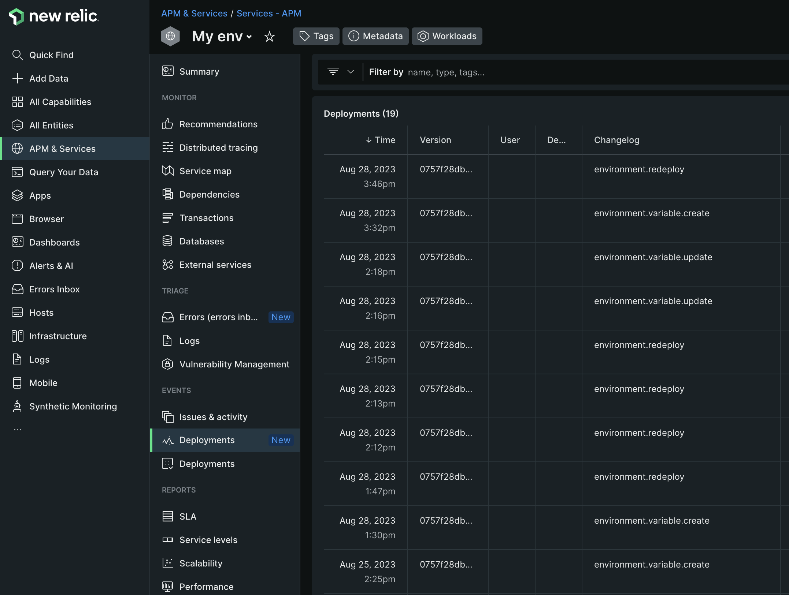

# Track deployments

You can enable the New Relic _Track changes_ feature to monitor deployment events on your Commerce on cloud infrastructure project. 

The Deployments data collection helps analyze the impact of deployment changes to overall performance, such as CPU, memory, response time, and more. See [Track changes using NerdGraph](https://docs.newrelic.com/docs/change-tracking/change-tracking-graphql/) in the _New Relic documentation_.

>[!PREREQUISITES]
>
>- `NR_API_URL`: New Relic API endpoint, in this case NerdGraph API URL `https://api.newrelic.com/graphql`
>- `NR_API_KEY`: Create a user key, see [New Relic API Keys](https://docs.newrelic.com/docs/apis/intro-apis/new-relic-api-keys) in the _New Relic_ documentation.
>- `NR_APP_GUID`: An entity that reports data to New Relic has a unique ID (GUID). As an example, to enable on a Staging environment, adjust the Staging environment `NR_APP_GUID` cloud variable with the _staging entity GUID_ from New Relic. See the [NerdGraph tutorial: View entity data](https://docs.newrelic.com/docs/apis/nerdgraph/examples/nerdgraph-entities-api-tutorial/) in the _New Relic_ documentation.

## Enable Track deployments

Track your Commerce project deployment events in New Relic by creating a _script_ integration.

**To enable the track deployments**:

1. On your local workstation, change to your project directory.
1. Create an `action-integration.js` file. Copy the following code and paste it in the `action-integration.js` file and save:

    ```javascript
    function variables() {
        var vars = {};
        activity.payload.deployment.variables.forEach(function(variable) {
            vars[variable.name] = variable.value;
        });
        return vars;
    }

    function trackDeployments() {
        const config = JSON.parse(variables()['env:NR_CONFIG'].replace(/'/g, '"'));
        const commitSha = activity.payload.commits ? activity.payload.commits[0].sha : activity.payload.environment.head_commit;
        const deploymentType = activity.type;

        if (!config.NR_APP_GUID || !config.NR_API_KEY || !config.NR_API_URL) {
            throw new Error('You must define the next configuation in the env variable NR_CONFIG: NR_APP_GUID, NR_API_KEY and NR_API_URL');
        }

        const query = `mutation {
            changeTrackingCreateDeployment(
            deployment: {
                version: "${commitSha}",
                entityGuid: "${config.NR_APP_GUID}",
                commit: "${commitSha}",
                changelog: "${deploymentType}"
            }
            ) {
            deploymentId
            entityGuid
            }
        }`;

        var resp = fetch(config.NR_API_URL, {
            method: 'POST',
            headers: {
                'Content-Type': 'application/json',
                'API-Key': config.NR_API_KEY
            },
            body: JSON.stringify({
                query
            })
        });

        if (!resp.ok) {
            console.log('Sending new relic change tracking failed: ' + resp.text());
        } else {
            console.log(resp.text());
        }
    }

    trackDeployments();
    ```

1. Create a _script_ integration using the `magento-cloud` CLI command and reference the `action-integration.js` file.

    ```bash
    magento-cloud integration:add --type script --events='environment.restore, environment.push, environment.branch, environment.activate, environment.synchronize, environment.initialize, environment.merge, environment.redeploy, environment.variable.create, environment.variable.delete, environment.variable.update' --file ./action-integration.js --project=<YOUR_PROJECT_ID> --environments=<YOUR_ENVIRONMENT_ID>
    ```

   Sample response:

    ```terminal
    Created integration 767u4hathojjw (type: script)
    +-----------------------+-----------------------------------------------------------------------------------------------------------------------------------------+
    | Property              | Value                                                                                                                                   |
    +-----------------------+-----------------------------------------------------------------------------------------------------------------------------------------+
    | id                    | 767u4hathojjw                                                                                                                           |
    | type                  | script                                                                                                                                  |
    | role                  |                                                                                                                                         |
    | events                | - environment.restore                                                                                                                   |
    |                       | - environment.push                                                                                                                      |
    |                       | - environment.branch                                                                                                                    |
    |                       | - environment.activate                                                                                                                  |
    |                       | - environment.synchronize                                                                                                               |
    |                       | - environment.initialize                                                                                                                |
    |                       | - environment.merge                                                                                                                     |
    |                       | - environment.redeploy                                                                                                                  |
    |                       | - environment.variable.create                                                                                                           |
    |                       | - environment.variable.delete                                                                                                           |
    |                       | - environment.variable.update                                                                                                           |
    | environments          | - staging                                                                                                                               |
    | excluded_environments | {  }                                                                                                                                    |
    | states                | - complete                                                                                                                              |
    | result                | *                                                                                                                                       |
    | script                | function variables() {                                                                                                                  |
    |                       |     var vars = {};                                                                                                                      |
    |                       |     activity.payload.deployment.variables.forEach(function(variable) {                                                                  |
    |                       |         vars[variable.name] = variable.value;                                                                                           |
    |                       |     });                                                                                                                                 |
    |                       |     return vars;                                                                                                                        |
    |                       | }                                                                                                                                       |
    |                       |                                                                                                                                         |
    |                       | function trackDeployments() {                                                                                                           |
    |                       |     const config = JSON.parse(variables()['env:NR_CONFIG'].replace(/'/g, '"'));                                                         |
    |                       |     const commitSha = activity.payload.commits ? activity.payload.commits[0].sha : activity.payload.environment.head_commit;            |
    |                       |     const deploymentType = activity.type;                                                                                               |
    |                       |                                                                                                                                         |
    |                       |     if (!config.NR_APP_GUID || !config.NR_API_KEY || !config.NR_API_URL) {                                                              |
    |                       |         throw new Error('You must define the next configuation in the env variable NR_CONFIG: NR_APP_GUID, NR_API_KEY and NR_API_URL'); |
    |                       |     }                                                                                                                                   |
    |                       |                                                                                                                                         |
    |                       |     const query = `mutation {                                                                                                           |
    |                       |         changeTrackingCreateDeployment(                                                                                                 |
    |                       |           deployment: {                                                                                                                 |
    |                       |             version: "${commitSha}",                                                                                                    |
    |                       |             entityGuid: "${config.NR_APP_GUID}",                                                                                        |
    |                       |             commit: "${commitSha}",                                                                                                     |
    |                       |             changelog: "${deploymentType}"                                                                                              |
    |                       |           }                                                                                                                             |
    |                       |         ) {                                                                                                                             |
    |                       |           deploymentId                                                                                                                  |
    |                       |           entityGuid                                                                                                                    |
    |                       |         }                                                                                                                               |
    |                       |     }`;                                                                                                                                 |
    |                       |                                                                                                                                         |
    |                       |     var resp = fetch(config.NR_API_URL, {                                                                                               |
    |                       |         method: 'POST',                                                                                                                 |
    |                       |         headers: {                                                                                                                      |
    |                       |             'Content-Type': 'application/json',                                                                                         |
    |                       |             'API-Key': config.NR_API_KEY                                                                                                |
    |                       |         },                                                                                                                              |
    |                       |         body: JSON.stringify({                                                                                                          |
    |                       |             query                                                                                                                       |
    |                       |         })                                                                                                                              |
    |                       |     });                                                                                                                                 |
    |                       |                                                                                                                                         |
    |                       |     if (!resp.ok) {                                                                                                                     |
    |                       |         console.log('Sending new relic change tracking failed: ' + resp.text());                                                        |
    |                       |     } else {                                                                                                                            |
    |                       |         console.log(resp.text());                                                                                                       |
    |                       |     }                                                                                                                                   |
    |                       | }                                                                                                                                       |
    |                       |                                                                                                                                         |
    |                       | trackDeployments();                                                                                                                     |
    |                       |                                                                                                                                         |
    +-----------------------+-----------------------------------------------------------------------------------------------------------------------------------------+
    ```

1. Make a note of the integration ID for later use. In this example, the ID is:

    ```terminal
    Created integration 767u4hathojjw (type: script)
    ```

   Optionally, you can verify the integration and note the integration ID using: `magento-cloud integration:list`

1. Create the environment variable using the prerequisites.

    ```bash
    magento-cloud variable:create --level environment --name=env:NR_CONFIG --value='{"NR_API_KEY": "<YOUR_API_KEY>", "NR_API_URL": "https://api.newrelic.com/graphql", "NR_APP_GUID":"<YOUR_APP_GUID>"}'  -p <YOUR_PROJECT_ID> -e <YOUR_ENVIRONMENT_ID>
    ```

1. Review the last activity log.

   ```bash
   magento-cloud integration:activity:log <INTEGRATION_ID> -p <YOUR_PROJECT_ID> -e <YOUR_ENVIRONMENT_ID>
   ```

   Response:

    ```terminal
    Integration ID: 767u4hathojjw
    Activity ID: poxqidsfajkmg
    Type: integration.script
    Description: Running activity script
    Created: 2023-08-28T20:32:02+00:00
    State: complete
    Log:
    HTTP request
    HTTP response
    {"data":{"changeTrackingCreateDeployment":{"deploymentId":"some-deployment-id","entityGuid":"SomeGUIDhere"}}}
    ```

1. Log in to your [New Relic account](https://login.newrelic.com/login).

1. In the Explorer navigation menu, click **[!UICONTROL APM & Services]**. Select your environment [!UICONTROL Name] and [!UICONTROL Account].

1. Under _Events_, click **[!UICONTROL Deployments]**.

   
