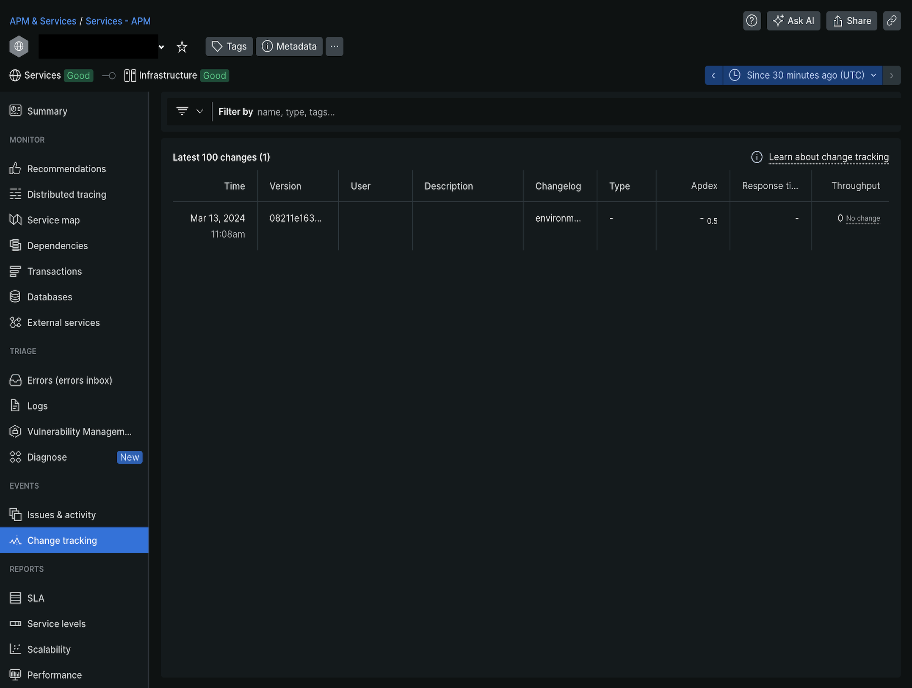

# Track deployments

You can enable the New Relic change-tracking feature to build NerdGraph charts that track deployment changes.

The Deployments chart helps you to analyze the impact on your Commerce on cloud infrastructure project, such as CPU, memory, response time, and more. See [Track changes using NerdGraph](https://docs.newrelic.com/docs/change-tracking/change-tracking-graphql/) in the _New Relic documentation_ to learn about the Track changes features.

>[!PREREQUISITES]
>
>- **New Relic API endpoint** `NR_API_URL`: NerdGraph API URL `https://api.newrelic.com/graphql`
>- **New Relic API Key** `NR_API_KEY`: How to access your [New Relic API Keys](https://docs.newrelic.com/docs/apis/intro-apis/new-relic-api-keys)
>- **NR_APP_GUID**: GUID's are unique to a New Relic entity, choose meta data from the menu next to an entity name in New Relic app or use the [Nerdgraph entities API tutorial](https://docs.newrelic.com/docs/apis/nerdgraph/examples/nerdgraph-entities-api-tutorial/). If you wish to set this up for a Staging environment adjust the Staging environment NR_APP_GUID cloud variable with the staging entity GUID from New Relic.

## Enable Track deployments

The following steps you through the process of configuring your Commerce on cloud infrastructure project to track deployment events with New Relic.

**To enable the track deployments**:

1. Create a file `action-integration.js` with the next code:

    ```javascript
    function variables() {
        var vars = {};
        activity.payload.deployment.variables.forEach(function(variable) {
            vars[variable.name] = variable.value;
        });
        return vars;
    }

    function trackDeployments() {
        const config = JSON.parse(variables()['env:NR_CONFIG'].replace(/'/g, '"'));
        const commitSha = activity.payload.commits ? activity.payload.commits[0].sha : activity.payload.environment.head_commit;
        const deploymentType = activity.type;

        if (!config.NR_APP_GUID || !config.NR_API_KEY || !config.NR_API_URL) {
            throw new Error('You must define the next configuation in the env variable NR_CONFIG: NR_APP_GUID, NR_API_KEY and NR_API_URL');
        }

        const query = `mutation {
            changeTrackingCreateDeployment(
            deployment: {
                version: "${commitSha}",
                entityGuid: "${config.NR_APP_GUID}",
                commit: "${commitSha}",
                changelog: "${deploymentType}"
            }
            ) {
            deploymentId
            entityGuid
            }
        }`;

        var resp = fetch(config.NR_API_URL, {
            method: 'POST',
            headers: {
                'Content-Type': 'application/json',
                'API-Key': config.NR_API_KEY
            },
            body: JSON.stringify({
                query
            })
        });

        if (!resp.ok) {
            console.log('Sending new relic change tracking failed: ' + resp.text());
        } else {
            console.log(resp.text());
        }
    }

    trackDeployments();
    ```

1. Using magento-cloud cli tool add the integration to your environment:

    ```bash
    magento-cloud magento-cloud integration:add --type script --events='environment.restore, environment.push, environment.branch, environment.activate, environment.synchronize, environment.initialize, environment.merge, environment.redeploy, environment.variable.create, environment.variable.delete, environment.variable.update' --file ./action-integration.js --project=<YOUR_PROJECT_ID> --environments=<YOUR_ENVIRONMENT_ID>
    ```

   Response:

    ```terminal
    Created integration 767u4hathojjw (type: script)
    +-----------------------+-----------------------------------------------------------------------------------------------------------------------------------------+
    | Property              | Value                                                                                                                                   |
    +-----------------------+-----------------------------------------------------------------------------------------------------------------------------------------+
    | id                    | 767u4hathojjw                                                                                                                           |
    | type                  | script                                                                                                                                  |
    | role                  |                                                                                                                                         |
    | events                | - environment.restore                                                                                                                   |
    |                       | - environment.push                                                                                                                      |
    |                       | - environment.branch                                                                                                                    |
    |                       | - environment.activate                                                                                                                  |
    |                       | - environment.synchronize                                                                                                               |
    |                       | - environment.initialize                                                                                                                |
    |                       | - environment.merge                                                                                                                     |
    |                       | - environment.redeploy                                                                                                                  |
    |                       | - environment.variable.create                                                                                                           |
    |                       | - environment.variable.delete                                                                                                           |
    |                       | - environment.variable.update                                                                                                           |
    | environments          | - staging                                                                                                                               |
    | excluded_environments | {  }                                                                                                                                    |
    | states                | - complete                                                                                                                              |
    | result                | *                                                                                                                                       |
    | script                | function variables() {                                                                                                                  |
    |                       |     var vars = {};                                                                                                                      |
    |                       |     activity.payload.deployment.variables.forEach(function(variable) {                                                                  |
    |                       |         vars[variable.name] = variable.value;                                                                                           |
    |                       |     });                                                                                                                                 |
    |                       |     return vars;                                                                                                                        |
    |                       | }                                                                                                                                       |
    |                       |                                                                                                                                         |
    |                       | function trackDeployments() {                                                                                                           |
    |                       |     const config = JSON.parse(variables()['env:NR_CONFIG'].replace(/'/g, '"'));                                                         |
    |                       |     const commitSha = activity.payload.commits ? activity.payload.commits[0].sha : activity.payload.environment.head_commit;            |
    |                       |     const deploymentType = activity.type;                                                                                               |
    |                       |                                                                                                                                         |
    |                       |     if (!config.NR_APP_GUID || !config.NR_API_KEY || !config.NR_API_URL) {                                                              |
    |                       |         throw new Error('You must define the next configuation in the env variable NR_CONFIG: NR_APP_GUID, NR_API_KEY and NR_API_URL'); |
    |                       |     }                                                                                                                                   |
    |                       |                                                                                                                                         |
    |                       |     const query = `mutation {                                                                                                           |
    |                       |         changeTrackingCreateDeployment(                                                                                                 |
    |                       |           deployment: {                                                                                                                 |
    |                       |             version: "${commitSha}",                                                                                                    |
    |                       |             entityGuid: "${config.NR_APP_GUID}",                                                                                        |
    |                       |             commit: "${commitSha}",                                                                                                     |
    |                       |             changelog: "${deploymentType}"                                                                                              |
    |                       |           }                                                                                                                             |
    |                       |         ) {                                                                                                                             |
    |                       |           deploymentId                                                                                                                  |
    |                       |           entityGuid                                                                                                                    |
    |                       |         }                                                                                                                               |
    |                       |     }`;                                                                                                                                 |
    |                       |                                                                                                                                         |
    |                       |     var resp = fetch(config.NR_API_URL, {                                                                                               |
    |                       |         method: 'POST',                                                                                                                 |
    |                       |         headers: {                                                                                                                      |
    |                       |             'Content-Type': 'application/json',                                                                                         |
    |                       |             'API-Key': config.NR_API_KEY                                                                                                |
    |                       |         },                                                                                                                              |
    |                       |         body: JSON.stringify({                                                                                                          |
    |                       |             query                                                                                                                       |
    |                       |         })                                                                                                                              |
    |                       |     });                                                                                                                                 |
    |                       |                                                                                                                                         |
    |                       |     if (!resp.ok) {                                                                                                                     |
    |                       |         console.log('Sending new relic change tracking failed: ' + resp.text());                                                        |
    |                       |     } else {                                                                                                                            |
    |                       |         console.log(resp.text());                                                                                                       |
    |                       |     }                                                                                                                                   |
    |                       | }                                                                                                                                       |
    |                       |                                                                                                                                         |
    |                       | trackDeployments();                                                                                                                     |
    |                       |                                                                                                                                         |
    +-----------------------+-----------------------------------------------------------------------------------------------------------------------------------------+
    ```

   Using the id you can check logs, updated the integration and so on.

1. Add the environment variable with configuration collected in the first step:

    ```bash
    magento-cloud variable:create --level environment --name=env:NR_CONFIG --value='{"NR_API_KEY": "<YOUR_API_KEY>", "NR_API_URL": "https://api.newrelic.com/graphql", "NR_APP_GUID":"<YOUR_APP_GUID>"}'  -p <YOUR_PROJECT_ID> -e <YOUR_ENVIRONMENT_ID>
    ```

1. You can check the last activity log:

   ```bash
   magento-cloud integration:activity:log <INTEGRATION_ID_FROM_STEP_2> -p <YOUR_PROJECT_ID> -e <YOUR_ENVIRONMENT_ID>
   ```

   Response:

    ```terminal
    Integration ID: 767u4hathojjw
    Activity ID: poxqidsfajkmg
    Type: integration.script
    Description: Running activity script
    Created: 2023-08-28T20:32:02+00:00
    State: complete
    Log:
    HTTP request
    HTTP response
    {"data":{"changeTrackingCreateDeployment":{"deploymentId":"some-deployment-id","entityGuid":"SomeGUIDhere"}}}
    ```

1. Open your project in New Relic and check deployments

   
