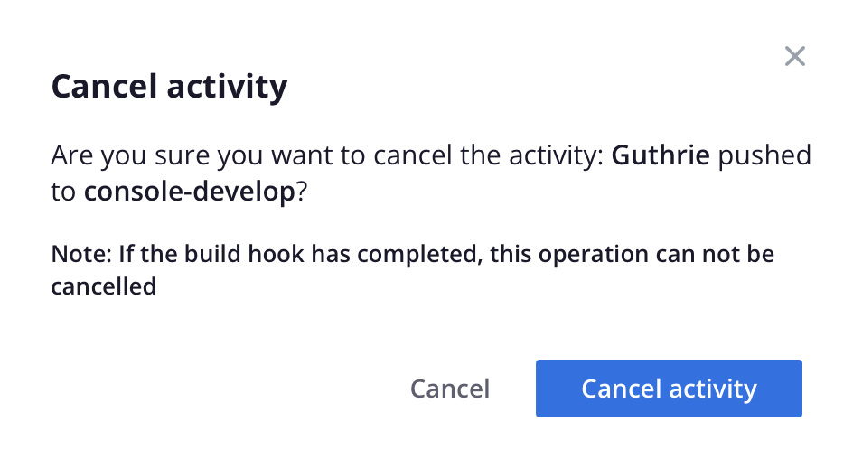

# Activity feeds

The activity feed lists historical events similar to a Git log. In the Project Web Interface, you can view an activity list for a specific environment and filter the list by event type, such as backups. In the Cloud CLI, you can use the `activity` command to see the same list of events. Both methods provide a way for you to review the log detail for a specific event.

The following is a list of the types of activities that display in the Activity feeds:

<!-- | Icon                                                              | Event                                        |
| :---------------------------------------------------------------: | ----------------------------------------------- |
|  | Backup<br>Restore  |
|      | Branch environment                              |
|  | Clear project build cache   |
|       | Merge environment                               |
|       | Push to environment                             |
|  | Redeploy the environment                            |
|        | Sync code and data                              |
|      | Update environment                              |

{style="table-layout:auto"} -->


## Filter activities

The ability to filter the activity list is useful, especially if you are looking for something specific, such as a backup or a merge event. Select an environment and view the activity list. Choose **[!UICONTROL All]** to include the full event history and enable the **[!UICONTROL Filter by]** options:


Choose **[!UICONTROL Recent]** activity and reset the list.

## View activity log

Each activity has 

```bash
mgc activity:log wvl5wm7s5vkhy
```

Sample response:

```bash
Activity ID: wvl5wm7s5vkhy
Type: environment.backup
Description: Guthrie created a backup of Master
Created: 2023-09-08T14:03:33+00:00
State: complete
Log:
Creating backup of master
Created backup eg5pu63egt2dcojkljalzjdopa
```

## Manage an activity

Some activities are in a _running_ or _pending_ status.




If you have a terminal running the activity, canceling in the Project Web Interface results in the cancellation in the terminal:


## Activity in the Cloud CLI

```bash
magento-cloud activity:list
```

Sample response:

```terminal
Activities on the project Username-sandbox (project-id), environment master (type: production):
+---------------+--------------------+-------------------------------------------------+----------+----------+---------+
| ID            | Created            | Description                                     | Progress | State    | Result  |
+---------------+--------------------+-------------------------------------------------+----------+----------+---------+
| wvl5wm7s5vkhy | 2023-09-08T14:03:3 | Username created a backup of Master             | 100%     | complete | success |
|               | 3+00:00            |                                                 |          |          |         |
| 7wk35p2566lgc | 2023-09-08T14:02:3 | Username redeployed environment Master          | 100%     | complete | success |
|               | 7+00:00            |                                                 |          |          |         |
| vdcngfj24kdm4 | 2023-09-08T14:01:2 | Username added user bdenham as admin to         | 100%     | complete | success |
|               | 5+00:00            | environment type production                     |          |          |         |
| pp6l7k3b36zns | 2023-09-07T21:42:5 | Username pushed to Master                       | 100%     | complete | success |
|               | 4+00:00            |                                                 |          |          |         |
| nhho3zhu363tw | 2023-06-28T20:01:5 | Username branched environment next-version from | 100%     | complete | success |
|               | 9+00:00            | Master                                          |          |          |         |
| x3a2mlbyblqwi | 2023-05-31T15:23:3 | Username deleted environment staging            | 100%     | complete | success |
|               | 4+00:00            |                                                 |          |          |         |
| ntnqinouzd6p6 | 2023-05-30T21:19:3 | Username pushed to Master                       | 100%     | complete | success |
|               | 4+00:00            |                                                 |          |          |         |
| c757qvcxs63qi | 2023-05-22T20:22:5 | Username created a backup of Master             | 100%     | complete | success |
|               | 2+00:00            |                                                 |          |          |         |
| vowopgwnnwz5u | 2023-05-22T19:55:1 | Username pushed to Master                       | 100%     | complete | success |
|               | 3+00:00            |                                                 |          |          |         |
| liiv5xyotyrj6 | 2023-05-22T15:35:2 | Username updated variable env:COMPOSER_AUTH     | 100%     | complete | success |
|               | 8+00:00            |                                                 |          |          |         |
+---------------+--------------------+-------------------------------------------------+----------+----------+---------+
```
