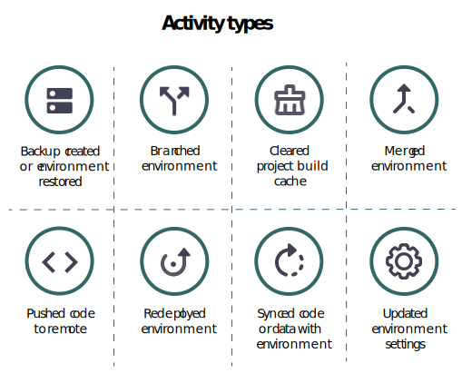
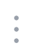
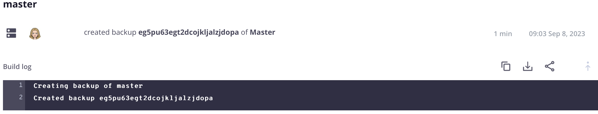
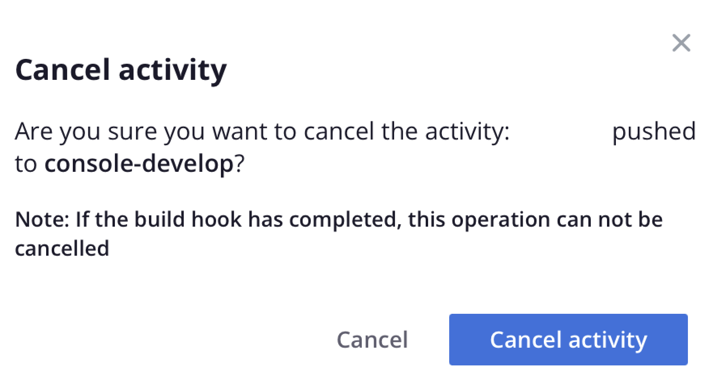
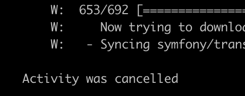
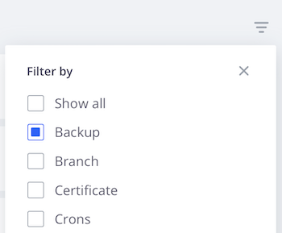

# Activity stream

The main view for each environment displays an **Activity** list of historical events similar to a Git log. The Activity list is a stream of the recent events for active environments. The following is a list of the activity types and their icons that display in the Activity stream:

{width="500" align="center"}

## View logs

In the Activity list, click the status icon of an activity to view the log. Alternatively, click the (_more_) icon  to access more options for managing the activity. The following shows a short log creating a backup. You can [use the Cloud CLI](#activity-stream-with-cloud-cli) to view the same log.



## Manage an activity

Some activities are in a _running_ or _pending_ status. You can act on a running activity, such as canceling a running deployment. The following tabs show two methods of canceling an activity: the Cloud Console or the Cloud CLI.

>[!BEGINTABS]

>[!TAB Console]

**To cancel an activity in the Cloud Console**:

You can act on a running activity by accessing the {width="32"} (_more_) menu and selecting an action, such as `Cancel` or `View log`. For this example, select the **Cancel** option to stop the running activity.

Not all activities have the cancelation option. For example, the option to cancel the application deployment appears only during the _build_ phase. Once the application has moved into the _deploy_ phase, you can no longer cancel the activity. See [Deployment process](../deploy/process.md) about the different phases.

{width="450" align="center"}

If you have a terminal running the deployment activity, canceling in the Cloud Console results in the cancellation in the terminal:

{width="300"}

>[!TAB CLI]

**To cancel an activity in the Cloud CLI**:

1. Identify the running activities and select an activity ID.

   ```bash
   magento-cloud activity:list --state=in_progress
   ```

1. Cancel the activity using the activity ID:

   ```bash
   magento-cloud activity:cancel wvl5wm7s5vkhy
   ```

>[!ENDTABS]

## Filter activity stream

The ability to filter the activity list is useful when you are looking for something specific, such as a backup or a merge event.

**To filter the activity list in the Cloud Console**:

1. Select an environment and choose the Activity **[!UICONTROL All]** view to include the full event history.

1. Click {width="32"} and select the **[!UICONTROL Filter by]** options:

   

1. Choose the Activity **[!UICONTROL Recent]** view and reset the list.

## View stream with Cloud CLI

The `magento-cloud` CLI provides most of the same abilities as the Cloud Console. The `activity` command can:

- `list` the stream of activities for an environment
- `get` details about a specific activity
- display the `log` for a specific activity
- `cancel` an activity

**To view the Activity stream with the Cloud CLI**:

1. List the activities for the current environment.

   ```bash
   magento-cloud activity:list
   ```

1. Each activity has a unique ID. Select an ID from the earlier list and view the details for that activity.

   ```bash
   magento-cloud activity:get wvl5wm7s5vkhy
   ```

1. View the full log for that activity.

   ```bash
   magento-cloud activity:log wvl5wm7s5vkhy
   ```

   Sample response:

    ```bash
    Activity ID: wvl5wm7s5vkhy
    Type: environment.backup
    Description: User created a backup of Master
    Created: 2023-09-08T14:03:33+00:00
    State: complete
    Log:
    Creating backup of master
    Created backup eg5pu63egt2dcojkljalzjdopa
    ```
