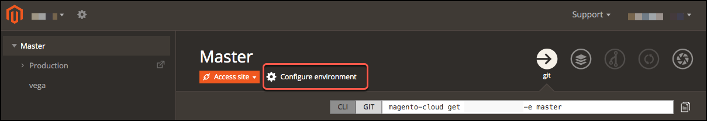
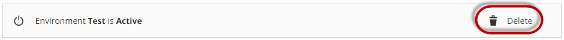
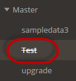
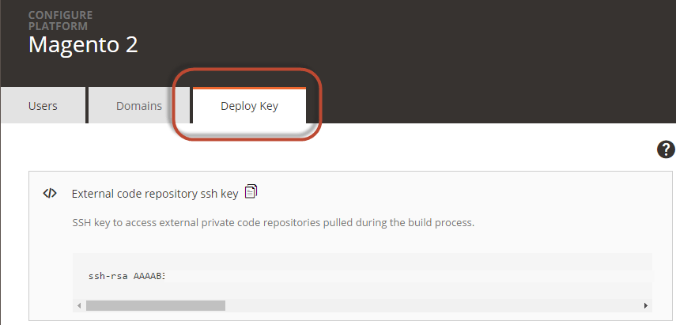

# Manage branches with the Project Web Interface

Every Adobe Commerce on cloud infrastructure environment has an associated Git branch. You can manage your environments using either the Project Web Interface and the `magento-cloud` CLI. You can use Git commands, but the cloud CLI commands interact with platform features whereas the Git commands do not. See [Git commands](../dev-tools/cloud-cli.md#git-commands) in the cloud CLI topic.

This topic discusses how to use the Project Web Interface to:

-  Add or delete an environment. You cannot add or delete the `master` branch for Pro plan Staging and Production. You can branch from a `master` branch.
-  Sync (`git pull`) from the parent environment
-  Merge (`git push`) to the parent environment

>[!INFO]
>
>You cannot create branches from Pro Staging and Production environments.

## Create or delete an environment

The branching strategy uses a common Git workflow where you develop code and add extension in a development branch. See [Starter](../architecture/starter-architecture.md) and [Pro](../architecture/starter-develop-deploy-workflow.md) architecture overviews.

-  For Starter, create a `staging` branch from the `master` branch, then branch from `staging` for development.
-  For Pro, create a development branch from the Integration environment.

Your account supports a limited number of active Git branches and an unlimited number of inactive development branches. Manage active and inactive branches by adding or deleting a branch. When deleted, a branch is deactivated and remains listed in the project branches list as _inactive_. You can activate the inactive branch later or you can [delete the branch](../dev-tools/cloud-cli.md#) using the CLI.

If you need additional environments for development, enter a [Support ticket](https://experienceleague.adobe.com/docs/commerce-knowledge-base/kb/help-center-guide/magento-help-center-user-guide.html#submit-ticket).

**To add a branch**:

1. Log in to [the Project Web Interface](https://accounts.magento.cloud/user/).
1. Click on the project.
1. In the left environment list, click the name of the parent environment.

   Your new branch is cloned from this environment. Choose a parent environment that is similar to the environment that you are about to create.

1. Click (branch).

   

1. In the _New environment name_ field, enter a branch name. Often, the environment name is the same as the ID.

   The environment _name_ is different from the environment _ID_ only if you use spaces or capital letters in the environment name. An environment ID consists of all lowercase letters, numbers, and allowed symbols. Capital letters in an environment name are converted to lowercase in the ID; spaces in an environment name are converted to dashes.

   An environment name **cannot** include characters reserved for your Linux shell or for regular expressions. Forbidden characters include curly braces (`{ }`), parentheses, asterisk (`*`), angle brackets (`>`), ampersand (`&`), percent (<code>%</code>), and other characters.

1. Click **Branch**.
1. Wait while the environment deploys.

   During deployment, the environment status is **In process**. After a successful deployment, the status changes to **Success**.

**To delete an environment and make it inactive**:

1. Log in to [the Project Web Interface](https://accounts.magento.cloud/user/).
1. Click on the project.
1. In the left environment list, click the name of the branch to delete.
1. Click **Configure environment**.

   

1. Click the **Settings** tab.
1. Click **Delete** next to the environment status, as the following figure shows.

   

   A deleted (inactive) environment displays with its name stricken out as the following figure shows.

   

## Sync an environment

Syncing an environment (or branch) is the same as `git pull origin <parent>`. You sync to get updated code from a parent environment. You can use this feature through the interface for all Starter and Pro environments.

For Pro plan, you can also sync from Staging and Production to your Integration `master` branch. This sync only pulls and pushes code, not data. To sync data, dump the database data and push it to another environment's database. See [Migrate and deploy static files and data](https://devdocs.magento.com/cloud/live/stage-prod-migrate.html).

**To sync an environment**:

1. Log in to [the Project Web Interface](https://accounts.magento.cloud/user/).
1. Click on the project.
1. In the left environment list, click the name of the branch to sync.
1. Click (sync).

    

1. Select the items to sync.

   - `code`—syncs updated code from the parent branch.
   - `data & files`— syncs changes in the database and content files from the parent branch.

1. Click **Sync**.

## Merge with parent environment

Merging an environment (or branch) is the same as `git push origin`. You merge to push updated code from an environment to its parent environment. You can merge this code to `master`. You can deploy to Staging and Production using the `merge` command.

**To merge with parent environment**:

1. Log in to [the Project Web Interface](https://accounts.magento.cloud/user/).
1. Click on the project.
1. In the left environment list, click the name of the branch to merge.
1. Click (merge).

   

1. Click **Merge** to confirm the action.

## View logs

Through the Project Web Interface, you can review various logs for environments including build, deploy, and deployment history.

For **Starter**, you can review build and deploy logs and the deployment history. These environments include the `master` (Production) branch and all branches created from it.

For **Pro**, you can review the following logs in each environment:

-  Integration—Build and deploy and deployment history
-  Staging—Build logs and deployment history. Use SSH to log into the server to view deploy logs.
-  Production—Build logs and deployment history. Use SSH to log into the server to view deploy logs.

**To view logs in the Project Web Interface**:

1. Log in to [the Project Web Interface](https://accounts.magento.cloud/user/).
1. Click on the project.
1. In the left environment list, click the name of the branch to view logs.

   The view provides a deployment history of one entry per action attempted including syncs, merges, branches, snapshots, and more.

1. To view the build log, select the Success or Failure link per deployment record on the account.

>[!TIP]
>
>Click the **Showing all types of messages** drop-down list to change the type of messages to view.

## Pull code from a private Git repository

Your Adobe Commerce on cloud infrastructure project can include code from a private Git repository. For example, you may have code for a custom module or theme in a private repo. To do so, you must add your project's public SSH key to your private Git repository and update your project `composer.json` file.

To add a deployment key to your private GitHub repository, you must be the administrator of that repository. GitHub allows you to use a deploy key for one repository only.

If your project needs to access multiple repositories, you can choose to attach an SSH key to an automated user account. Because this account is not used by a human, it is referred to as a [machine user](https://docs.github.com/en/developers/overview/managing-deploy-keys). Add the machine account as a collaborator or add the machine user to a team with access to the repositories.

>[!INFO]
>
>Adobe recommends adding and merging this code to your project Git repositories. If you do not configure the connection, you will have build issues.

### Find your deploy key

**To find your project SSH public key**:

1. Log in to [the Project Web Interface](https://accounts.magento.cloud/user/).
1. Click on the project.
1. Click  next to the project name.
1. Click **Deploy Key**.

   

1. Copy the deploy key to the clipboard.

### Enter your GitHub deploy key

On GitHub, deploy keys are read-only by default.

**To enter your project public key as a GitHub deploy key**:

1. Log in to your GitHub repository as the administrator.
1. Click the repository **Settings** tab.

   >[!NOTE]
   >
   >If you do not see this option, you are not signed in as the repository administrator and you cannot complete this task. Ask your GitHub repository administrator to do this.

1. On the _Settings_ tab in the left navigation bar, click **Deploy Keys**.
1. Click **Add deploy key**.
1. Follow the prompts to complete the task.

In `composer.json`, use the `<user>@<host>:<.git</code>` format, or `ssh://<user>@<host>:<port>/<path>.git` if using a non-standard port.

### Enter your Bitbucket deployment key

**To enter your project public key as a Bitbucket deploy key**:

1. Log in to your Bitbucket repository as the administrator.
1. In the left navigation bar, click **Settings**.
1. Click General > **Deployment Keys**.
1. Click **Add Key**.
1. Follow the prompts to complete the task.

### Enter your GitLab deploy key

**To add the public SSH key for your project as a GitLab deploy key**:

1. Log in to your GitLab repository as the owner.
1. Verify that the _Pipelines_ option is enabled for your project:

   1. In the project settings, expand the **Visibility, project, features, permissions** section.
   1. If necessary, click **Pipelines** to enable the option.

1. Add your public SSH key to the CI/CD settings.

   1. In the left navigation bar, click Settings > **CI / CD**.
   1. Click Deploy Keys **Expand** to configure the key.
   1. In the _Deploy Key_ form, add a deploy key name to the **Title** field, and paste your public SSH key in the **Key** field.
   1. Click **Add Key** to save the configuration.

## Secure environments and branches

You can access your project and environments from any location through a web browser using the Project Web Interface. You may have security set for your Production environment, stores, and sites. This section helps you secure your Integration and Staging environments for strictly your developers, DBAs, and more.

>[!WARNING]
>
>**DO NOT** use the following methods for securing Pro Staging and Production environments. This breaks Fastly caching. You must use the [Blocking](https://devdocs.magento.com/cloud/cdn/fastly-vcl-blocking.html) feature available in the Fastly CDN for Adobe Commerce.

**To secure environments**:

1. Log into your [Project Web Interface](https://accounts.magento.cloud/user/).
1. Click on the project.
1. Select an environment branch.
1. Click **Configure Environment**.
1. On the **Settings** tab, click **ON** for **HTTP access control** to enable secure access. You can choose between credentials or IP addresses to filter for access.
1. To filter by credentials, click **Add Login**, enter a username and password, and click again **Add Login** to add.
1. To filter by IP address, enter the IP addresses in a list with `deny` or `allow`. For example:

   ```text
   123.456.789.111/29 allow
   123.456.789.112/29 allow
   234.123.567.111/29 allow
   0.0.0.0/0 deny
   ```

1. Click **Save**.

The branch redeploys to update the environment security and settings. Adobe recommends testing your environments after completing security settings.
