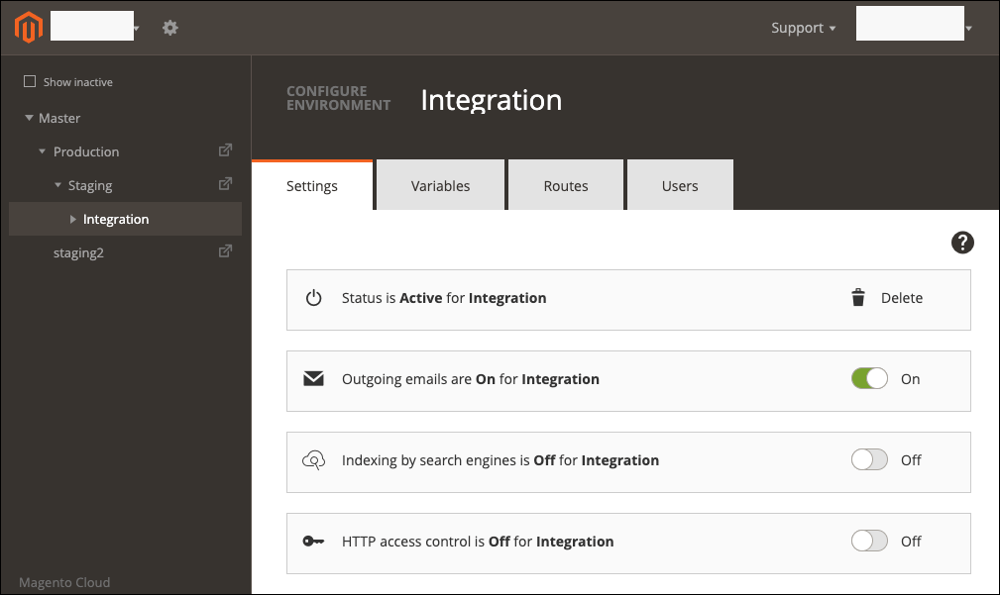

# Configure outgoing emails

You can enable and disable outgoing emails for each environment from the [!DNL Cloud Console] or from the command line. Enable outgoing emails for integration and staging environments to send two-factor authentication or reset password emails for Cloud project users.

By default, outgoing email is enabled in Production environments. The [!UICONTROL Enable outgoing emails] may appear disabled in the environment settings regardless of status until you set the [`enable_smtp` property](#enable-emails-in-the-cli).

{{redeploy-warning}}

## Enable emails in the [!DNL Cloud Console]

Use the **[!UICONTROL Outgoing emails]** toggle in the _Configure environment_ view to enable or disable email support.

**To manage email support from the [!DNL Cloud Console]**:

1. Log in to the [[!DNL Cloud Console]](https://console.adobecommerce.com).
1. Select a project from the _All projects_ list.
1. On the Project dashboard, click the configuration icon in the upper right.
1. Click **[!UICONTROL Environments]** and select a specific environment from the list.
1. To enable or disable outgoing emails, toggle _Enable outgoing emails_ **On** or **Off**.

   

After you change the setting, the environment builds and deploys with the new configuration.

## Enable emails in the CLI

You can change the email configuration for an active environment using the `magento-cloud` CLI `environment:info` command to set the `enable_smtp` property. Enabling SMTP updates the `MAGENTO_CLOUD_SMTP_HOST` environment variable with the IP address of the SMTP host for sending mail.

**To manage email support from the command line**:

1. On your local workstation, change to your project directory.

1. Check the outgoing email setting for the environment.

   ```bash
   magento-cloud environment:info -e <environment-id> | grep enable_smtp
   ```

1. Change the email support configuration by setting the `enable_smtp` environment variable to `true` or `false`.

   ```bash
   magento-cloud environment:info --refresh -e <environment-id> enable_smtp true
   ```

   Wait for the environment to build and deploy.

1. Use an SSH to log into the remote environment.

1. Verify that the email works; send a test email to an address that you can check.

      ```bash
      php -r 'mail("mail@example.com", "test message", "just testing", "From: tester@example.com");'
      ```
