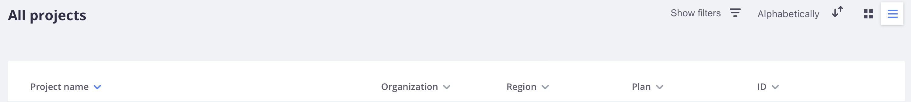
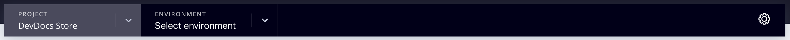
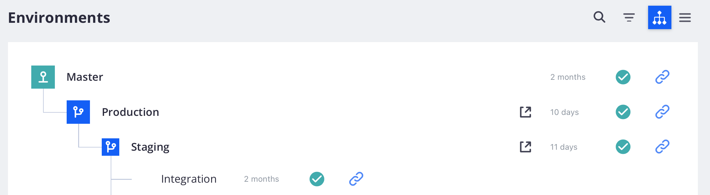
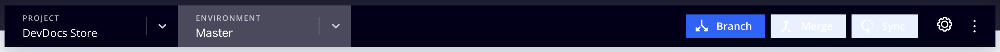

# Cloud infrastructure project

The Adobe Commerce on cloud infrastructure project includes all code in Git branches, associated environments, and scripts to deploy the Commerce application. Environments contain services to support the Commerce application, including a database, web server, and caching server.

Adobe provides a Cloud Console and developer tools to fully manage all aspects of your project. You, as the account owner, have full access to all environments.

## Cloud Console

The Cloud Console provides interactive methods to build, manage, and deploy Commerce code in a user-friendly format. [Log in to the Cloud Console](https://console.adobecommerce.com) to view your project list. You can only see projects that you have permission to access as an admin or for specific environment types. If you are an Adobe Solutions Partner, you may see multiple projects for clients that you support.

>[!TIP]
>
>If you do not see any projects, you must contact the [Account Owner or Project admin](../project/user-access.md) associated with the project and request access. For first-time users, see the [Onboarding topic](../../get-started/onboarding.md#cloud-console) in the _Get started_ guide.

The _All projects_ view lists all projects that you have permission to access. You can click **[!UICONTROL Show filters]** and filter your project list by type, region, or plan.



### Project overview

Selecting a project from the _All projects_ list opens the project overview. The project overview always displays a project navigation bar, which includes an environment selector and a configuration button:



The project overview, as long as you do not have an environment selected, shows a summary of project details in the preview area:

- Project name
- Region, Project ID
- Plan, allotted storage, environments, users
- Storefront URL with **[!UICONTROL Set a custom domain]** button

And in the main project overview:

- Environments list—Shows list or tree view of {width="32"} (active) and {width="32"} (inactive) environments
- [Activity stream](activity-stream.md)—Shows running, pending, and recent activities for the project.
<!-- - Apps & Services—Shows a topology of service containers -->

For **Starter** projects, there is a hierarchy of branches starting from `master` (Production). Any branch that you create display as children from the `master` branch. Adobe recommends creating a `staging` branch, then create an `integration` branch for development. See [Starter architecture](../architecture/starter-architecture.md).

For **Pro**, there is a hierarchy of branches starting from `production` to `staging` to `integration`. The {width="32"} icon indicates that the branch deploys to a dedicated environment. Any branches that you create display as children of the `integration` branch. See [Pro architecture](../architecture/pro-architecture.md).



### Environment overview

Selecting an environment from the project navigation bar changes the overview and the navigation bar to focus on the selected environment. The navigation bar includes branch controls (Branch, Merge, and Sync) and a configuration button:



The environment overview shows a summary of environment details in the preview area:

- Environment name, type
- Region, Project ID
- Date and time of last activity, including backup
- HTTP access  and search engine status
- Machine name
- Environment status (Active or Inactive)
- Storefront URL with **[!UICONTROL Set a custom domain]** button

The [Activity stream](activity-stream.md) makes up the main environment overview.

### Access storefront

Each active environment has a storefront. Select an environment from the top navigation and click the URL in the environment overview. Also, there is a **[!UICONTROL URLs]** list on the right-had side above the Activity list.

The Web Access URL may include the following:

```terminal
https://<branch>-<unique-ID>-<project-ID>.<region>.magentosite.cloud/
```

- **Unique ID** = 7 random alpha-numeric characters
- **Project ID** = 13-character project ID
- **Region** = AWS or Azure region name, see [Regional IP addresses](regional-ip-addresses.md)

The Pro Production and Staging environments include three nodes that you can access using the following links:

- Load balancer URLs:

    - `http[s]://<your-domain>.c.<project-ID>.ent.magento.cloud`
    - `http[s]://<your-staging-domain>.c.<project-ID>.ent.magento.cloud`

- Direct access to one of the three redundant servers:

    - `http[s]://<your-domain>.{1|2|3}.<project-ID>.ent.magento.cloud`
    - `http[s]://<your-staging-domain>.{1|2|3}.<project-ID>.ent.magento.cloud`

   The production URL is used by the content delivery network (CDN).

## Settings

Open the _Settings_ panel by clicking the {width="36"} (configure) icon on the right side of the project navigation.

### Project settings

**[!UICONTROL Project Settings]** expands a menu of project-level controls to manage users, variables, and more:

| Option       | Description                                                                                                                   |
|--------------|-------------------------------------------------------------------------------------------------------------------------------|
| General      | Manage the timezone for use with scheduling backups or maintenance.                                                           |
| Access       | Manage [user access](user-access.md) to project and environment types.                                                        |
| Certificates | View a list of the SSL certificates associated with the project.                                                              |
| Deploy Key   | Add and view the public key to the project code repository.                                                                   |
| Domains      | Add a domain name to the project. See [Manage domains](../cdn/fastly-custom-cache-configuration.md#manage-domains).           |
| Integrations | Add and manage [integrations](../integrations/overview.md), such as health notifications and webhooks.                        |
| Variables    | Add [project-level variables](../environment/variable-levels.md) that are available at build and runtime in all environments. |

{style="table-layout:auto"}

### Environment settings

Click **[!UICONTROL Environments]** and select a specific environment from the list for controls to manage site settings, environment variables, and more:

| Option    | Description                                                                                                                      |
| --------- | -------------------------------------------------------------------------------------------------------------------------------- |
| General   | Configure display name, environment type, and parent environment.<br>Toggle different environment settings:                      |
|           | **Enable outgoing emails**: Send [outgoing emails](outgoing-emails.md) from the environment using the SMTP protocol.             |
|           | **Hide from search engines**: Block search engine indexers and crawlers from the site.                                           |
|           | **HTTP access control**: Enable security configuration for the Cloud Console using a login and IP address access control.|
|           | Status is `active` or `inactive`. Most of your work is in an active environment. You can deactivate or delete the environment.   |
| Variables | View, create, and manage [environment-level variables](../environment/variable-levels.md) available at runtime.                  |
| Domains   | View a list of [configured routes](../routes/routes-yaml.md).                                                                    |

{style="table-layout:auto"}

>[!WARNING]
>
>**DO NOT** use the HTTP access control method for securing Pro Staging and Production environments. This breaks Fastly caching. Instead, use the [Blocking](../cdn/fastly-vcl-blocking.md) feature available in the Fastly CDN for Adobe Commerce.

## Fastly and New Relic credentials

Your project includes [Fastly](../cdn/fastly.md) and [New Relic](../monitor/new-relic-service.md). The project details display information for your project plan and important licenses and tokens for these integrations. Only the License Owner has initial access to the credentials and services. Provide these credentials to technical and developer resources as needed.

- [Fastly](https://www.fastly.com/) provides content delivery (CDN), image optimization, and security services (DDoS and WAF) for your Adobe Commerce on cloud infrastructure projects. See [Get Fastly credentials](../cdn/fastly-configuration.md#get-fastly-credentials).

- [New Relic](../monitor/new-relic-service.md) provides application metrics and performance information for Staging and Production environments.

Use the [Cloud CLI](../dev-tools/cloud-cli-overview.md) to review your integration tokens, IDs, and more:

```bash
magento-cloud subscription:info services
```
