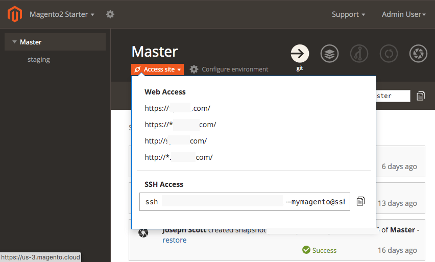
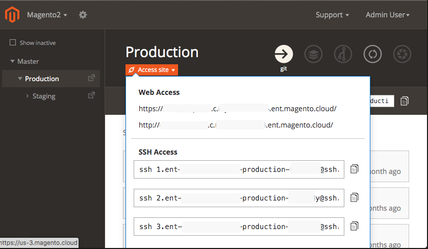
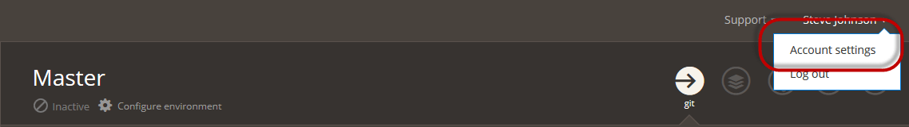
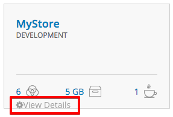
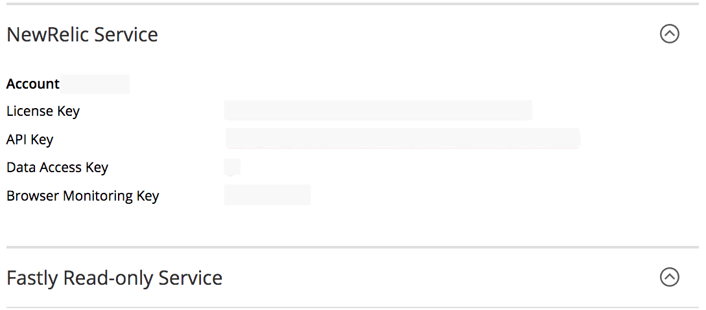

# Cloud infrastructure project

The Adobe Commerce on cloud infrastructure project includes all code in Git branches, associated environments, and scripts to deploy the Commerce application. Environments contain services to support the Commerce application, including a database, web server, and caching server.

Adobe provides a Project Web Interface and developer tools to fully manage all aspects of your project. You, as the account owner, have full access to all environments.

## Access the Project Web Interface

The Project Web Interface provides features to create, manage, and deploy code in Integration, Staging, and Production environments for Starter and Pro plans.

**To access your projects and environments**:

1. Log in to [My Account](https://account.magento.com/customer/account/login).
1. Click **Projects (Cloud)**.
1. Locate your project and click **View Project Page**.

The **View Project Page** link displays for Account Owners only. If you are not an Account Owner, go to the [user login](https://accounts.magento.cloud/user/) instead.

>[!TIP]
>
>If you do not see any projects, you must contact the [Account Owner or Super User](../project/user-access.md) associated with the project and request access.

When you log in to the [Project Web interface](https://accounts.magento.cloud/user/), you see your accessible projects. As an Account Owner, you can only see projects for your company. An Adobe Solutions Partner may see multiple projects for clients that they support. Click on a project to see a hierarchy of environments.

For **Starter** projects, there is a hierarchy of branches starting from `master` (Production). Any branches you create display as children from the `master` branch. Adobe recommends creating a staging branch, then branching from `staging` for your Integration development. See [Starter architecture](../architecture/starter-architecture.md).



For **Pro**, there is a hierarchy of branches starting from Production to Staging to Integration. The  icon indicates that these branches deploy to a dedicated server, used by Staging and Production. Any branches you create display as children from Integration. See [Pro architecture](../architecture/pro-architecture.md).

### Access site

To access an environment store and admin, select a branch and click **Access Site**. A list of store URLs and SSH command display. Select the URL to view the store in that environment.



The Web Access URL may include the following:

```terminal
https://<branch>-<unique-ID>-<project-ID>.<region>.magentosite.cloud/
```

- **Unique ID** = 7 random alpha-numeric characters
- **Project ID** = 13-character project ID
- **Region** = AWS or Azure region name, see [Regional IP addresses](regional-ip-addresses.md)

The Pro Production and Staging environments include three nodes that you can access using the following links:

-  Load balancer URLs:

    -  `http[s]://<your-domain>.c.<project-ID>.ent.magento.cloud`
    -  `http[s]://<your-staging-domain>.c.<project-ID>.ent.magento.cloud`

-  Direct access to one of the three redundant servers:

    -  `http[s]://<your-domain>.{1|2|3}.<project-ID>.ent.magento.cloud`
    -  `http[s]://<your-staging-domain>.{1|2|3}.<project-ID>.ent.magento.cloud`

   The production URL is used by the content delivery network (CDN).

If you have inactive Git branches of code, you can toggle displaying the branches in the hierarchy.

## Configure the project

Click  configure icon to display users and deploy keys and variables associated with the project. You can modify access and permissions across the entire project. See [Manage user access](user-access.md).

You can set the following configuration options for each project:

| Option       | Description                                                                                                                                        |
|--------------|----------------------------------------------------------------------------------------------------------------------------------------------------|
| Users        | Manage user access to project using roles and environments types. See [Manage user access](user-access.md).                                        |
| Domains      | Add a domain name to the project. See [Manage domains](../cdn/fastly-custom-cache-configuration.md#manage-domains).                                |
| Certificates | View a list of the SSL certificates associated with the project.                                                                                   |
| Deploy Key   | Add and view the public key to the project code repository.                                                                                        |
| Variables    | Add project-level variables that are available at build and runtime in all environments. See [Variable levels](../environment/variable-levels.md). |

{style="table-layout:auto"}

## Configure environment

You can manage variables and settings for Production, Staging, and Integration environments through this interface, [configuration files](../environment/overview.md), or with CLI commands. Select an environment in the environment list and click **Configure environment** to update the settings, add variables, routes, and users.

You can set the following configuration options for each environment:

| Option    | Description                                                                                                                                                                                                                                |
|-----------|--------------------------------------------------------------------------------------------------------------------------------------------------------------------------------------------------------------------------------------------|
| Settings  | Toggle different environment settings:                                                                                                                                                                                                     |
|           | **Status**: An environment can be `active` or `inactive`. Most of your work is in an active environment. After merging an environment, you can delete the environment, making it inactive. You can activate an inactive environment later. |
|           | **Outgoing emails**: Setting this option to `On` enables support for sending emails from the environment using the SMTP protocol. See [Outgoing emails](outgoing-emails.md).                                                               |
|           | **Indexing by search engines**: Setting this option to `On` enables the search engine visibility.                                                                                                                                          |
|           | **HTTP access control**: Setting this option to `On` enables you to configure security for the Project Web Interface using a login and IP address access control.                                                                          |
| Variables | View, create, and manage environment variables available for the environment at runtime. See [Variable levels](../environment/variable-levels.md).                                                                                         |
| Routes    | View a list of configured routes. See [Configure routes](../routes/routes-yaml.md).                                                                                                                                                        |
| Users     | View a list of users granted environment level access. It is best to [Manage users with the CLI](user-access.md#manage-users-with-the-cli).                                                                                                |

{style="table-layout:auto"}

>[!WARNING]
>
>**DO NOT** use the HTTP access control method for securing Pro Staging and Production environments. This breaks Fastly caching. Instead, use the [Blocking](../cdn/fastly-vcl-blocking.md) feature available in the Fastly CDN for Adobe Commerce.

## Fastly and New Relic credentials

Your project includes [Fastly](../cdn/fastly.md) and [New Relic](../monitor/new-relic.md). The project details display information for your project plan and important licenses and tokens for these integrations. Only the License Owner has initial access to the credentials and services. Provide these credentials to technical and developer resources as needed.

-  [Fastly](https://www.fastly.com/) provides content delivery (CDN), image optimization, and security services (DDoS and WAF) for your Adobe Commerce on cloud infrastructure projects. See [Get Fastly credentials](../cdn/fastly-configuration.md#get-fastly-credentials).

-  [New Relic](../monitor/new-relic.md) provides application metrics and performance information for Staging and Production environments.

**To review your integration tokens, IDs, and more**:

1. Log in to [your account](https://accounts.magento.cloud/user/)

1. In the upper right corner, click your name and **Account settings**.

   

1. On the _Projects_ tab, click **View Details** for your project to open general settings and plan details.

   

1. On your project details page, scroll to and expand the **New Relic** and **Fastly** sections to review service credentials.

   
