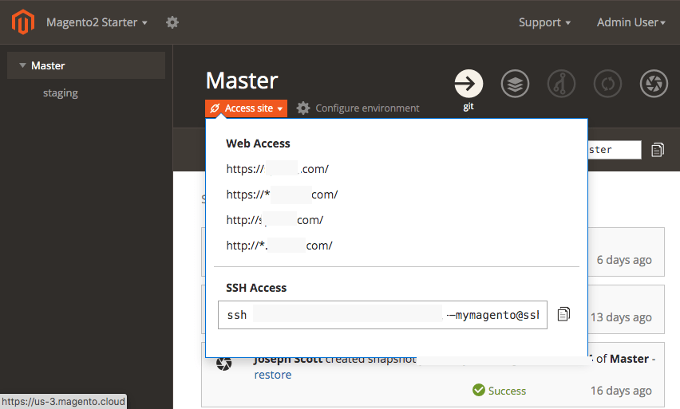
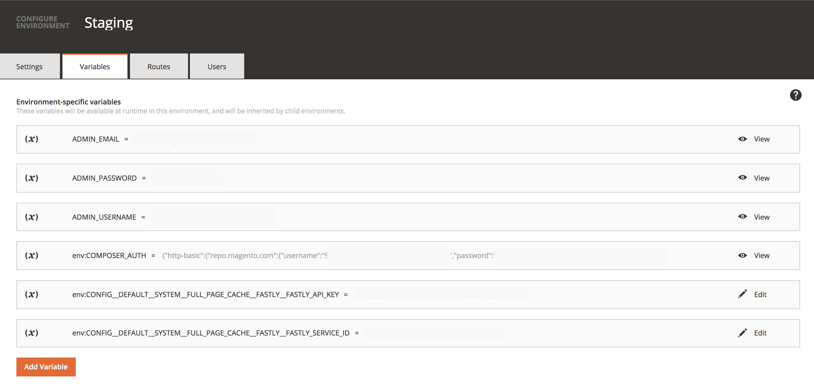

# Cloud infrastructure project

The Adobe Commerce on cloud infrastructure project includes all code in Git branches, associated environments, and scripts to deploy the Commerce application. Environments contain services to support the Commerce application, including a database, web server, and caching server.

Adobe provides a Project Web Interface and developer tools to fully manage all aspects of your project. You, as the account owner, have full access to all environments.

## Access the Project Web Interface

The Project Web Interface provides features to create, manage, and deploy code in Integration, Staging, and Production environments for Starter and Pro plans.

**To access your projects and environments**:

1. Log in to [My Account](https://account.magento.com/customer/account/login).
1. Click **Projects (Cloud)**.
1. Locate your project and click **View Project Page**.

The **View Project Page** link displays for Account Owners only. If you are not an Account Owner, go to the [user login](https://accounts.magento.cloud) instead.

>[!TIP]
>
>If you do not see any projects, you must contact the [Account Owner or Super User](https://devdocs.magento.com/cloud/project/user-admin.html) associated with the project and request access.

## Access the project and environments

When you log in to the [Project Web interface](https://accounts.magento.cloud/user/), you see your accessible projects. As an Account Owner, you can only see projects for your company. An Adobe Solutions Partner may see multiple projects for all of the clients that they support. Click on a project to see a hierarchy of environments.

For **Starter** projects, there is a hierarchy of branches starting from `master` (Production). Any branches you create display as children from the `master` branch. Adobe recommends creating a Staging branch, then branching from `staging` for your Integration development. See [Starter architecture](https://devdocs.magento.com/cloud/architecture/starter-architecture.html).

For **Pro**, there is a hierarchy of branches starting from Production to Staging to Integration. The  icon indicates these branches deploy to a dedicated server, used by Staging and Production. Any branches you create display as children from Integration. See [Pro architecture](https://devdocs.magento.com/cloud/architecture/pro-architecture.html).

To access an environment store and admin, select a branch and click **Access Site**. A list of store URLs and SSH command display. Select the URL to view the store in that environment.

The Pro plan Production and Staging environments include three nodes that you can access using the following links:

-  Load balancer URLs:

    -  `http[s]://<your domain>.c.<project ID>.ent.magento.cloud`
    -  `http[s]://<your staging domain name>.c.<project ID>.ent.magento.cloud`

-  Direct access to one of the three redundant servers:

    -  `http[s]://<your domain>.{1|2|3}.<project ID>.ent.magento.cloud`
    -  `http[s]://<your staging domain name>.{1|2|3}.<project ID>.ent.magento.cloud`

   The production URL is used by the content delivery network (CDN).

If you have inactive Git branches of code, you can toggle displaying the branches in the hierarchy.

## Configure environments

You can manage variables and settings for Production, Staging, and Integration environments through this interface, or with CLI commands. Select an environment in the environment list and click **Configure environment** to update the settings, add variables, routes, and users.

### Environment variables

On the _Variables_ tab, you can view, create, and manage environment variables for your project. For example, after we add your project to the Adobe Commerce on cloud infrastructure Fastly service account, you can view the Fastly API token and service ID credentials as shown in the following example:

## Configure the project

Click  configure icon to display users and deploy keys and variables associated with the project. You can modify access and permissions across the entire project. See [Manage user access](user-access.md).

## Fastly and New Relic credentials

Your project includes [Fastly](https://devdocs.magento.com/cloud/cdn/cloud-fastly.html) and [New Relic](../monitor/new-relic.md). The project details display information for your project plan and important licenses and tokens for these integrations. Only the License Owner has initial access to the credentials and services. You should provide these credentials to technical and developer resources as needed.

-  [Fastly](https://www.fastly.com/) provides content delivery (CDN), image optimization, and security services (DDoS and WAF) for your Adobe Commerce on cloud infrastructure projects. See [Get Fastly credentials](https://devdocs.magento.com/cloud/cdn/configure-fastly.html).

-  [New Relic](../monitor/new-relic.md) provides application metrics and performance information for Staging and Production environments.

**To review your integration tokens, IDs, and more**:

1. Log in to [your account](https://accounts.magento.cloud/user/)

1. In the upper right corner, click your name and **Account settings**.

   

1. On the _Projects_ tab, click **View Details** for your project to open general settings and plan details.

   

1. On your project details page, scroll to and expand the **New Relic** and **Fastly** sections to review service credentials.

   
