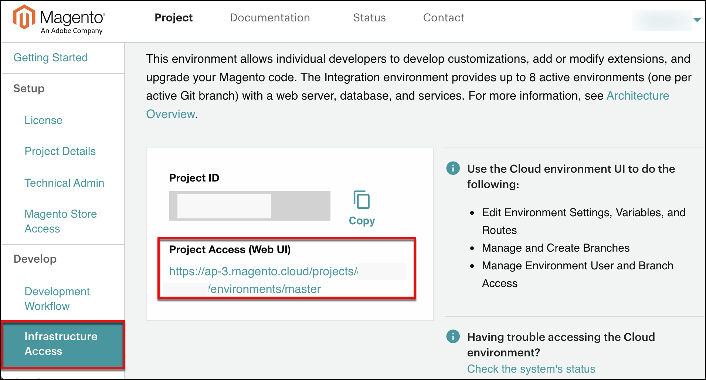
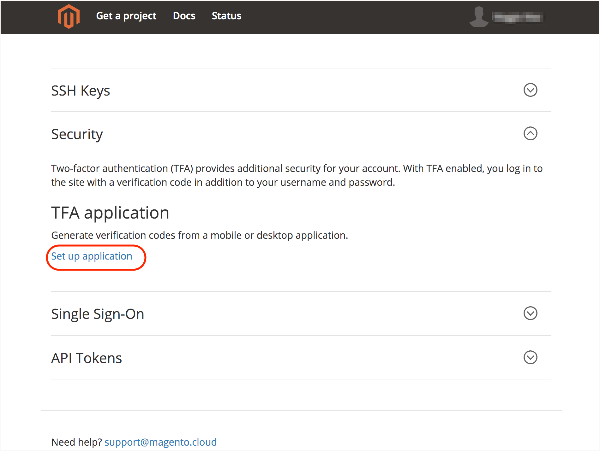
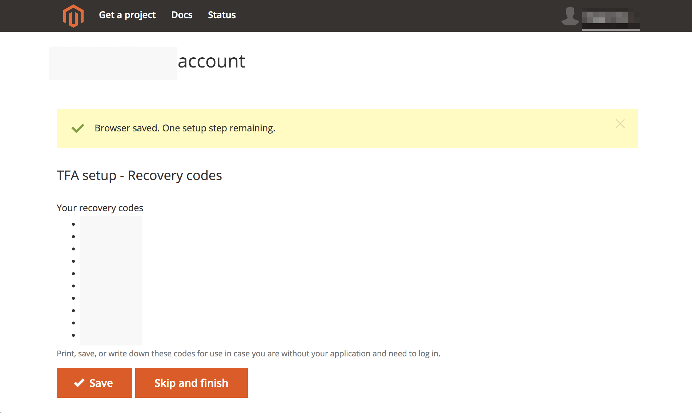
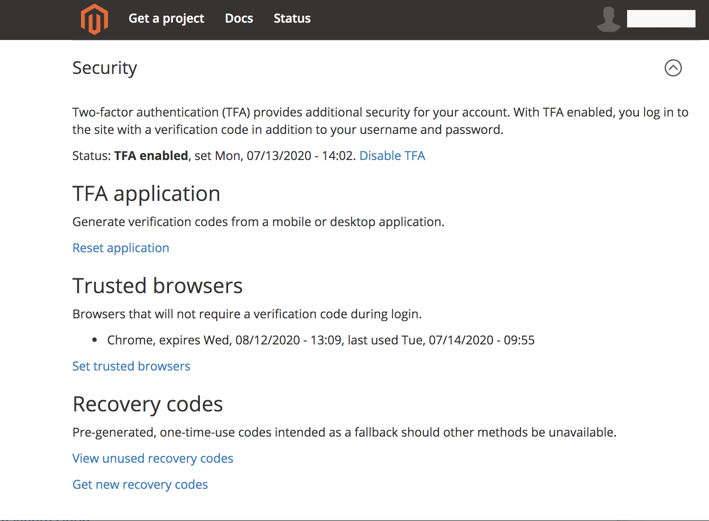
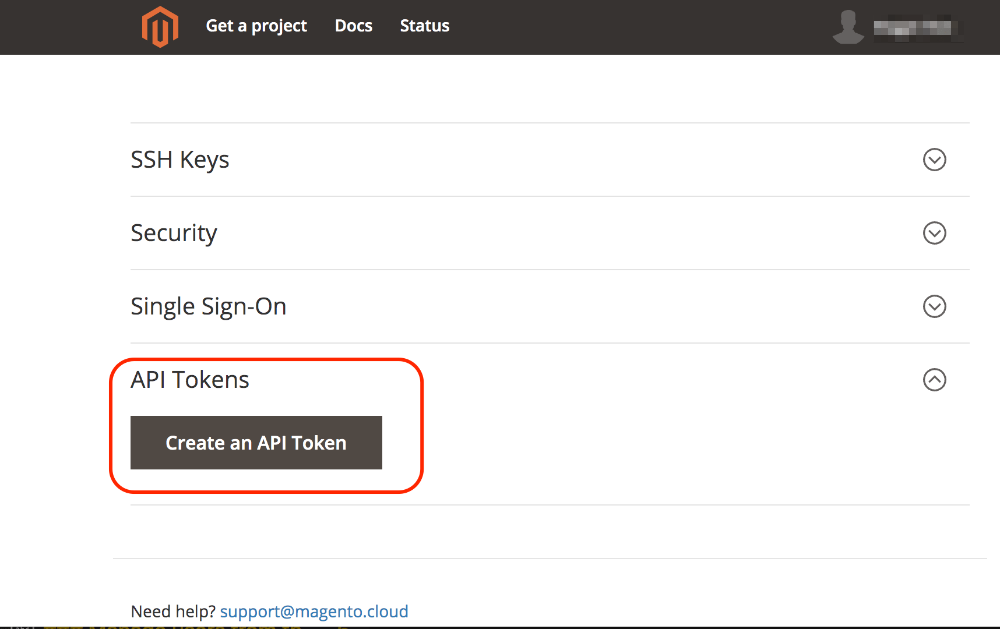
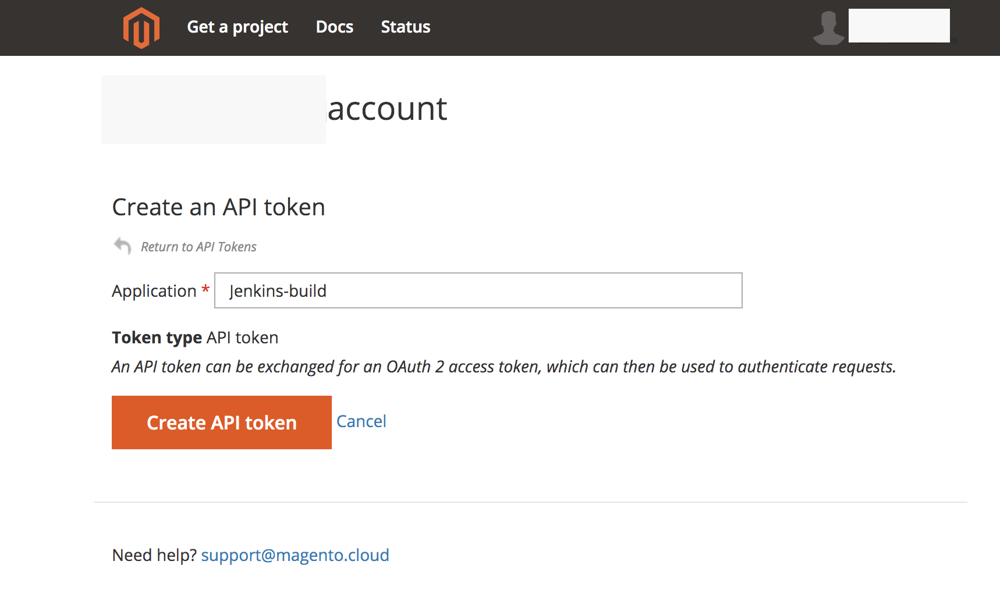
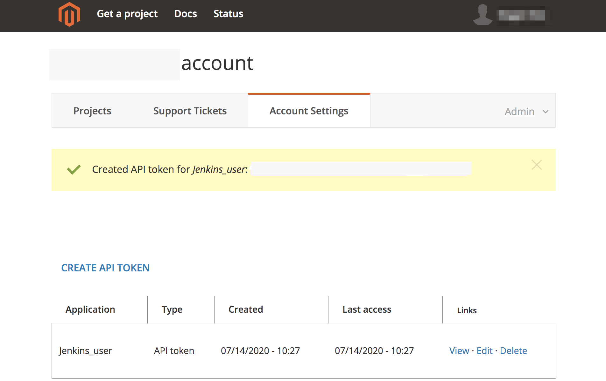

# Manage user access

You manage access to Adobe Commerce on cloud infrastructure projects and environments by adding users and assigning roles.

Project-level access provides role-based access to a specific project. Environment-level access provides role-based access to environment types within the project. Adobe Commerce on cloud infrastructure consists of three environments types: Production, Staging, and Integration. The following table lists the roles

| Role               | Scope       | Access     | SSH     |
| ------------------ | ----------- | ---------- | ------- |
| **Project owner**  | Project     | Perform any administrator task in any project or environment, including deletion (supersedes the **Super User** role.)<p>This role might not be assigned to the License Owner associated with the email address, name, and information of the person who registered the account. [Submit an Adobe Commerce Support ticket](https://experienceleague.adobe.com/docs/commerce-knowledge-base/kb/help-center-guide/magento-help-center-user-guide.html#submit-ticket) to modify settings or change the Project owner. | — |
| **Super User**     | Project     | Access all project settings and environments. Super users can change settings and perform administrator tasks on any environment, including creating and restoring [snapshots](../storage/snapshots.md) (in Pro Integration and all Starter environments) and managing users. | — |
| **Project viewer** | Project     | View-only access to all project environments. Users with this role cannot perform tasks on any environment. Can be granted write access to a specific environment type. | — |
| **Admin**          | Environment | Perform administrator tasks, such as change settings, push code, perform tasks and branch management, including merging with the parent environment | Yes |
| **Contributor**    | Environment | Push code and branch the environment; cannot change settings or execute actions | Yes |
| **Viewer**         | Environment | View-only access to an environment | No |
| **None**           | Environment | No access to an environment | No |

{style="table-layout:auto"}

## Add user authentication requirements

For added security, Adobe provides project-level multi-factor authentication (MFA) enforcement to require two-factor authentication (TFA) for SSH access to Adobe Commerce on cloud infrastructure project source code and environments. See [Enable MFA for SSH](multi-factor-authentication.md).

When MFA enforcement is enabled on an Adobe Commerce on cloud infrastructure project, all users with SSH access to an environment in that project must enable TFA on their Adobe Commerce on cloud infrastructure account. For automated processes, users must create an API token that machine users can use to authenticate from the command line. See [Enable user accounts for TFA and SSH access](#update-account-security-settings).

## Add users and manage access

Add users and assign roles using the `magento-cloud` CLI or the Project Web Interface.

**Prerequisites:**

- A registered user with an Adobe ID. A user must [register for an Adobe account](https://account.adobe.com) and then [initialize their Cloud account](https://accounts.magento.cloud) before you can add them to a Cloud project.

- A user assigned the **Admin** role cannot manage users with the `magento-cloud` CLI. Only users that are granted the **Super User** or **Account Owner** role can manage users.

## Manage users with the CLI

Use the `magento-cloud` CLI to manage users and integrate with automated systems:

- `magento-cloud user:add`–add a user to the project
- `magento-cloud user:delete`–delete a user
- `magento-cloud user:list [users]`–list project users
- `magento-cloud user:role`–view or change the user role
- `magento-cloud user:update`–update user role on a project

The following examples use the `magento-cloud` CLI to add a user, configure roles, modify project assignments, and assign user roles.

### Add a user and assign roles

1. Use the `magento-cloud` CLI to add the user.

   ```bash
   magento-cloud user:add
   ```

   >[!IMPORTANT]
   >
   >The user must have an Adobe ID; see the [prerequisites](#add-users-and-manage-access).

1. Follow the prompts: specify the user email address, set the project and environment-type roles, and add the user.

   > Sample prompts

   ```terminal
   Enter the user's email address: alice@example.com

   Email address: alice@example.com

   The user's project role can be admin (a) or viewer (v).

   Project role (default: viewer) [a/v]: viewer

   The user's environment type role(s) can be admin (a), viewer (v), contributor (c) or none (n).

   Role on type development (default: none) [a/v/c/n]: none
   Role on type production (default: none) [a/v/c/n]: admin
   Role on type staging (default: none) [a/v/c/n]: admin

   Adding the user alice@example.com to (project_id):
   Project role: viewer
     Role on type production: admin
     Role on type staging: admin

   Are you sure you want to add this user? [Y/n] y
   Adding the user to the project
   ```

   After you add the user, Adobe sends an email to the specified address with instructions for accessing the Adobe Commerce on cloud infrastructure project.

### View a user's project role

```bash
magento-cloud user:get alice@example.com
```

>Sample response:

```terminal
Current role(s) of User (alice@example.com) on Production (project_id):
  Project role: admin
```

### Add a user to multiple environments

To add a user as a `viewer` on a `Production` environment, and as a `contributor` on an `Integration` environment:

```bash
magento-cloud user:add alice@example.com -r production:v -r integration:c
```

### Update user environment permissions

To update user environment permissions to `admin` on the `Production` environment:

```bash
magento-cloud user:update alice@example.com -r production:a
```

## Manage users from the Project Web Interface

You can use the Project Web Interface to add permissions and use the _Edit_ feature to modify permissions for an existing user.

>[!IMPORTANT]
>
>The user must have an Adobe ID; see the [prerequisites](#add-users-and-manage-access).

### Add users from the Project Web Interface

1. Log in to [your account](https://account.magento.com/customer/account/login).

1. On the _My Account_ page, click the [!UICONTROL Magento] tab to see the projects in your account.

1. Click the **Projects** tab.

1. Click a project.

1. Click **Infrastructure access**, and then click **Project Access (Web UI)**.

   

1. In the Project Access (Web UI), add users as needed.

### Add a project-level user

1. In the Project Web Interface, click the settings icon in the top navigation bar.

1. In the _Users_ tab, click **Add User**.

1. Complete the _Add User_ form:

   -  Enter the user e-mail address.

   -  Select **Super User** to create a project administrator account. This role provides Admin rights to all settings and environments. Other users only have access to view options for all project environments.

   -  Select **Environment permissions**: _No access_, _Admin_ (change settings, execute action, merge code), _Contributor_ (push code), or _Viewer_ (view only). When you add active environments, you can modify permissions per user.

   >[!TIP]
   >
   >Only **Super Users** can manage users in any environment. To grant a user access to the **Users** tab when configuring the environment, another **Super User** or the **Account Owner** must assign that user the **Super User** role.

1. Click **Add User**.

1. After adding project-level users, redeploy all environments to apply the changes. Adding a project-level user does not trigger a deployment automatically. Redeployment is an important step to ensure that the user can access an environment using SSH.

After you add the user, Adobe sends an email to the specified address with instructions for accessing the Adobe Commerce on cloud infrastructure project.

## Update account security settings

After you add a user to a Cloud project, ask the user to review their account security settings and add the following security configuration as needed:

-  **Enable TFA**—Adobe recommends adding TFA to all accounts to meet security and compliance standards. Projects configured with [MFA enforcement](multi-factor-authentication.md) require TFA on accounts that use SSH to access the projects.

-  **Enable SSH keys**—Users that require access to Adobe Commerce on cloud infrastructure source code repositories must enable SSH keys on their account. See [Secure connections](../development/secure-connections.md).

-  **Create an API token**—Users must generate an API token that is used for SSH access to an environment. You need the token to enable authentication workflows for automated processes.

   On projects with MFA enforcement enabled, you must use the API token to authenticate SSH access requests from automated accounts. The token allows automated processes to bypass authentication workflows which require TFA.

### Enable TFA for Cloud accounts

Adobe Commerce on cloud infrastructure supports TFA using any of the following applications:

-  [Google Authenticator (Android/iPhone)](https://support.google.com/accounts/answer/1066447?hl=en)
-  [Authy (Android/iPhone)](https://authy.com/features/)
-  [FreeOTP (Android)](https://play.google.com/store/apps/details?id=org.fedorahosted.freeotp)
-  [GAuth Authenticator (Firefox OS, desktop, others)](https://github.com/gbraad-apps/gauth)

Instructions for installing the authenticator application and enabling TFA are available on the _Account settings_ page in the Project Web Interface.

**To enable TFA on your user account**:

1. Log in to [your account](https://accounts.magento.cloud/user/).

1. Click the **Account settings** tab.

1. Click **Security**. In the _TFA application_ settings, click **Set up application**.

   

1. If you do not have an approved authenticator application on your mobile device, use the linked instructions to install one.

1. Add your Adobe Commerce on cloud infrastructure account to the authenticator application.

   -  On your mobile device, open the authenticator application. Then, add the setup code to the application.

   -  On the [!UICONTROL **TFA set up - Application**] page, type the TFA code from your mobile device in the **Application verification code** field.

   -  Click **Verify and save**.

      If the code is valid, Adobe sends a notification to the account email address confirming that the account now has TFA.

1. Optional. Enable _Trusted browser_ settings to cache the authentication code in the browser for 30 days.

   This configuration reduces the number of authentication challenges during project login.

1. Click **Save** or **Skip**.

1. Save the recovery codes.

   -  On the _TFA setup - Recovery_ codes page, copy and save the recovery codes so that you can log into your Adobe Commerce on cloud infrastructure project when you cannot access your mobile device or authentication application.

     

   -  Copy the recovery codes to another location or write them down in case you lose access to your device or authentication application.

   -  Click **Save** to save the codes to your account so you can view and manage them from your account security settings.

      >[!WARNING]
      >
      >If you lose access to an account with TFA and have no recovery codes, you must contact your project administrator, or [Submit an Adobe Commerce Support ticket](https://experienceleague.adobe.com/docs/commerce-knowledge-base/kb/help-center-guide/magento-help-center-user-guide.html#submit-ticket) to reset the TFA application.

1. After completing the TFA setup, click **Save** to update your account.

1. Authenticate your current session with TFA.

   -  Log out of your account.

   -  Log in with your username and password.

   -  When prompted, enter the TFA code for the `accounts.magento.cloud` entry from the authenticator application on your mobile device.

### Manage TFA configuration and recovery codes

You manage the TFA configuration for an Adobe Commerce on cloud infrastructure account from the _Security_ section on the _Account settings_ page.

1. Log in to [your account](https://accounts.magento.cloud/user/).

1. Click the **Account Settings** tab.

1. Click **Security** and view the TFA configuration options.

   

1. Use the available links to update the TFA settings for your Adobe Commerce on cloud infrastructure account:

   -  Disable TFA
   -  Reset the authenticator application
   -  Add or remove trusted browsers
   -  View or refresh TFA recovery codes on account

### Create an API token

An API token can be exchanged for an OAuth 2 access token, which can then be used to authenticate requests.

On projects that have MFA enforcement enabled, you must have an API token to enable SSH access for machine users and automated processes.

>[!IMPORTANT]
>
>Protect API token values for your account. Do not expose the value in code samples, screen captures, or insecure client-server communications. Also, do not expose the value in source code stored in public repositories.

**To create an API token**:

1. Log in to [your account](https://accounts.magento.cloud/user/).

1. On the Cloud projects page, click the **Account settings** tab.

1. On the _Account settings_ tab, expand the **API Tokens** section. Then, click **Create an API token**.

   

1. Specify an **Application** name for the token, for example, specify a name that matches the machine user or automated process that uses the API token.

   

1. Click **Create API token**.

   
