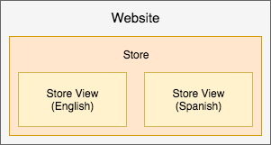
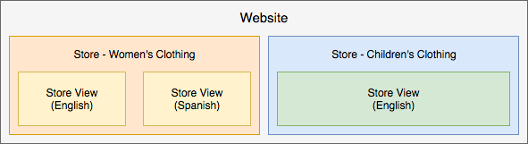
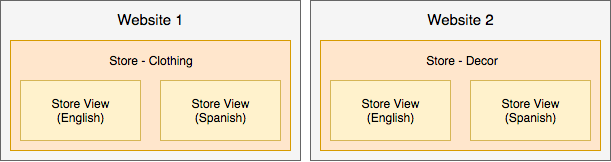

# Best practices for store configuration

For detailed information for configuring your store, sites, and websites, you may want to review the [Adobe Commerce User Guide](https://experienceleague.adobe.com/docs/commerce-admin/user-guides/home.html). This page provides best practices, helpful information, and guidelines for configuring your stores, sites, and more with additional content to post over time and across versions.

## Marketing campaigns and promotions

This information is helpful for Adobe Commerce on cloud infrastructure 2.1.X and 2.2.X.

To create campaigns and promotions, create the options and settings in [Content Staging](https://experienceleague.adobe.com/docs/commerce-admin/content-design/staging/content-staging.html). This feature allows you to create and preview your campaigns before making them public for customer sales. The following information provides helpful information. For exact instructions, see the linked Adobe Commerce User Guide content.

_Campaigns_ are marketing events for seasonal sales, new product lines, and more. Each campaign can include custom themes, blocks for content, widgets to control and display content, and associated promotions with price rules. Due to the extensive nature of a campaign, you create them with a start and end date through Content Staging.

_Promotions_ provide discounts, one time offers, coupons, first-time buyer incentives, and more. You create these promotions as _Price Rules_ that set the terms, discounts, and options to encourage customers to buy. You can create price rules on the [shopping cart](https://experienceleague.adobe.com/docs/commerce-admin/marketing/promotions/cart-rules/price-rules-cart.html) or [catalog](https://experienceleague.adobe.com/docs/commerce-admin/marketing/promotions/catalog-rules/price-rules-catalog.html), with additional options for banners, reward points, and more. You can schedule campaigns for your promotions, applying price rules for major events like a new product line or seasonal sales.

The following are tips to help create, update, and manage promotions and campaigns:

*  A promotion can be part of a campaign. A campaign cannot be a part of a promotion. You can have lists of promotions as price rules to use multiples times, with multiple campaigns.
*  When you create a promotion, it always creates an initial campaign that is inactive. It has a start date but not an end date. You can ignore this initial campaign. You can Schedule a New Update with the correct campaign schedule and make it active.
*  A campaign has a start and end date, not a promotion. The Scheduler that appears when you create a promotion does not configure the start and end dates for the promotion. It enables you to schedule a campaign for this promotion while you are on the promotion's configuration page.
*  You cannot directly edit in Staged Content. If you must edit settings and options in the campaign, edit the original or a replica and push to overwrite in Staged Content. For example, if you do not an end date for a campaign, you must edit the original and push to update.

## Advanced Pricing and Staged Content

This information is helpful for Adobe Commerce on cloud infrastructure 2.1.X and 2.2.X.

Typically, you can set [Advanced Pricing](https://experienceleague.adobe.com/docs/commerce-admin/catalog/products/pricing/pricing-advanced.html) for products through the **Products** > **Catalogs** area of the Admin. With Staged Content, complete a few extra steps to add the pricing to a promotion and campaign.

To edit Advanced Pricing and update Content Staging:

1. Log in to the Admin.
1. Navigate to **Products** > **Catalog** and select a product and edit.
1. In the Pricing tab, select **Advanced Pricing**. Edit the price and Save changes.
1. At the top of the page, click **Schedule New Update**.
1. Create a promotion for the product.
1. Complete the promotion information. For the Scheduler, enter a begin and end date and time.
1. Save the promotion. An inactive initial campaign is created.
1. You can Preview to review the special price, promotion name, regular price, and the scheduled date range for the campaign.

For additional steps, you can continue with instructions with [Schedule Changes for Catalog Price Rules](https://experienceleague.adobe.com/docs/commerce-admin/marketing/promotions/catalog-rules/price-rule-catalog-scheduled-changes.html). Click **Next** to walk through the steps.

## Price Rules

Price rules can include logic and conditions as limitless as your marketing imagination. Some popular examples include Buy One Get One Free, Buy One Get One 50% Off, a $25 dollars off on orders over $100 dollars, and more.

To create a Price Rule, see [Adobe Commerce User Guide](https://experienceleague.adobe.com/docs/commerce-admin/marketing/promotions/catalog-rules/price-rules-catalog-create.html).

The following provides an example of creating a Price Rule for a First Order Only discount. For this discount, you would want to:

*  Create a price rule with a [customer segment](https://experienceleague.adobe.com/en/docs/commerce-admin/customers/segments/customer-segment-price-rule) with a condition: Total Number of Orders less than 1
*  Add this customer segment as a condition to the cart rule
*  Optional - Add conditions and rules to apply the discounts to specific SKUs or categories of products for focused purchases

This ensures net-new customers or existing customers who have not made a purchase receive the discount only on their first order. You could create banners and send email promotions for the first-time purchase discount.

## Store views

You can set up and run several stores with a single implementation of Adobe Commerce on cloud infrastructure. See [Set up multiple websites or stores](multiple-sites.md).

For stores that do not interact with each other, you can create multiple _websites_. Each website has specific articles, customer data, checkout, and shopping cart that are not shared with other websites in Adobe Commerce.

Each website can include one or more _stores_ with different categories and articles, shared customer data, checkout, and shopping cart. For these stores, a customer can sign up once and shop across different catalogs of products with a single checkout.

Also, you can create _store views_ for different languages, layouts, and designs. Each view can have a separate domain, branding, and language while sharing articles, customer data, checkout, and shopping cart.

The following are examples to better explain:

*  Single website with one store and two views for English and Spanish locale. All article data, customers, checkout, and shopping cart are shared.

   

*  Single website with a store for women's clothing includes two views: one for English and one for Spanish. The store for children's clothing includes a single store view in English. All article data, customers, checkout, and shopping cart are shared. The stores may have different domains and themes.

   

*  Two websites one for clothing and another for home decor with different catalogs and separate articles, customer data, and shopping cart. Each website could have multiple stores and views sharing articles, customer data, checkout, and shopping cart only within that website.

   

>[!WARNING]
>
>Catalog data expands as you increase the number of websites and stores. Depending on your project architecture, the additional stores can lead to a longer indexing process and slower response times for non-cached catalog pages. Adobe recommends that you monitor site performance closely.
