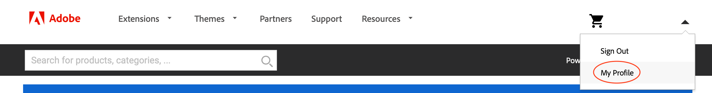
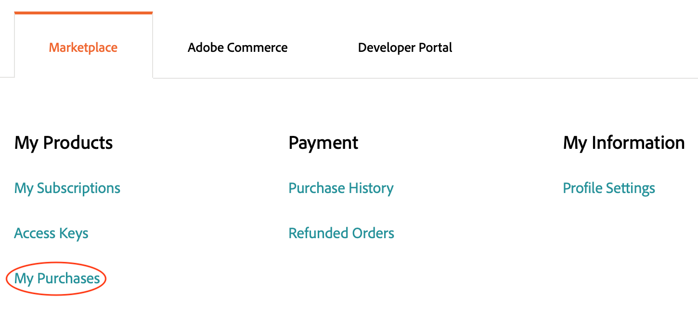
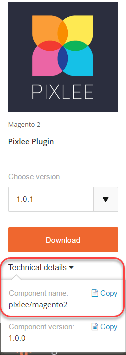

# Manage extensions

You can extend your Adobe Commerce application capabilities by adding an extension from the [Commerce Marketplace](https://marketplace.magento.com). For example, you can add a theme to change the look and feel of your storefront, or you can add a language package to localize your storefront and Admin.

## Composer name of an extension

Although this discusses how to get the Composer name and version of an extension from Commerce Marketplace, you can find the name and version of _any_ module in the Composer file of the module. Open the `composer.json` file in a text editor and note the `"name"` and `"version"` values.

**To get the Composer name of a module from the Commerce Marketplace**:

1. Log in to [Commerce Marketplace](https://marketplace.magento.com) with the username and password you used to purchase the component.

1. In the upper right corner, click your username and select **My Profile**.

   

1. On the _My Account_ page, click **My Purchases**.

   

1. On the _My Purchases_ page, select a module that you purchased and click **Technical Details**.

   

1. Click **Copy** to copy the component name to the clipboard.

1. Open a text editor and paste the module name.

1. Append a colon character (`:`) to the component name.

1. In **Technical Details**, click **Copy** to copy the version to the clipboard.

1. Append the version number to the component name after the colon. For example:

   ```text
   pixlee/magento2:1.0.1
   ```

## Install an extension

We recommend working in a development branch when adding an extension to your implementation. When installing an extension, the extension name (`<VendorName>_<ComponentName>`) is automatically inserted in the [`app/etc/config.php`](https://experienceleague.adobe.com/docs/commerce-operations/configuration-guide/files/deployment-files.html) file. There is no need to edit the file directly.

**To install an extension**:

1. On your local workstation, change to your project directory.

1. Create or check out a development branch. See [branching](../development/cli-branches.md).

1. Using the Composer name and version, add the extension to the `require` section of the `composer.json` file.

   ```bash
   composer require <extension-name>:<version> --no-update
   ```

   For example:

   ```bash
   composer require pixlee/magento2:1.0.1 --no-update
   ```

1. Update the project dependencies.

   ```bash
   composer update
   ```

1. Add, commit, and push code changes.

   ```bash
   git add -A
   ```

   ```bash
   git commit -m "Install <extension-name>"
   ```

   ```bash
   git push origin <branch-name>
   ```

   >[!WARNING]
   >
   >When installing an extension, you must include the `composer.lock` file when you push code changes to the remote environment. The `composer install` command reads the `composer.lock` file to enable the defined dependencies in the remote environment.

1. After the build and deploy finishes, use an SSH to log in to the remote environment and verify the extension installed.

   ```bash
   bin/magento module:status <extension-name>
   ```

   An extension name uses the format: `<VendorName>_<ComponentName>`.

   Sample response:

   ```terminal
   Module is enabled
   ```

   If you encounter deployment errors, see [extension deployment failure][].

## Manage extensions

When you add an extension using Composer, the deployment process automatically enables the extension. If you already have the extension installed, you can enable or disable the extension using the CLI. When managing extensions, use the format: `<VendorName>_<ComponentName>`

Never enable or disable an extension while logged in to the remote environments.

**To enable or disable an extension**:

1. On your local workstation, change to your project directory.

1. Enable or disable a module. The `module` command updates the `config.php` file with the requested status of the module.

   >Enable a module.

   ```bash
   bin/magento module:enable <module-name>
   ```

   >Disable a module.

   ```bash
   bin/magento module:disable <module-name>
   ```

1. If you enabled a module, use `ece-tools` to refresh the configuration.

   ```bash
   ./vendor/bin/ece-tools module:refresh
   ```

1. Verify the status of a module.

   ```bash
   bin/magento module:status <module-name>
   ```

1. Add, commit, and push code changes.

   ```bash
   git add -A
   ```

   ```bash
   git commit -m "Disable <extension-name>"
   ```

   ```bash
   git push origin <branch-names>
   ```

## Upgrade an extension

Before you continue, you need the Composer name and version for the extension. Also, confirm that the extension is compatible with your project and Adobe Commerce version. In particular, check the required PHP version before you begin.

**To update an extension**:

1. On your local workstation, change to your project directory.

1. Create or check out a development branch. See [branching](../development/cli-branches.md).

1. Open the `composer.json` file in a text editor.

1. Locate your extension and update the version.

1. Save your changes and exit the text editor.

1. Update the project dependencies.

   ```bash
   composer update
   ```

1. Add, commit, and push your code changes.

   ```bash
   git add -A
   ```

   ```bash
   git commit -m "Update <extension-name>"
   ```

   ```bash
   git push origin <branch-names>
   ```

If you encounter errors, see [Recover from component failure](../deploy/recover-failed-deployment.md). To learn more about using extensions with Adobe Commerce, see [Extensions](https://experienceleague.adobe.com/docs/commerce-admin/start/resources/extensions.html) in the _Admin Guide_.
