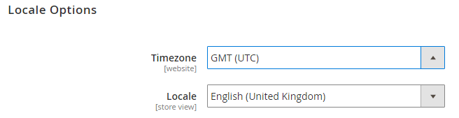
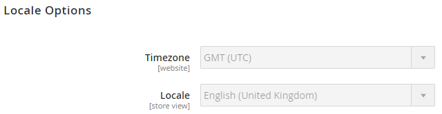

# Example of managing system-specific settings

This example shows how to use configuration management to keep store settings consistent across all environments.

The example uses the following procedure defined in [Store settings](store-settings.md):

1. Enter your configurations in your Integration environment store Admin.
1. Create a `config.php` file and transfer it to your local workstation.
1. Push `config.php` to the remote Integration environment.
1. Verify your settings are not editable in the Admin.
1. Make any necessary modifications:

   *  Change configuration settings on the Integration environment.
   *  To add new configurations, run the command to create `config.php` again. New configurations are appended to the file.
   *  To remove or edit existing configurations, manually edit the file.
   *  Commit and push.

For example, you may want to set the following settings:

*  Disable [locale](https://glossary.magento.com/locale) and static file optimization settings in your Integration environment
*  Enable static file optimization in Staging and Production environments
*  Configure Fastly in Staging and Production with specific credentials for each

_Static file optimization_ means merging and minifying JavaScript and Cascading Style Sheets, and minifying HTML templates. See [Static content deployment strategies](../deploy/static-content.md).

## Prerequisites

To complete these configuration management tasks, you need the following:

*  Project reader role with [environment "admin"](../project/user-access.md) privileges
*  Admin URL and credentials for Integration, Staging, and Production environments

## Configure the Commerce Admin

In the Integration environment, you can log in to the Admin to modify system configuration settings for stores, websites, modules or extensions, static file optimization, and system values related to static content deployment. See [Configuration data](store-settings.md#scd-performance).

**To change locale and static file optimization settings**:

1. Log in to the Integration environment Admin. You can access this URL through the [Project Web Interface](../project/overview.md).
1. Navigate to **Stores** > Settings > **Configuration** > General > **General**.
1. In the page navigation, expand **Locale Options**.
1. From the **Locale** list, change the locale. You can change it back later.

   

1. Click **Save Config**.
1. If prompted, [flush the cache](https://docs.magento.com/user-guide/system/cache-management.html).
1. Log out of the Admin.

## Export values and transfer config.php to your local system

This step creates and transfers the `config.php` configuration file on the Integration environment using a command you run on your local machine.

This procedure corresponds to step 2 in the [recommended procedure](store-settings.md). After you create `config.php`, transfer it to your local system so you can add it to Git.

**To create and transfer `config.php`**:

1. On your local workstation, change to your project directory.

1. Change to the Integration environment.

   ```bash
   magento-cloud environment:checkout integration
   ```

1. Create a local dump of the remote database.

   ```bash
   magento-cloud db:dump
   ```

The following snippet from `config.php` shows an example of changing the default locale to `en_GB` and changing static file optimization settings:

```php?start_inline=1
'general' => [
     'locale' => [
         'code' => 'en_GB',
         'timezone' => 'UTC',
     ],

     ... more ...

 'dev' => [
     'template' => [
         'allow_symlink' => '0',
         'minify_html' => '0',
     ],
     'js' => [
         'merge_files' => '0',
         'enable_js_bundling' => '0',
         'minify_files' => '0',
     ],
     'css' => [
         'merge_css_files' => '0',
         'minify_files' => '0',
     ],

     ... more ...
```

## Push and deploy config.php to environments

Now that you have created `config.php` and transferred it to your local system, commit it to Git and push it to your environments. This procedure corresponds to step 3 and 4 in the [recommended procedure](store-settings.md).

The following command adds, commits, and pushes to the `master` branch:

```bash
git add app/etc/config.php && git commit -m "Add system-specific configuration" && git push origin master
```

Complete code deployment to Staging and Production. For Starter, you push to `staging` and `master` branches. For details on deployment commands, see [Deploy your store](../deploy/staging-production.md).

Wait for deployment to complete in all environments.

## Verify your configuration changes

After you push `config.php` to your environments, any values you changed should be read-only in the Admin. In this example, the modified default locale and static file optimization settings should not be editable in the Admin. These configuration settings are set in `config.php`.

To verify your configuration changes:

1. Log out of the Admin in one of the environments.
1. Log back in to the Admin.
1. Click **Stores** > Settings > **Configuration** > General > **General**.
1. In the right pane, expand **Locale Options**.

   Notice several fields cannot be edited, as shown in the following sample. These configuration settings are maintained by `config.php`.

   

1. Log out of the Admin.

## Change and update system-specific configuration settings

If you need to modify any of these settings, then modify the `config.php` file manually with a text editor. After completing edits or removals, you can commit and push it to the remote environment following the previous steps.

To add new configurations, modify your Integration environment and run the command again to generate the file. Any new configurations are appended to the code in the file. Push it to Git following the previous steps.

For this example, modify static file optimization settings and add a new setting for JavaScript.

### Add new configurations in Integration

To add additional configuration values in the Integration environment Admin. For this example, we are merging JavaScript files.

1. Log out of the Integration Admin.
1. Log back in to the Integration Admin.
1. Click **Stores** > Settings > **Configuration** > **Advanced** > **Developer**.
1. In the right pane, expand **JavaScript Settings**.
1. From the **Merge JavaScript Files** list, click **Yes**.
1. Click **Save Config**.
1. If prompted, [flush the cache](https://docs.magento.com/user-guide/system/cache-management.html).
1. Log out of the Admin.

By running the dump command again, the new configuration is appended to the file.

```bash
magento-cloud db:dump
```

### Edit config.php with new settings

On your local, use a text editor to edit the updated `app/etc/config.php` file. Edit these settings to enable minifying for JavaScript, HTML, and CSS files.

```php?start_inline=1
 'dev' => [
     'template' => [
         'allow_symlink' => '0',
         'minify_html' => '0',
     ],

     ... more ...

     'js' => [
         'merge_files' => '0',
         'enable_js_bundling' => '0',
         'minify_files' => '0',
     ],
     'css' => [
         'merge_css_files' => '0',
         'minify_files' => '0',
     ],
```

To modify settings to allow minification, edit `'0'` to `'1'` for `'minify_html'` and each `'minify_files'` option:

```php?start_inline=1
 'dev' => [
     'template' => [
         'allow_symlink' => '0',
         'minify_html' => '1',
     ],

     ... more ...

     'js' => [
         'merge_files' => '0',
         'enable_js_bundling' => '0',
         'minify_files' => '1',
     ],
     'css' => [
         'merge_css_files' => '0',
         'minify_files' => '1',
     ],
```

Save the changes to the file.

### Push the changes to Git

To push your changes, enter the following:

```bash
git add app/etc/config.php
```

```bash
git commit -m "Add system-specific configuration and edit settings"
```

```bash
git push origin master
```

Wait for deployment to complete.

Repeat the deployment process for pushing the code to all environments.
