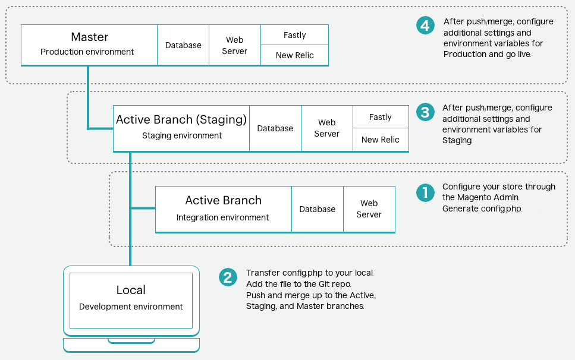

# Store configuration management

The default configurations for your store are stored in a `config.xml` for the appropriate module. When you change settings in the Commerce Admin or the CLI `bin/magento config:set` command, the changes are reflected in the core database, specifically the `core_config_data` table. These settings overwrite the default configurations stored in the `config.xml` file.

Store settings, which refer to the configurations in the Admin **Stores** > **Settings** > **Configuration** section, are stored in the deployment configuration files based on the type of configuration:

- `app/etc/config.php`—configuration settings for stores, websites, modules or extensions, static file optimization, and system values related to static content deployment. See the [config.php reference](https://experienceleague.adobe.com/docs/commerce-operations/configuration-guide/files/config-reference-configphp.html) in the _Configuration Guide_.
- `app/etc/env.php`—values for system-specific overrides and sensitive settings that should _NOT_ be stored in source control. See the [env.php reference](https://experienceleague.adobe.com/docs/commerce-operations/configuration-guide/files/config-reference-envphp.html) in the _Configuration Guide_.

>[!NOTE]
>
>Because Adobe Commerce on cloud infrastructure supports only the production and maintenance modes, the **Advanced** > **Developer** section is not accessible in the Admin. You must have [environment Admin privileges](../project/user-access.md) to complete configuration management tasks. You can configure additional settings using [environment variables](../environment/configure-env-yaml.md).

Configuration management provides a way to deploy consistent store settings across your environments with minimal downtime using Pipeline deployment. Adobe Commerce on cloud infrastructure project includes the build server, build and deploy scripts, and deployment environments designed with the [pipeline deployment strategy](https://experienceleague.adobe.com/docs/commerce-operations/configuration-guide/deployment/technical-details.html) in mind.

## Configuration override scheme

All system configurations are set during build and deploy phases according to the following override scheme:

1. If an environment variable exists, use the custom configuration and ignore the default configuration.
1. If an environment variable does not exist, use the configuration from a `MAGENTO_CLOUD_RELATIONSHIPS` name-value pair in the [`.magento.app.yaml` file](../application/configure-app-yaml.md). Ignore the default configuration.
1. If an environment variable does not exist and `MAGENTO_CLOUD_RELATIONSHIPS` does not contain a name-value pair, remove all customized configuration and use the values from the default configuration.

To summarize, environment variables override all other values.

>[!TIP]
>
>See [Configuration management](https://experienceleague.adobe.com/docs/commerce-operations/configuration-guide/deployment/technical-details.html) in the _Configuration guide_ for more about the override scheme for pipeline deployment.

If the same setting is configured in multiple places, the application relies on the following configuration hierarchy to determine which value to apply to the environment :

| Priority | Configuration<br>Method  | Description |
| -------- | ------------------------ | ----------- |
| 1 | [!DNL Cloud Console]<br>environment variables | Values added from the _Variables_ tab of environment configuration in the [!DNL Cloud Console]. Specify values here for sensitive or environment-specific configurations. Settings specified here cannot be edited from the Admin. See [Environment configuration variables](../project/overview.md#configure-environment). |
| 2 | `.magento.app.yaml` | Values added in the `variables` section of the `.magento.app.yaml` file. Specify values here to ensure consistent configuration across all environments. **Do not specify sensitive values in the `.magento.app.yaml` file.** See [Application settings](../application/configure-app-yaml.md). |
| 3 | `app/etc/env.php` | Environment-specific configuration values stored here are added by using the `app:config:dump` command. Set the system-specific and sensitive values using environment variables or the CLI. See [Sensitive data](#sensitive-data). The `env.php` file is **not** included in source control. |
| 4 | `app/etc/config.php` | Values stored here are added by using the `app:config:dump` command. Shared configuration values are added to `config.php`. Set shared configuration from the Admin or using the CLI. The `config.php` file is included in source control. |
| 5 | Database | Values stored here are added by setting configurations in the Admin. Configurations set using any of the preceding methods are locked (grayed out) and cannot be edited from the Admin. |
| 6 | `config.xml` | Many configurations have default values set in the `config.xml` file for a module. If Adobe Commerce cannot find any value set by any of the preceding methods, it falls back to the default value, if set. |

{style="table-layout:auto"}

## Configuration dump

You can use the following `ece-tools` command to generate a `config.php` file that contains all the current store configurations:

```bash
./vendor/bin/ece-tools config:dump
```

The data "dumped" to the `app/etc/config.php` file becomes _locked_, which means the corresponding field in the Commerce Admin becomes **read-only**. The `config.php` file includes only the settings that you configure. It does not lock the default values. Locking only the values you update also ensures that all extensions used in the Staging and Production environments do not break due to read-only configurations, especially Fastly.

>[!WARNING]
>
>The `ece-tools config:dump` command does not retrieve detailed configurations for modules, such as B2B. If you need a comprehensive configuration dump, use the `app:config:dump` command, but this command locks configuration values in a read-only state.

### Sensitive data

Any sensitive configurations export to the `app/etc/env.php` file when you use the `bin/magento app:config:dump` command. You can set sensitive values using the CLI command: `bin/magento config:sensitive:set`. See  [Sensitive and environment-specific settings](https://developer.adobe.com/commerce/php/development/configuration/sensitive-environment-settings/) in the _Commerce PHP Extensions_ guide to learn how to designate configuration settings as being sensitive or system-specific.

See a list of [Sensitive or system-specific settings](https://experienceleague.adobe.com/docs/commerce-operations/configuration-guide/paths/config-reference-sens.html) in the _Configuration Guide_.

### SCD performance

Depending on the size of your store, you may have a large number of static content files to deploy. Normally, static content deploys during the deploy phase when the application is in Maintenance mode. The most optimal configuration is to generate static content during the build phase. See [Choosing a deploy strategy](../deploy/static-content.md).

If you have enabled Configuration Management after dumping the configurations, you should move the SCD_* variables from the deploy stage to the build stage to properly enable static content generation during the build phase. See [Environment variables](../environment/configure-env-yaml.md#environment-variables).

**Before Configuration Management**:

```yaml
  deploy:
    CRON_CONSUMERS_RUNNER:
      cron_run: true
      consumers: []
    SCD_STRATEGY: compact
    SCD_MATRIX:
      ...
    REDIS_USE_SLAVE_CONNECTION: 1
```

**After enabling Configuration Management**:

Move the SCD_* variables to the build stage:

```yaml
  deploy:
    CRON_CONSUMERS_RUNNER:
      cron_run: true
      consumers: []
    REDIS_USE_SLAVE_CONNECTION: 1
  build:
    SCD_STRATEGY: compact
    SCD_MATRIX:
      ...
```

>[!NOTE]
>
>Before deploying static files, the build and deploy phases compress static content using GZIP. Compressing static files reduces server loads and increases site performance. See [build options](../environment/variables-build.md) to learn about customizing or disabling file compression.

## Procedure to manage your settings

The following illustrates a high-level overview of this process:



**To configure your store and generate a configuration file**:

1. Complete all configurations for your stores in the Admin for one of the environments:

   - Starter: An active development branch
   - Pro: An active branch in the integration environment

   These configurations do not include the actual products unless you plan on dumping the database from this environment to Staging and Production environments. Typically, development databases do not include your full store data.

1. On your local workstation, change to your project directory.

1. Create a local dump of the remote database.

   ```bash
   magento-cloud db:dump
   ```

1. Add, commit, and push code changes to update a remote environment.

   ```bash
   git add app/etc/config.php
   ```

   ```bash
   git commit -m "Add system-specific configuration"
   ```

   ```bash
   git push origin <branch-name>
   ```

After the deployment is complete, log in to the Admin for the updated environment to verify the settings. Continue to merge any additional configurations to the Staging and Production environments, as needed.

### Update configurations

When you modify your environment through the Admin and run the command again, new configurations are appended to the code in the `config.php` file.

>[!WARNING]
>
>While you can manually edit the `config.php` file in the Staging and Production environments, it is **not** recommended. The file helps to keep all configurations consistent across all environments. Never delete the `config.php` file for rebuilding it. Deleting the file can remove specific configurations and settings required for build and deploy processes.

### Restore configuration files

Copies of the original `app/etc/env.php` and `app/etc/config.php` files were created during the deployment process and store in the same folder. The following shows the BAK (backup files) and PHP (original files) in the same `app/etc` folder:

```terminal
...
config.php.bak
di.xml
env.php.bak
vendor_path.php
config.php
db_schema.xml
env.php
...
```

Older configurations used the `app/etc/config.local.php` file. See [Migrate older configurations](#migrate-older-configurations).

**To restore configuration files**:

1. On your local workstation, use SSH to log in to the remote project and environment.

   ```bash
   magento-cloud ssh
   ```

1. Verify the backup files location and availability.

   ```bash
   ./vendor/bin/ece-tools backup:list
   ```

   Sample response:

   ```terminal
   The list of backup files:
   app/etc/env.php
   app/etc/config.php
   ```

1. Restore backup files.

   ```bash
   ./vendor/bin/ece-tools backup:restore
   ```

### Migrate older configurations

If you upgrade to Adobe Commerce on cloud infrastructure 2.2 or later, you may want to migrate settings from the `config.local.php` file to your new `config.php` file. If the configuration settings in your Admin match the contents of the file, follow the instructions to generate and add the `config.php` file.

If they differ, you can append content from the `config.local.php` file to your new `config.php` file:

1. Follow instructions to generate the `config.php` file.

1. Open the `config.php` file and delete the last line.

1. Open the `config.local.php` file and copy the contents.

1. Paste the contents into the `config.php` file, save, and complete adding it to Git.

1. Deploy across your environments.

You only complete this migration once. After migration, use the `config.php` file.

### Change locales

You can change your store locales without following a complex configuration import and export process, _if_ you have [SCD_ON_DEMAND](../environment/variables-global.md#scd_on_demand) enabled. You can update the locales using the Admin.

You can add another locale to the Staging or Production environment by enabling `SCD_ON_DEMAND` in an integration branch, generate an updated `config.php` file with the new locale information, and copy the configuration file to the target environment.

>[!WARNING]
>
>This process **overwrites** the store configuration; only do the following if the environments contain the same stores.

1. In the integration environment, enable the `SCD_ON_DEMAND` variable using the [`.magento.env.yaml` file](../environment/configure-env-yaml.md).

1. Add the necessary locales using your Admin.

1. Use SSH to log in to the remote environment and generate the `/app/etc/config.php` file containing all locales.

   ```bash
   ssh <SSH-URL> "./vendor/bin/ece-tools config:dump"
   ```

1. Copy the new configuration file from the remote integration environment to your local environment directory.

   ```bash
   rsync <SSH-URL>:app/etc/config.php ./app/etc/config.php
   ```

1. Add, commit, and push code changes to update a remote environment.
