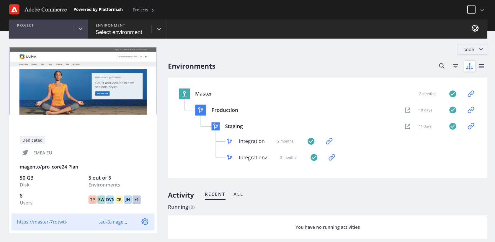
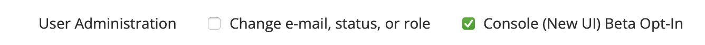

# What is the new Cloud Console?

Adobe Commerce on Cloud infrastructure has a new look in beta that you can enable and test. This new Cloud Console provides a more modern, user-friendly experience and lays the foundation for future interface enhancements.

The new or improved features include:

- Clear overview of project and environment characteristics
- Activity stream with sortable history
- Manual backup management and history for Starter projects
- Enhanced log views
- Sortable lists
- Simple forms and guidance to add integrations
- Web Content Accessibility Guidelines (WCAG) compliance

**To Enable or disable Cloud Console**:

1. Open the original [Project Web Interface](https://accounts.magento.cloud/user).

1. On the _Account Settings_ tab, select **[!UICONTROL Console (New UI) Beta Opt-in]** to enable default Cloud Console access for your user account.

   

1. Click **[!UICONTROL Save]**.

1. Open the new [Cloud Console](https://console.magento.cloud).

1. To disable default Cloud Console access, return to your account settings in the original Project Web Interface and deselect **[!UICONTROL Console (New UI) Beta Opt-in]**.

## Feature questions

**_Where can I find the Snapshots feature_**?

For Starter projects, snapshots is now called _backups_. You can create a manual backup of your Starter environment from the Cloud Console or create a snapshot from the Cloud CLI. You must have an Admin role for the environment.

Select an environment from the project navigation bar. The environment must be active. Select the **Backups** tab. Currently, this option is not available for a Pro environment.

**_Where is the list of configured routes for the environment_**?

You can find the list of configured routes on the _Services_ tab for an environment. Select an environment from the project navigation bar. Select the **Services** tab. The **Router** overview displays the configured routes. Currently, you cannot add a route.
