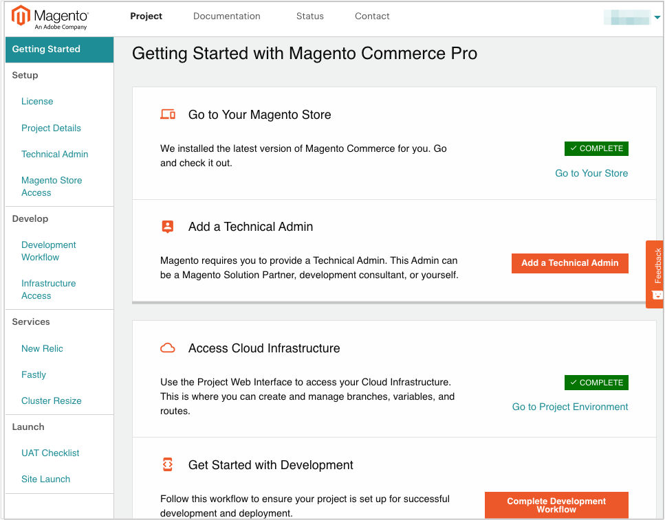

# [!DNL Onboarding] to Commerce

After Adobe activates a Commerce on cloud infrastructure subscription, the initial project and code access is available only to the person designated as the License Owner (Account Owner).

The License Owner is the person in your business or finance organization that manages payments and other business-related transactions for the Adobe Commerce on cloud infrastructure account. This person serves as the point of contact with Adobe. If you need to change the License Owner on your account, you must contact your Adobe Account Team.

To quickly onboard your project, so you can begin developing your site for live deployment, you must complete required setup and [!DNL onboarding] tasks. Typically, the License Owner begins the process by securing Admin access and creating Technical Admin users that can help with setup, customization, and development work.

## Sign up for a Cloud account

If you do not have an Adobe Commerce on cloud infrastructure account, contact [Sales][]. When you sign up, Adobe creates your account and sends you a welcome email that provides instructions on how to access the project interface. The email contains a link so that you can log in to [your account](https://accounts.magento.cloud/user) and complete your initial project setup.

## Cloud Project portal ([!DNL Onboarding] UI)

Use the Adobe Commerce on cloud infrastructure Project Portal ([!DNL Onboarding] UI) to help project administrators, business users, and developers with the tasks required to develop, build, test, and launch your site.

- Access your Cloud environments, storefront, and Admin
- Add a Technical Admin, a super user to help manage your project and branches
- Access your project environments, including a link to the Project Web Interface
- Provide your developer with a getting started workflow to set up their local development environments and begin developing
- Complete a quick user acceptance test (UAT) checklist with links to further tests

**To open the Cloud Project portal**:

1. Log in to your [Adobe Commerce on cloud infrastructure account](https://account.magento.com/customer/account/).

1. On the _My Account_ page, click the [!UICONTROL Magento] tab to see the projects in your account.

1. **Click View Project Page** in the [Projects section](https://cloud.magento.com/cloud/project/subscriptions/).

1. Click the name of your project to open the Cloud Project portal ([!DNL Onboarding] UI).

   

   Browse through the portal to find helpful information and options to start planning your project, developing, code, and preparing for UAT and site launch.

## Project access and users

The License Owner can add user accounts to provide access to code, manage
branches, enter tickets, and support environments. These user accounts can include in-house development, consultants, and solution specialists.

Typically, the only user the License Owner must create is the _Technical Admin_. The Technical Admin needs a user account with admin access to create user accounts for developers, set environment permissions, and manage all branches and environments. The Technical Admin can be a developer, a consultant, an [Adobe Solution Partner](https://business.adobe.com/products/magento/partners.html), or yourself.

You can create a Technical Admin through the Project portal, from the Project Web interface, or from the command line using the `magento-cloud` CLI.

### User registration

You can only add registered users to your Adobe Commerce on cloud infrastructure projects and environments. If you have a new user, ask them to [register for an account](https://account.magento.com/customer/account/login/) and to provide the email address associated with their account profile.

### Set up shared account access

The License Owner can set up shared access for the account. Shared access allows trusted employees and service providers to use the Help center to submit and track Support tickets related to your Adobe Commerce on cloud infrastructure projects. For setup instructions, see the [Shared Access][] article in the Help Center.

## Get started with the Project Web Interface

When you sign up for a Pro or Starter subscription plan, we provision your initial project environment with a template Adobe Commerce on cloud infrastructure repository to build and manage your site. For information about what is included in Pro and Starter plans, see [Starter Architecture](../cloud-guide/architecture/starter-architecture.md) and [Pro Architecture](../cloud-guide/architecture/pro-architecture.md).

You can use the [Project Web Interface](../cloud-guide/project/overview.md) to manage your project, add user accounts, and begin developing your store. The License Owner, Technical Admin users, and developers can use this interface to manage all environments and branches, environment variables, environment settings, and routes.

## Access your Admin panel

Users that have administrative access to the Admin panel can add users, configure store services, complete store setup and customization work, and more.

For a new project, the first step after getting the welcome email is to secure Admin access to the project by changing the password on the License Owner account. The default username for this account is the License Owner email address.

You can submit a password change request using either of the following methods:

- Locate the welcome email sent to the License Owner email address and follow the link to change your password.

- Copy the store URL from the [Project Web Interface](../cloud-guide/project/overview.md) into a browser. Then, append `/admin` to the end of the URL to open the sign-in page. Click the **Forgot password?** link to send a password change request to the License Owner email address.

After you submit the password change request, check your email for the password reset notification. If you do not get the email, check your spam folder.

>[!TIP]
>
>If the password reset fails or you cannot sign in to the Admin panel, a user with admin access can connect to the project using SSH and add an admin user using the CLI [admin:user:create command](https://experienceleague.adobe.com/docs/commerce-operations/installation-guide/tutorials/admin.html).

## Sign up for Adobe status

Get updates about Adobe Commerce on cloud infrastructure platform environments and related services from the [Status page][].

The page provides a status for Adobe Commerce on cloud infrastructure components and services followed by notifications about incident reports, service upgrades, planned outages, and more. These notifications are ordered by date.

Anyone working on your project can subscribe to the Adobe Commerce on cloud infrastructure status site to receive event notifications and updates through email. You can customize your subscription to select only the platform and services that you want to track.

>[!TIP]
>
>View the [Commerce on Cloud Infrastructure user guide](../cloud-guide/overview.md).

<!--Link references-->

[Sales]: https://business.adobe.com/products/magento/get-demo.html
[Shared Access]: https://experienceleague.adobe.com/docs/commerce-knowledge-base/kb/help-center-guide/magento-help-center-user-guide.html#shared-access
[Status page]: https://status.adobe.com/products/503473
