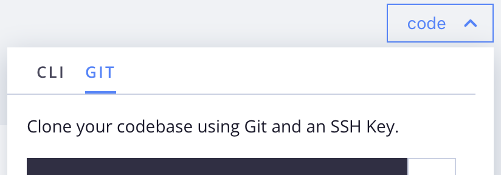

# Prepare for development

Whether you are new to Commerce or are an existing Commerce owner moving to the cloud infrastructure, use these steps for preparing a development workspace for your Cloud project. If you already completed some of these steps or have an existing Adobe Commerce developer environment, review the following for expected results and continue to the next step. Some configurations and workflows differ from a typical on-premises installation.

## Credentials

Before setting up a workspace, gather the following keys and account access:

- **Authentication keys (Composer keys)**

  Authentication keys are 32-character authentication tokens that provide secure access to the Adobe Commerce Composer repository (`repo.magento.com`), and any other Git services required for application development such as GitHub. Your account can have multiple authentication keys. For the workspace setup, start with one specific key for your code repository. If you do not have any keys, contact the project owner, or create the [authentication keys](../cloud-guide/development/authentication-keys.md) yourself.

- **Cloud Project account**

  The Project Owner should invite you to the Adobe Commerce on cloud infrastructure project. When you receive the e-mail invitation, click the link and follow the prompts to create your account. See [Onboarding](onboarding.md).

- **Adobe Commerce Encryption Key**

  When importing an existing system only, capture the encryption key used to protect your access and data for the database. For details on this key, see [Resolve issues with encryption key](https://experienceleague.adobe.com/docs/commerce-knowledge-base/kb/troubleshooting/miscellaneous/resolve-issues-with-encryption-key.html)

## Developer tools

- **Install the Cloud CLI**

  Install the `magento-cloud` CLI so that you can manage Cloud environments and run automation tasks. See [Cloud CLI](../cloud-guide/dev-tools/cloud-cli-overview.md) for installation instructions.

- **Install Docker for local development and testing**

  Optionally, use the Docker environment to emulate the Commerce on cloud infrastructure `integration` environment for local development. There are three essential components: an Adobe Commerce v2 template, Docker Compose, and `ece-tools` package.

  - [Docker architecture and common commands](../cloud-guide/dev-tools/cloud-docker.md)
  - [Launch Docker development environment](https://developer.adobe.com/commerce/cloud-tools/docker/setup/)
  - [ECE-Tools package](../cloud-guide/dev-tools/package-overview.md)

- **Integrate Git-based services**

  Optionally integrate a Git-based hosting service, such as GitHub or GitLab, with Adobe Commerce on cloud infrastructure. See [Integrations](../cloud-guide/integrations/overview.md).

## Project code

A secure connection is essential for interacting with the remote environments. For a new project, [log in to the Cloud Console](https://console.adobecommerce.com) and click **[!UICONTROL No SSH key]**. This icon is to the right of the command field and is visible when the project does not contain an SSH key. See [Secure connections](../cloud-guide/development/secure-connections.md#add-an-ssh-public-key-to-your-account).

**To clone your codebase to your local workstation**:

1. In the [Cloud Console](https://console.adobecommerce.com), click **[!UICONTROL code]** and select the **[!UICONTROL Git]** tab.

   {width="450"}

1. Copy the `git clone ...` command provided.

1. In a terminal, create and change to your working directory.

1. Paste and run the `git clone ...` command.

>[!TIP]
>
>Adobe provisions your initial project environment using a template repository that includes package instructions for a specific version of Adobe Commerce. Review the [project file structure](../cloud-guide/project/file-structure.md) topic and learn more about important project files and cloud templates.
