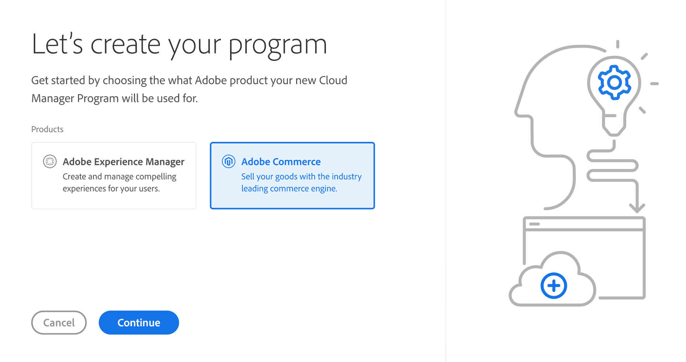
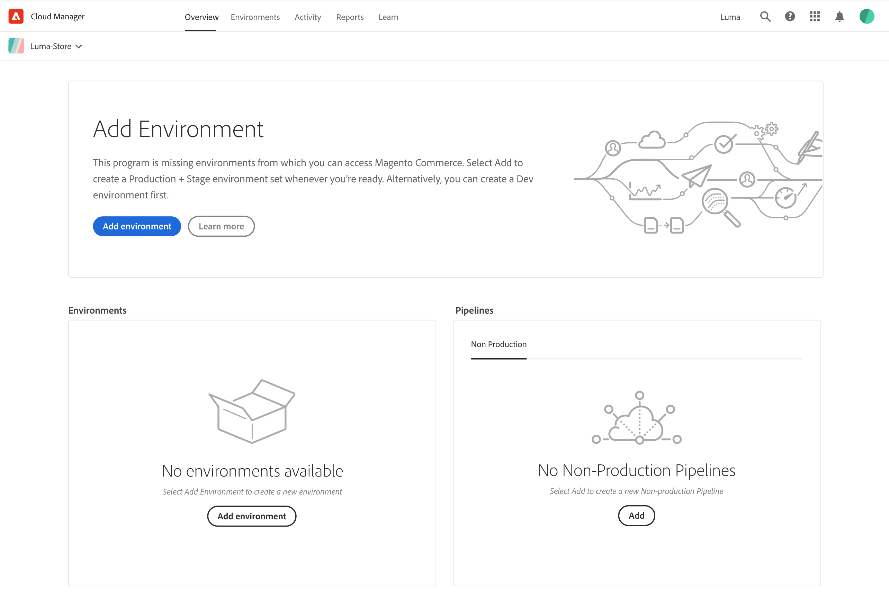

# Adobe Commerce Program

The Adobe Cloud Manager dashboard is a hub for your Adobe Cloud-based programs and products. Sign in to [Adobe Experience Cloud][cm-dash] for your organization and select [!UICONTROL Programs & Products].

From the Cloud Manager **Programs & Products** card view, you can click on an existing program card or click [!UICONTROL Add program] to create a new Commerce program.

A Commerce _program_ consists of multiple environments and pipelines.

**To add a Commerce program:**

1. Click [!UICONTROL Add program].

1. Choose [!UICONTROL Adobe Commerce] for your new program and continue through the steps.

   

1. Provide a [!UICONTROL Program name] and select the [!UICONTROL Set up for production] objective.

## Program overview

Your new program opens with the [!UICONTROL Program overview] page. _Program overview_ is a summary board that displays the status of your resources and provides opportunities to learn and do more.

<!-- link definitions -->
[cm-dash]: https://my.cloudmanager.adobe.com
