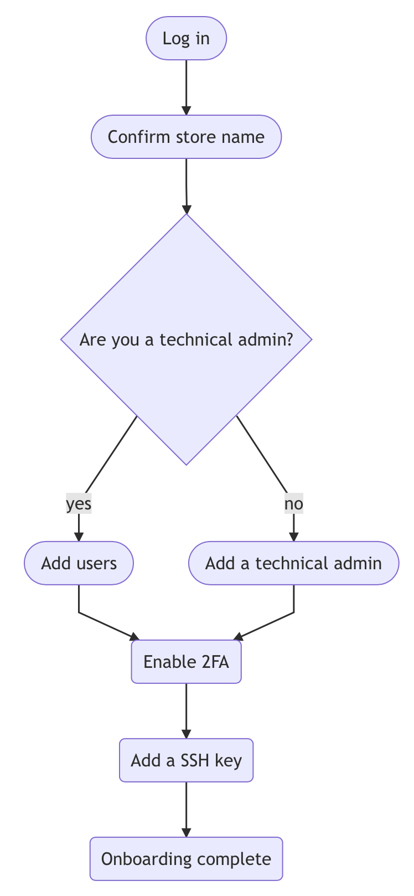

# Account administration

Admins manage users and program access. Programs manage environments, pipelines, and Git repositories.

As a License owner...

A Magento Cloud program includes a Web Interface and CLI commands to fully manage all aspects of your project.

## First time log in

When you log in to a new account for the first time, you added a Technical Admin.

<!-- link definitions -->

- link to user management
- link to Web UI tour
- link to local development
