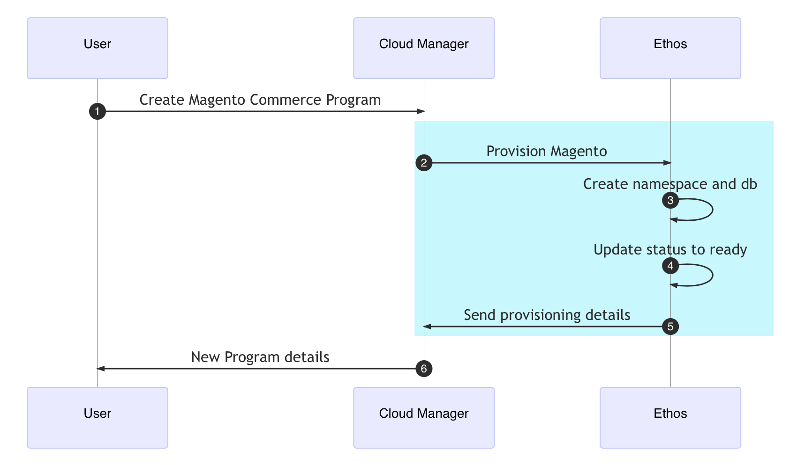

# Account administration

A Magento program includes a Cloud Manager interface that helps you to fully manage environments, pipelines, and Git repositories. As a Business owner or Administrator, you can provision and manage multiple programs, grant user access, and control the deployment-to-production process.

## First time log in

When you logged in to your new account for the first time, you went through an onboarding process that confirmed your store name, created a _technical admin_, and enabled two-factor authentication.

## Create program

