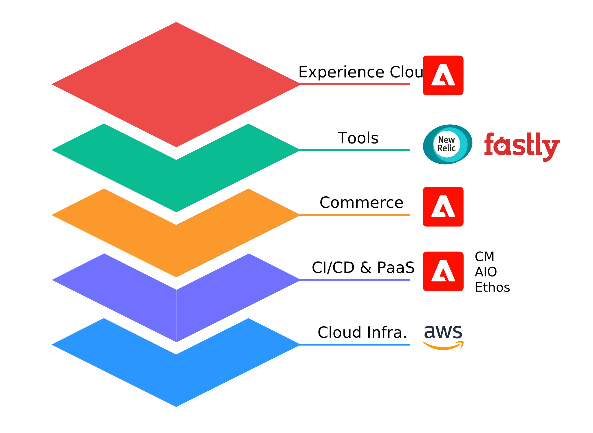

# Architecture for Commerce on AEC

The Commerce platform architecture, built on Ethos-Kubernetes and Adobe Experience Cloud technology, provides a cloud-native hosting environment with self-service capabilities.

## Experience Cloud

- **Cloud Manager**—Cloud Manager provides a basis for the new Commerce program interface and includes self-service mechanisms for the following:

  - Environment access, variables, and controls
  - CICD Pipeline optimization and scheduling
  - Activity and performance monitoring
  - Git source repository access management

    See the [Cloud Manager documentation][].

- **Admin Console**—Control team access to the Commerce program and define roles.

## Tools and integrations

- [Fastly][]—CDN service, WAF management, image optimization, and other security features.
- [New Relic][]—Software analytics service for analyzing Commerce interactions, such as database queries, customer transactions, and application dependency and event monitoring.
- [SendGrid][]—SMTP proxy service provides email authentication and reputation monitoring.

## Infrastructure

- **[!DNL AWS Managed Services]**—Provides a high-availability operational structure that includes the following services required to support Commerce:

  - **Aurora**—A fault-tolerant, relational database compatible with MySQL.
  - **Elasticsearch**—Powerful, multi-tenant search engine.
  - **RabbitMQ**—A native message queue for Commerce that enables a module to publish messages to queues and consumers to receive messages asynchronously.
  - **Redis**—(ElastiCache) session and search caching.
  - **S3**—Simple storage service that provides the option to store files and schedule imports/exports in a persistent, remote storage container that is version controlled, backed up, and encrypted.

- **Ethos-Kubernetes**—Ethos-managed clusters and Kubernetes operators orchestrate the Commerce stack and provide a stateless, read-only environment including:

  - **Contour**—ingress controller, load balancer with routing and SSL termination
  - **NGINX**—web server with PHP binaries
  - **PHP**—command-line capabilities
  - Secrets management

  See the [Kubernetes Infrastructure documentation][k8s].

- **Git**—Each Commerce program uses a Git-based source repository.

- **Skyline Provisioning Framework and Cloud Controller**—A provisioning framework manages the resources defined in a Kubernetes cluster and the cloud controller provides a platform that manages the application deployment on an ETHOS infrastructure.

<!-- link definitions -->
[Cloud Manager documentation]: https://www.adobe.io/apis/experiencecloud/cloud-manager.html
[Fastly]: https://www.fastly.com
[k8s]: https://developers.corp.adobe.com/adobe-platform/k8s-infrastructure/docs/index.md
[New Relic]: https://newrelic.com
[SendGrid]: https://sendgrid.com
