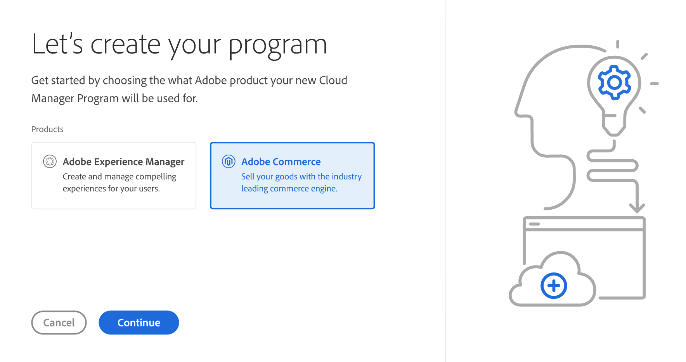
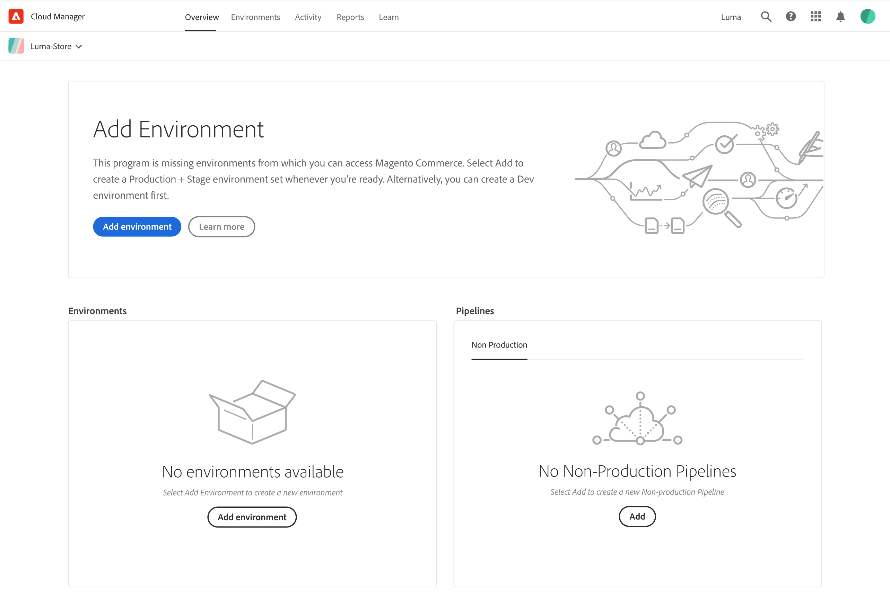

# Commerce Program tour

Adobe Cloud Manager is a hub for your Adobe Cloud-based programs and products. From the Cloud Manager card view, you can click on an existing program or add a new program.

Choose Adobe Commerce for your new program and continue through the steps.

Next, provide a Program name and select the **Set up for production** objective.

## Commerce overview

Your new program opens with the **Program overview** page. Program overview is a summary board that displays the status of your environments, pipelines, resources, and provides opportunities to learn and do more.

<!-- link definitions -->
