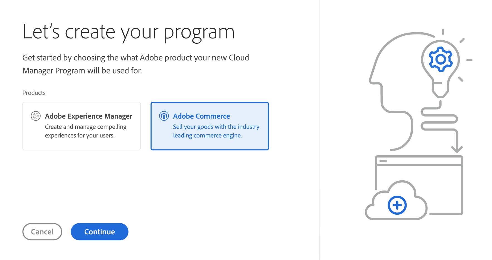
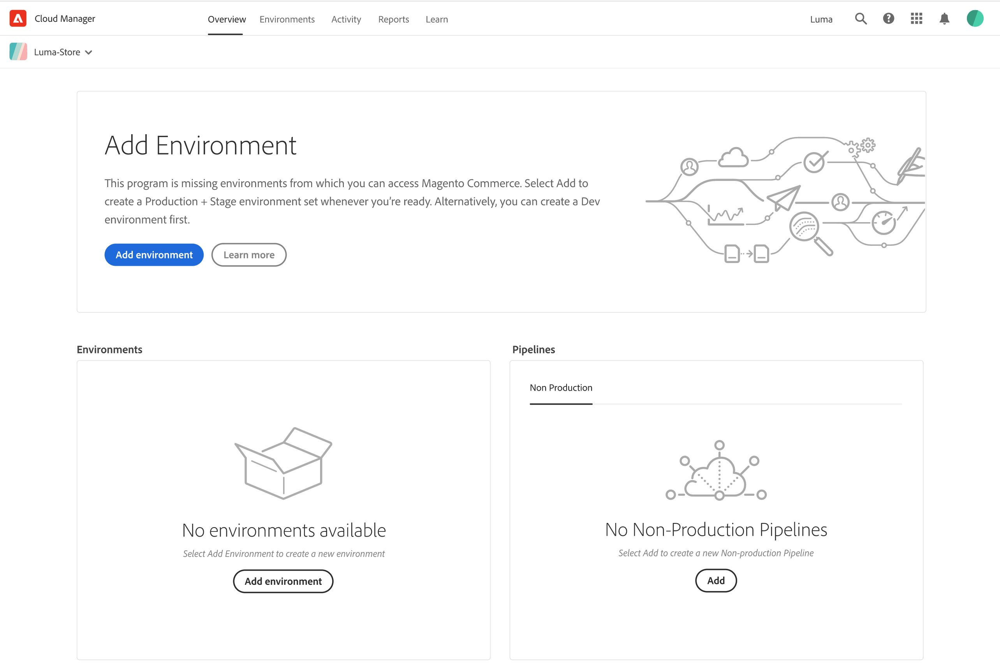

# Program tour

Adobe Cloud Manager is a hub for your Adobe Cloud-based programs and products. From the Cloud Manager card view, you can click on an existing program or add a new program.

Choose Adobe Commerce for your new program and continue through the steps.

## Commerce overview

Your new program opens to the Overview page. Overview is a summary board that displays the status of you program environments, pipelines, resources, and opportunities to learn and do more.

